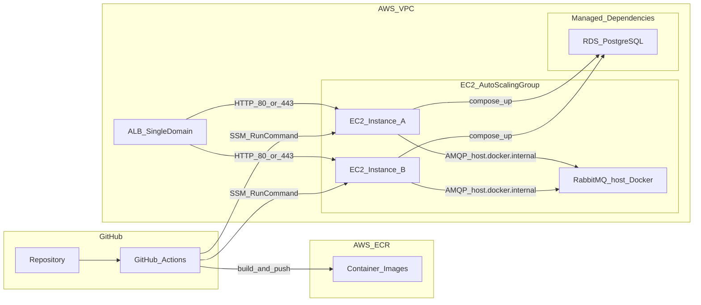
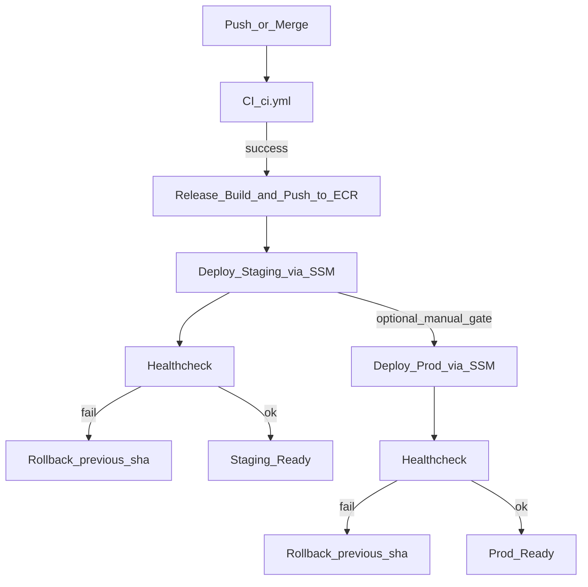

# CD 플랜: AWS ECR + EC2(2대+) + ALB + Docker Compose + SSM

플랜 ID: `aws_ec2+compose_cd_d5326d37`  
동기 문서: [docs/cd-aws-ec2-compose-alb-ssm-plan.md](../../docs/cd-aws-ec2-compose-alb-ssm-plan.md)

## 목표

- 저장소 정본에 맞춰 **AWS ECR**에 서비스별 이미지를 푸시하고, **ALB 뒤 EC2 2대 이상**에서 **Docker Compose**로 앱 스택을 기동한다.
- **RDS**는 매니지드로 두고, **RabbitMQ는 EC2 호스트 Docker**(`enable_ec2_rabbitmq`, Amazon MQ 아님). EC2에는 **앱·웹·web-edge**와 **호스트 RabbitMQ**를 둔다.
- 배포는 **GitHub Actions → SSM Run Command**로 EC2에 내려보내고, **인스턴스 단위 롤링**(drain → 배포 → 헬스체크 → 재등록)으로 무중단에 가깝게 만든다.

## 레포 근거

| 항목 | 경로 |
|------|------|
| CI | `.github/workflows/ci.yml` |
| 로컬 Compose | `docker-compose.yml` |
| 아키텍처(패턴 B, K8s 범위 밖) | `docs/architecture.md` |
| CD 방향 요약 | `docs/CI.md` |

## 배포 토폴로지

## GitHub Actions CD 흐름

## 이미지·태그 전략

- **불변 태그(롤백·추적)**: `:<git_sha>`
- **환경 포인터(선택)**: `:staging`, `:prod`
- Compose 배포는 기본적으로 **sha 태그**로 재현 가능하게 둔다.

## 배포 단위(이미지 목록 — 운영 범위에 맞게 선택)

- 백엔드: `api-gateway-service`, `proxy-service`, `identity-service`, `usage-service`, `billing-service`, `team-service`, `notification-service`
- 웹(Next standalone): `identity-web`, `usage-web`, `billing-web`, `team-web`, `notification-web`, `agent-web`
- 엣지: `web-edge` (단일 도메인 라우팅)

## Release 워크플로 (설계)

- **트리거**: `develop` → 스테이징 자동; `main` → 프로덕션(또는 `workflow_dispatch` + GitHub Environment 승인)
- **빌드·푸시**: `ci.yml`의 `changes`(paths-filter)를 재사용해 **변경된 서비스만** ECR에 push
- **도구**: `docker/build-push-action` + `push: true`
- **AWS 인증**: GitHub **OIDC AssumeRole** (Access Key 지양)

## Deploy 워크플로 — SSM 롤링 (설계)

대상: ALB Target Group에 등록된 EC2(ASG 권장).

인스턴스별 순서:

1. ALB에서 해당 인스턴스 **drain**(연결 종료 후 등록 해제)
2. SSM Run Command로 배포 스크립트 실행: ECR 로그인 → `docker compose -f <prod> pull` → `up -d`
3. 로컬 **헬스체크**(예: `web-edge` 또는 게이트웨이 경로)
4. 성공 시 Target Group **재등록**
5. 실패 시 **이전 `git_sha` 태그**로 롤백 후 재검증

## 운영용 Compose (설계)

- 로컬 `docker-compose.yml`의 Postgres/RabbitMQ/Redis **컨테이너 정의는 운영 파일에서 제외**
- 별도 파일 예: `docker-compose.prod.yml`
- 앱 `environment`는 RDS·호스트 RabbitMQ(`RABBITMQ_*`, Amazon MQ 아님)를 가리킴
- 비밀값: SSM Parameter Store 또는 Secrets Manager

## 헬스체크·롤백

- ALB Target Group 헬스: `web-edge` 안정 경로 또는 게이트웨이 헬스로 통일
- 배포 스크립트: N회 재시도 후 실패 시 롤백
- 배포 직전 성공 **git_sha**를 인스턴스 또는 파라미터에 보관

## AWS 리소스 체크리스트

- ECR 리포지토리
- IAM: GitHub OIDC Role(ECR push + SSM)
- EC2: Instance Profile(ECR pull + SSM Agent), ASG 최소 2대
- ALB + Target Group
- EC2 → RDS / MQ / Redis SG 규칙

## 주의사항

- `GATEWAY_SHARED_SECRET` 등 게이트웨이·프록시·usage **동일 값** — `docs/contracts/gateway-proxy.md`
- 서비스별 DB 분리 원칙은 RDS에도 반영 — `docs/msa-database-and-service-integration.md`
- Compose는 **인스턴스 단위 롤링**이 현실적

## 구현 TODO (체크리스트)

- [ ] 스테이징/프로덕션 브랜치 트리거 확정
- [ ] 운영 이미지·ECR 네이밍 확정
- [ ] GitHub OIDC IAM 및 최소 권한
- [ ] `docker-compose.prod.yml` + secret 주입
- [ ] Release 워크플로
- [ ] Deploy 워크플로 (SSM)
- [ ] 헬스 경로·롤백 정책

문서 유지: 구현 변경 시 `docs/CI.md`, `docs/architecture.md` §10과 모순 없게 갱신한다.
