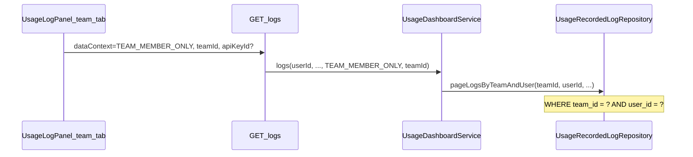
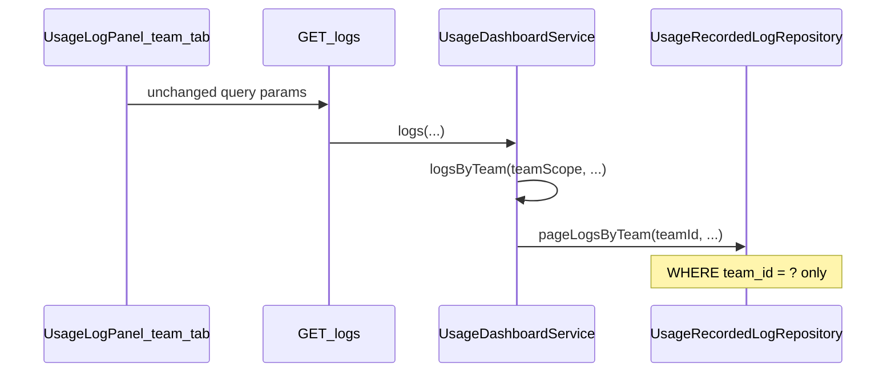

# Task59-2: 팀 로그 탭 데이터 범위 확장

## 현재 동작 (원인)

- 프론트 `[usage-log-panel.tsx](services/usage-service/web/src/components/usage/usage-log-panel.tsx)`는 팀 탭에서 이미 `logDataTabToDataContext("team")` → `TEAM_MEMBER_ONLY`, 선택 팀 `teamId`를 `[buildUsageQuery](services/usage-service/web/src/lib/usage/api/fetch-usage.ts)`로 `logs` API에 전달합니다 (라인 151, 262–277).
- 백엔드 `[UsageDashboardService.logs()](services/usage-service/src/main/java/com/eevee/usageservice/service/UsageDashboardService.java)` (949–965)에서 `teamScope != null`이면 `**pageLogsByTeamAndUser**` + `**resolveUserCredentialFilter(userId, apiKeyId)**` 를 사용해 **로그인 사용자 본인** 로그만 반환합니다.

## 목표 동작

- 팀 탭 + 팀 필터: 해당 `team_id`의 **모든 팀원** `usage_recorded_log` 행.
- API Key 필터: 팀 스코프 키 해석 (`resolveTeamCredentialFilter`) — 팀 BFF와 동일.
- 개인 탭: 기존 `PERSONAL` → `pageLogsPersonal` 유지 (**변경 없음**).

이미 팀 집계 BFF `[TeamTotalUsageDashboardStrategy](services/usage-service/src/main/java/com/eevee/usageservice/service/bff/strategy/TeamTotalUsageDashboardStrategy.java)`는 `logsByTeam()` → `pageLogsByTeam`을 사용합니다. 사용 로그 팀 탭만 같은 패턴으로 맞추면 됩니다.

## 구현 (백엔드만)

### 1. `UsageDashboardService.logs()` 분기 수정

파일: `[UsageDashboardService.java](services/usage-service/src/main/java/com/eevee/usageservice/service/UsageDashboardService.java)` (약 946–992)

`dataContext == TEAM_MEMBER_ONLY && teamScope != null` 일 때:

- **제거**: `logRepository.pageLogsByTeamAndUser(teamScope, userId, ...)` + `resolveUserCredentialFilter`
- **적용**: 기존 private 메서드 `**logsByTeam(teamScope, from, toInclusive, provider, apiKeyId, requestSuccessful, modelMask, reasoningPresence, page, size)`** 로 early return (또는 동일 로직 인라인)

`logsByTeam`은 이미 `resolveTeamCredentialFilter` + `pageLogsByTeam`을 사용합니다 (1013–1044).

**유지할 분기 (변경 금지)**:

| 조건                                        | Repository           | 의미                                |
| ----------------------------------------- | -------------------- | --------------------------------- |
| `PERSONAL`                                | `pageLogsPersonal`   | 개인 로그 탭                           |
| `TEAM_MEMBER_ONLY` && `teamScope == null` | `pageLogsTeamMember` | 팀 ID 없을 때(프론트는 팀 미선택 시 fetch 안 함) |

`pageLogsByTeam` / `pageLogsByTeamAndUser` / `logsByTeamAndUser`는 **삭제하지 않음** — `[TeamMemberUsageDashboardStrategy](services/usage-service/src/main/java/com/eevee/usageservice/service/bff/strategy/TeamMemberUsageDashboardStrategy.java)` 등 다른 화면에서 계속 사용.

### 2. 단위 테스트 추가

파일: `[UsageDashboardServiceTest.java](services/usage-service/src/test/java/com/eevee/usageservice/service/UsageDashboardServiceTest.java)`

- `logs` 호출: `dataContext=TEAM_MEMBER_ONLY`, `teamId="team-1"`, `userId="u1"`
- **verify**: `logRepository.pageLogsByTeam(eq("team-1"), ...)` 1회
- **verify**: `pageLogsByTeamAndUser` **never**
- API Key 지정 시: `apiKeyFilterResolutionService.resolveTeam("team-1", keyId)` 사용 확인 (mock)

(현재 테스트 파일에 `logs` 관련 테스트 없음 — 신규 추가)

### 3. 프론트엔드

**변경 없음** (`[usage-log-panel.tsx](services/usage-service/web/src/components/usage/usage-log-panel.tsx)`, `[usage-log-tab-storage.ts](services/usage-service/web/src/lib/usage/hooks/usage-log-tab-storage.ts)`).

- 개인 탭 UI/필터/`logs/api-keys` fetch 로직 그대로.
- 팀 탭 API Key 옵션은 계속 Team BFF (`useTeamBffTeamsAndApiKeys`) — 팀 키 목록과 백엔드 `resolveTeam` 정합.

### 4. 수동 검증 체크리스트

1. **개인 로그**: 본인 personal scope 로그만, 팀원 로그 미표시 (회귀 없음).
2. **팀 로그** `{팀: 1팀, API Key: 전체}`: 1팀의 **다른 팀원** 로그도 테이블에 표시.
3. **팀 로그** `{팀: 1팀, API Key: A}`: 팀 키 A로 발생한 **모든 팀원** 로그만 표시.
4. 고급 필터(성공/추론/모델/기간/공급자)는 팀·개인 탭 모두 기존과 동일하게 동작.

## 범위 밖 (이번 TASK에서 하지 않음)

- 대시보드 `TEAM_MEMBER_ONLY` 집계 API (`summary`, `daily`, …) — 여전히 “팀별 나의 사용량” (`*ByTeamAndUser`) 유지.
- 로그 행에 `userId`/멤버 표시 컬럼 추가 (`UsageLogEntryResponse`에 사용자 식별자 없음).
- `teamId` 서버 측 멤버십 검증 강화 (기존과 동일하게 UI·게이트웨이 신뢰; 별도 이슈).

## 영향 파일 요약

| 파일                               | 변경                                  |
| -------------------------------- | ----------------------------------- |
| `UsageDashboardService.java`     | `logs()` 팀+teamId 분기 → `logsByTeam` |
| `UsageDashboardServiceTest.java` | 신규 테스트                              |
| `usage-log-panel.tsx` 등 FE       | 없음                                  |

