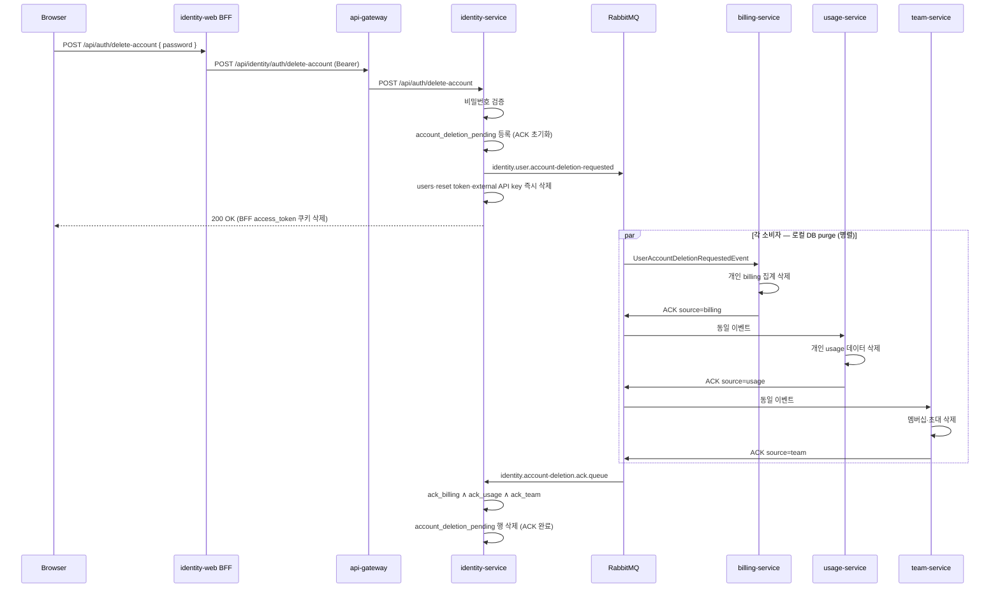

# 회원 탈퇴 — 설계·계약·서비스별 요구사항

버전: 1.1 (2026-05-31)  
**정본:** 본 문서 하나에 흐름·API·이벤트·구현 상태·서비스별 작업·정책 결정을 모두 둔다.

관련: [`architecture.md`](architecture.md) §6, [`msa-database-and-service-integration.md`](msa-database-and-service-integration.md) §3·§6.4, [`contracts/web-identity-bff.md`](contracts/web-identity-bff.md), [`libs/identity-events`](../libs/identity-events)

---

## 1. 목적·원칙

### 1.1 목적

- 사용자 **회원 탈퇴** 시 Identity·연동 서비스의 **개인 데이터**를 일관되게 제거한다.
- Identity Service가 **오케스트레이션**하고, 각 마이크로서비스는 **자기 DB만** 정리한 뒤 **ACK**로 완료를 알린다.

### 1.2 MSA 원칙

- **타 서비스 DB 직접 접근 금지** — JDBC 등으로 다른 서비스 PostgreSQL을 조회·삭제하지 않는다.
- 서비스 간 정합은 **RabbitMQ 이벤트**로 맞춘다 (eventual consistency).
- **멱등성** — 동일 탈퇴 이벤트가 재전송·재시도되어도 결과가 같아야 한다.

---

## 2. 전체 흐름



### 2.1 단계 요약

| 단계 | 주체 | 동작 |
|------|------|------|
| 1 | 사용자 | 설정(또는 API)에서 비밀번호 확인 후 탈퇴(즉시 로그아웃) |
| 2 | identity-service | 비밀번호 검증 → `account_deletion_pending` 저장 → 이벤트 발행 → **`users`·개인 키·재설정 토큰 즉시 삭제** |
| 3 | billing · usage · team | 각자 로컬 DB purge → **ACK 발행** |
| 4 | identity-service | **세 ACK 모두** 수신 시 `account_deletion_pending` 행만 제거 |

### 2.2 완료 조건 (2026-05-31)

`AccountDeletionPendingEntity.allAcknowledged()`는 **`ack_billing` · `ack_usage` · `ack_team` 세 값이 모두 true**여야 `account_deletion_pending` 행을 삭제한다. **`users` 행은 탈퇴 API 성공 직후 이미 삭제**되어 재가입·로그인 실패 UX는 미가입자와 동일하다.

- **billing** · **usage** · **team** ACK: ✅ 구현됨 (로컬 E2E로 pending 플래그·최종 삭제 확인 권장)

---

## 3. HTTP API

### 3.1 Identity Service

| 항목 | 값 |
|------|-----|
| Method | `POST` |
| Path | `/api/auth/delete-account` |
| 인증 | Bearer JWT (로그인 필수) |
| Request body | `{ "password": "..." }` (`DeleteAccountRequest`) |
| 성공 | **200 OK** — `"회원 탈퇴가 완료되었습니다. 계정에 다시 로그인할 수 없습니다."` (`users` 즉시 삭제; pending 은 ACK 용도만 유지) |
| 실패 | 401 (미인증·비밀번호 불일치), 400 (validation) |

**참고 코드:** `AuthController.deleteAccount`, `AccountDeletionService`

### 3.2 Web BFF (identity-service/web)

| 항목 | 값 |
|------|-----|
| 브라우저 경로 | `POST /api/auth/delete-account` |
| Upstream | `{GATEWAY_URL\|WEB_GATEWAY_URL}/api/identity/auth/delete-account` |
| 성공 시 | `access_token` httpOnly 쿠키 삭제 |
| 상태 | BFF ✅ / **설정 UI ✅** (`account-settings-view`) |

계약: [`contracts/web-identity-bff.md`](contracts/web-identity-bff.md) §2

### 3.3 api-gateway

- `Path=/api/identity/**` → identity-service rewrite (`/api/${segment}`)
- delete-account **별도 라우트 불필요**
- 인증 필요 (`SecurityConfiguration` — signup/login 등만 permitAll)

### 3.4 proxy-service

- 사용자별 영구 DB 없음 → **탈퇴 전용 작업 없음**

---

## 4. Identity 내부 — pending·코디네이션

### 4.1 `account_deletion_pending` 테이블

| 컬럼 | 설명 |
|------|------|
| `user_id` (PK) | Identity `users.id` |
| `user_email` | ACK 이메일 검증용 |
| `ack_billing` | billing ACK 수신 여부 |
| `ack_usage` | usage ACK 수신 여부 |
| `ack_team` | team ACK 수신 여부 |
| `created_at` | pending 등록 시각 |

- 동일 사용자 **재탈퇴 요청** 시 ACK 플래그를 **초기화**하고 다시 대기한다 (`registerDeletionRequested`).
- DDL: 현재 `spring.jpa.hibernate.ddl-auto=update` — Flyway 마이그레이션 권장.

### 4.2 Identity 로컬 삭제 (`IdentityAccountLocalDeletionService`)

**탈퇴 API 성공 직후** (`purgeUserIdentityImmediately`):

| 데이터 | 설명 |
|--------|------|
| `users` | 사용자 계정 |
| `password_reset_token` | 비밀번호 재설정 토큰 |
| `external_api_key` | 개인 외부 API 키 |

**세 ACK 수집 후** (`finalizePendingAfterAllAcks`):

| 데이터 | 설명 |
|--------|------|
| `account_deletion_pending` | ACK 코디네이션 행만 제거 |

**참고 코드:** `AccountDeletionCoordinationService`, `IdentityAccountLocalDeletionService`

---

## 5. RabbitMQ 이벤트 계약

타입 정본: `libs/identity-events`

### 5.1 토폴로지 (기본값)

| Exchange | Routing key | 큐 (예) | 역할 |
|----------|-------------|---------|------|
| `identity.events` | `identity.user.account-deletion-requested` | `team.account-deletion.requested.queue` | team 소비 |
| `identity.events` | 동일 | `billing.account-deletion.requested.queue` | billing 소비 (예정) |
| `identity.events` | 동일 | `usage.account-deletion.requested.queue` | usage 소비 (예정) |
| `identity.events` | `identity.user.account-deletion-ack` | `identity.account-deletion.ack.queue` | identity ACK 수집 |

Exchange: topic, durable. 큐·바인딩은 각 서비스 `@Configuration`에서 declare.

### 5.2 `UserAccountDeletionRequestedEvent` (발행)

```json
{
  "schemaVersion": 1,
  "occurredAt": "2026-05-31T12:00:00Z",
  "identityUserId": 42,
  "sub": "user@example.com"
}
```

| 필드 | 설명 |
|------|------|
| `identityUserId` | Identity `users.id` |
| `sub` / `userEmail` | 이메일 — billing·usage·team **user_id 매칭의 1순위** |

발행: `UserAccountDeletionEventPublisher` (identity-service)

### 5.3 `UserAccountDeletionAcknowledgedEvent` (소비자 → identity)

```json
{
  "schemaVersion": 1,
  "occurredAt": "2026-05-31T12:00:01Z",
  "identityUserId": 42,
  "sub": "user@example.com",
  "source": "billing"
}
```

| `source` | 발행 주체 |
|----------|-----------|
| `billing` | billing-service |
| `usage` | usage-service |
| `team` | team-service |

- Identity는 ACK의 `userEmail`이 pending 행과 **대소문자 무시 일치**하는지 검증한다.
- 알 수 없는 `source`는 무시(log warn).

소비: `UserAccountDeletionAckListener` (identity-service)

### 5.4 공통 소비자 구현 체크리스트

각 billing · usage · team (및 선택적 notification · agent)에 적용:

- [ ] 전용 큐 + `identity.events` 바인딩
- [ ] `@RabbitListener` + `UserAccountDeletionRequestedEvent` 역직렬화
- [ ] 실패 시 `AmqpRejectAndDontRequeueException` (team 패턴)
- [ ] **멱등** purge 서비스
- [ ] 트랜잭션 커밋 후 ACK 발행
- [ ] `userEmail` + `String.valueOf(identityUserId)` **lookup 후보** (서비스별 convention 반영)
- [ ] 단위 테스트 (+ 가능하면 통합 테스트)

### 5.5 환경 변수·설정 키

**identity-service** (`application.properties`):

```properties
identity.account-deletion-event.exchange=identity.events
identity.account-deletion-event.routing-key=identity.user.account-deletion-requested
identity.account-deletion-ack.queue=identity.account-deletion.ack.queue
identity.account-deletion-ack.routing-key=identity.user.account-deletion-ack
```

**team-service** (참고 — billing/usage도 동일 패턴):

```properties
identity.account-deletion-event.exchange=identity.events
identity.account-deletion-event.routing-key=identity.user.account-deletion-requested
identity.account-deletion-event.team.queue=team.account-deletion.requested.queue
identity.account-deletion-ack.exchange=identity.events
identity.account-deletion-ack.routing-key=identity.user.account-deletion-ack
```

---

## 6. 구현 상태 (2026-05-31)

| 서비스 | Listener | Purge | ACK | Identity 게이트 |
|--------|----------|-------|-----|-----------------|
| identity-service | 발행·ACK 수집 | ✅ (ACK 후) | — | 오케스트레이터 |
| team-service | ✅ | ✅ (OWNER 팀 삭제·MEMBER 제거) | ✅ `team` | **필수** |
| billing-service | ✅ | ✅ | ✅ `billing` | **필수** |
| usage-service | ✅ | ✅ | ✅ `usage` | **필수** |
| notification-service | ❌ | ❌ | — | 비필수 |
| agent-service | ✅ | ✅ | — (게이트 밖) | 비필수 |
| identity-service/web | BFF ✅ | — | — | UI ❌ |
| api-gateway | — | — | — | 프록시 ✅ |
| proxy-service | — | — | — | 해당 없음 |

---

## 7. 서비스별 요구사항

### 7.1 identity-service — 오케스트레이터

| # | 요구 | 상태 |
|---|------|------|
| 1 | `POST /api/auth/delete-account` (비밀번호, 202) | ✅ |
| 2 | `account_deletion_pending` 등록·ACK 코디네이션 | ✅ |
| 3 | 삭제 요청 이벤트 발행 | ✅ |
| 4 | billing+usage+team ACK 후 로컬 삭제 | ✅ |
| 5 | BFF + 쿠키 삭제 | ✅ |
| 6 | `identity-auth-api-contract.md`에 API 문서화 | ❌ |
| 7 | pending stuck 운영 (타임아웃·재발행·알림) | ❌ |
| 8 | `account_deletion_pending` Flyway | ❌ |
| 9 | Team `identity_user_sync`용 삭제/비활성 이벤트 | ❌ |

**주요 코드**

| 클래스 | 경로 |
|--------|------|
| `AccountDeletionService` | `services/identity-service/.../service/` |
| `AccountDeletionCoordinationService` | 동일 |
| `IdentityAccountLocalDeletionService` | 동일 |
| `UserAccountDeletionEventPublisher` | `.../mq/` |
| `UserAccountDeletionAckListener` | `.../mq/` |
| BFF route | `services/identity-service/web/src/app/api/auth/delete-account/route.ts` |

---

### 7.2 team-service — ACK 필수

**역할:** 탈퇴 사용자 팀 데이터 정리 → ACK `source=team`

**제품 규칙 (구현됨, 2026-05-31)**

| 역할 | 동작 |
|------|------|
| **팀장(OWNER)** | 본인이 OWNER인 팀: 팀 API 키 **즉시 삭제**(grace 0) → `TEAM_DELETED` 등 기존 팀 삭제 플로우로 **팀 전체 삭제** |
| **팀원(MEMBER)** | 타인 팀에서 **멤버십만 제거** (`TEAM_MEMBER_REMOVED` 발행). 팀·팀 API 키는 유지 |

| 데이터 | purge | 상태 |
|--------|-------|------|
| OWNER 팀 | 팀 API 키 + `teams` / `team_members` / `team_invitations` | ✅ |
| MEMBER 멤버십 | `team_members` 행 제거 | ✅ |
| `team_invitations` | `invitee_id` / `inviter_id` | ✅ |
| `identity_user_sync` | lookup 후보 id·email 행 삭제 | ✅ |

**userId 매칭:** `UserAccountDeletionRequestedEvent`의 `userEmail`·`identityUserId` + `IdentityUserSyncService.resolveMembershipLookupCandidates`.

| # | 추가·선택 | 상태 |
|---|-----------|------|
| 1 | OWNER가 아닌 `createdBy`만 있는 팀 | 미적용 — **OWNER 역할** 기준 |
| 2 | 팀 API 키 삭제 예약(유예) 없이 즉시 삭제 | ✅ (탈퇴 전용) |

**주요 코드**

| 클래스 | 경로 |
|--------|------|
| `UserAccountDeletionRequestedListener` | `services/team-service/.../mq/` |
| `UserAccountDeletionCleanupService` | `.../service/` |
| `UserAccountDeletionAckPublisher` | `.../service/` |
| `IdentityAccountDeletionRabbitConfig` | `.../config/` |

---

### 7.3 billing-service — ACK 필수

**역할:** **개인(Identity) 키** billing 집계 전체 purge → ACK `source=billing`

| # | 작업 |
|---|------|
| 1 | `IdentityAccountDeletionRabbitConfig` + 큐 `billing.account-deletion.requested.queue` |
| 2 | `UserAccountDeletionRequestedListener` |
| 3 | `UserAccountDeletionCleanupService` (사용자 단위 purge) |
| 4 | `UserAccountDeletionAckPublisher` |
| 5 | 테스트 |

**purge 대상 (개인 `user_id` — 전 키·전 기간)**

| 테이블 | 비고 |
|--------|------|
| `daily_expenditure_agg` | |
| `monthly_expenditure_agg` | |
| `billing_user_api_key_seen` | |

**제외 (팀 소유 데이터)**

- `team_api_key_daily_expenditure_agg`, `team_api_key_monthly_expenditure_agg`, `billing_team_api_key` 등

**매칭:** `lower(trim(user_id))` + 이메일·숫자 ID lookup 후보

**재사용:** `PersonalExternalApiKeyExpenditurePurgeService` / `BillingAggregationJdbc.deletePersonalAggregatesForExternalApiKey` → **사용자 단위**로 일반화

---

### 7.4 usage-service — ACK 필수

**역할:** **개인 scope** usage 데이터 purge → ACK `source=usage`

| # | 작업 |
|---|------|
| 1 | RabbitMQ config + 큐 `usage.account-deletion.requested.queue` |
| 2 | Listener + cleanup service + ACK publisher |
| 3 | 테스트 |

**purge 대상 (개인 — 기본)**

| 테이블 / 영역 | 비고 |
|---------------|------|
| `usage_recorded_log` | `user_id` |
| `api_key_metadata` | `key_scope=PERSONAL` |
| `daily_usage_summary` | |
| `daily_cumulative_token_by_scope` | rollup·멱등 테이블 포함 |

**팀 맥락 (`team_id` 있음) — 제품 결정 필요**

| 옵션 | 설명 |
|------|------|
| A | team 멤버십만 제거, usage 로그 **유지** (팀 감사) |
| B | 해당 `user_id` 행 **삭제/익명화** |
| C | OWNER/팀 정책과 연동, 탈퇴 전 팀 처리 **강제** |

**로그 보존:** external API key 삭제의 `retainLogs`와 동일하게 계정 탈퇴 시 **즉시 삭제 vs 유예** 기본값 결정.

**재사용:** `ApiKeyMetadataSyncService` (`EXTERNAL_API_KEY_DELETED`) — 계정 전체 purge는 **별도 서비스** 필요.

---

### 7.5 notification-service — 권장 (ACK 게이트 밖)

Identity 최종 삭제를 **막지 않음**. 개인정보·UX를 위해 **병행 정리** 권장.

| # | 작업 |
|---|------|
| 1 | `identity.user.account-deletion-requested` 구독 (또는 별도 이벤트) |
| 2 | `in_app_notifications.user_id` 삭제 |
| 3 | `notification_delivery` — payload에 userId 포함 시 연관 정리 |
| 4 | 팀 초대·예산 알림 — void vs 삭제 정책 |
| 5 | ACK **불필요** |

---

### 7.6 agent-service — 권장 (ACK 게이트 밖, 구현됨)

큐 `agent.account-deletion.requested.queue` — `UserAccountDeletionRequestedListener` (ACK 없음).

| 테이블 | purge 기준 | 상태 |
|--------|------------|------|
| `identity_api_key_projection` | `user_id` | ✅ |
| `billing_signal_projection` | `user_id` | ✅ |
| `daily_cumulative_token_projection` | `user_id` | ✅ |
| `usage_prediction_signal_projection` | `user_id` | ✅ |
| `usage_recorded_token_rollup` | `scope_type=PERSONAL`, `scope_id` | ✅ |
| `budget_forecast_projection` | `scope_type=PERSONAL`, `scope_id` | ✅ |
| `recommendation_projection` | `scope_type=PERSONAL`, `scope_id` | ✅ |
| `team_api_key_projection` | `owner_user_id` (탈퇴 팀장 등록 키 스냅샷) | ✅ |

**userId 후보:** 이메일 + `String.valueOf(identityUserId)`. Identity 최종 삭제 **게이트에 미포함**.

---

### 7.7 identity-service/web — 프론트 (미구현)

| # | 작업 | 상태 |
|---|------|------|
| 1 | `account-settings-view` — 회원탈퇴 섹션 | ❌ |
| 2 | 비밀번호 확인 모달 | ❌ |
| 3 | `POST /api/auth/delete-account` 호출 | BFF ✅ |
| 4 | 성공: 안내 + 로그인 페이지 이동 | ❌ |
| 5 | 실패: 비밀번호 오류 메시지 | ❌ |
| 6 | (선택) OWNER 팀·예약 키 삭제 경고 | ❌ |

---

## 8. 제품·정책 결정 (구현 전 합의)

| # | 주제 | 선택지 |
|---|------|--------|
| 1 | **팀 OWNER 탈퇴** | ✅ **팀 삭제**(팀 API 키 즉시 삭제 후) — team-service |
| 2 | **팀 맥락 usage·billing 로그** | ✅ **유지** (usage 옵션 A) |
| 3 | **usage retainLogs (계정 탈퇴)** | ✅ **즉시 삭제** |
| 4 | **notification·agent** | Identity ACK 3개에 포함 vs 비동기만 |
| 5 | **pending stuck** | 재발행 주기 / 운영 알림 / 수동 복구 |

---

## 9. 구현 우선순위

1. **billing-service** — listener + 사용자 단위 purge + ACK
2. **usage-service** — listener + 개인 purge + ACK (§8 정책 확정)
3. ~~**identity-service/web** — 설정 UI~~ ✅
4. **team-service** — `identity_user_sync`, OWNER 정책
5. **notification-service**, **agent-service** — 프로젝션 정리 (병행)
6. **문서·운영** — ~~`identity-auth-api-contract.md`~~ ✅, Flyway, pending stuck

---

## 10. 코드·문서 인덱스

| 구분 | 경로 |
|------|------|
| 이벤트 타입 | `libs/identity-events/.../UserAccountDeletionRequestedEvent.java` |
| 이벤트 타입 | `libs/identity-events/.../UserAccountDeletionAcknowledgedEvent.java` |
| Identity orchestration | `services/identity-service/src/main/java/.../service/AccountDeletion*.java` |
| Identity MQ | `services/identity-service/src/main/java/.../mq/UserAccountDeletion*.java` |
| Team consumer | `services/team-service/src/main/java/.../mq/UserAccountDeletionRequestedListener.java` |
| Team cleanup | `services/team-service/.../service/UserAccountDeletionCleanupService.java` |
| Billing 키 purge (참고) | `services/billing-service/.../PersonalExternalApiKeyExpenditurePurgeService.java` |
| Usage 키 purge (참고) | `services/usage-service/.../ApiKeyMetadataSyncService.java` |
| Web BFF | `services/identity-service/web/src/app/api/auth/delete-account/route.ts` |
| BFF 계약 | `docs/contracts/web-identity-bff.md` |

---

## 11. 변경 이력

| 버전 | 날짜 | 내용 |
|------|------|------|
| 1.0 | 2026-05-31 | 초판 — 설계·API·이벤트·서비스별 요구·구현 상태·정책·우선순위 통합 |
| 1.1 | 2026-05-31 | billing/usage ACK 구현 반영; team OWNER 팀 삭제·MEMBER 제거; agent 프로젝션 purge |
