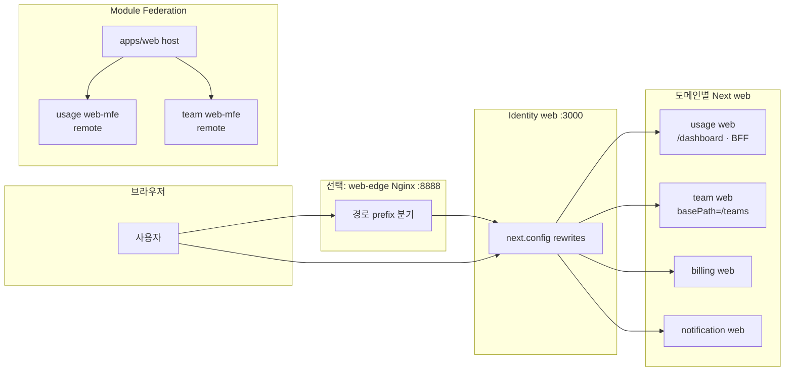

# <Team Project> AI Usage & Billing Platform (MSA) 아키텍처 문서
버전: 0.6.1

---

## 0. 관련 문서

- **MSA 이론 배경**(일반 개념·특징·API Gateway 패턴): [`docs/msa-architecture-theory.md`](msa-architecture-theory.md)
  - 본 문서(`architecture.md`)는 **이 팀 프로젝트의 구조·스택·서비스 분해**를 다룬다. 위 이론 문서는 구현과 무관한 **일반 설명**을 위한 참고 자료이다.
- **이벤트 소비·발행 흐름**(Proxy `UsageRecordedEvent` → usage·billing 소비, Billing `UsageCostFinalizedEvent` → usage 등): 본 문서 **§6**, 공유 타입·AMQP는 [`libs/usage-events`](../libs/usage-events) · 상세는 [`docs/billing-service-overview-20260412.md`](billing-service-overview-20260412.md)(부록 A 포함)
- **팀 도메인 이벤트 → 인앱 알림**: Team Service 발행 `team.events` / notification-service 소비·인앱 저장 — 본 문서 **§4.9·§6**, 페이로드 계약은 [`docs/contracts/web-team-bff.md`](contracts/web-team-bff.md) §6.2
- **사용량·집계·대시보드 관점**: 본 문서 **§6·§11**, 다이어그램은 [`docs/c4-architecture-diagrams.md`](c4-architecture-diagrams.md)
- **서비스별 DB 구성·서비스 간 데이터 전달**(물리/논리 PostgreSQL, 타 서비스 DB 직접 접근 금지, API vs RabbitMQ, 조회 성능): [`docs/msa-database-and-service-integration.md`](msa-database-and-service-integration.md)
- **Agent Service 이벤트 스냅샷/어시스턴트 개요**: [`docs/agent-service-overview-20260430.md`](agent-service-overview-20260430.md)

---

## 1. 목적과 범위

### 1.1 문제 정의
- 사용자는 OpenAI / Gemini / Claude 같은 AI Provider를 직접 호출할 때, 조직/팀/개인 단위 사용량과 비용을 “한 곳에서” 투명하게 관리하기 어렵다.
- 비용 폭증, 팀별 책임 불명확, 개인별 사용량 추적 부재, 사용량 제한(Quota/Budget) 부재가 발생한다.
- 공급사별 usage 구조가 달라 통합 분석이 어렵다.

### 1.2 목표(Goals)
- 조직 내 AI API 사용량을 투명하게 관리한다.
- 팀별 AI 비용을 자동 정산한다.
- 개인 사용자의 AI API 비용을 별도로 추적/분석한다.
- 사용량 폭증을 사전에 감지한다.
- 사용자/팀/조직별 비용 책임을 명확하게 분리한다.

### 1.3 MVP 범위(캡스톤 기준)
- 필수 기능
  - 회원가입/로그인
  - 개인 사용자 모드
  - 조직 생성
  - 팀 생성
  - API Key 등록/별칭 수정/키별 월 예산 설정/삭제 예약(7일 유예)
  - 프록시 서버를 통한 AI API 호출
  - 사용량 기록
  - 비용 계산
  - 개인 대시보드
  - 조직/팀 대시보드
- 선택 기능
  - Quota 설정(soft limit / hard block)
  - Slack/이메일 알림
  - 월별 리포트 생성(고정 주기 집계)

### 1.4 비목표(Non-Goals)
- 공급사별 완벽한 토큰 계산(가능하면 Provider의 usage 값을 신뢰하여 사용)

---

## 2. 핵심 아이디어

- 사용자는 AI Provider API를 직접 호출하지 않고, 본 플랫폼의 **Proxy 엔드포인트**로 호출한다.
- Proxy는 요청/응답을 중간에서 처리하며, usage(토큰/비용) 정보는 **RabbitMQ로 이벤트를 발행**하고 **Usage Tracking 서비스가 이를 소비해 DB에 저장**한다(Proxy가 Usage DB에 직접 쓰지 않음; §6).
- 기록된 usage를 기반으로 Billing, Quota, Notification을 비동기 이벤트로 연계한다.

### 2.1 기술 스택(결정)
- **애플리케이션 프레임워크(Proxy Service 등)**: **Spring Boot + Spring WebFlux**
  - 비동기 I/O·Provider HTTP 중계·스트리밍(SSE 등) 응답 처리에 적합하다.
  - **FastAPI(Python)는 사용하지 않는다.**
- **메시지 브로커**: **RabbitMQ** (이벤트 기반 연계의 단일 브로커)
- **기타 마이크로서비스**: 동일 Spring 생태계 내에서 **Spring MVC(Web) + JPA** 등으로 구현할 수 있다(Identity/Billing 등, 팀 합의).
- **프론트엔드(서비스 단위 풀스택)**: 사용자 대면 UI·BFF가 필요한 도메인은 **`services/<svc>/web/`** 의 **Next.js 15(App Router)**, **React 19**, **TypeScript**, **Tailwind CSS**, **Shadcn UI**(및 Radix), 차트는 **Recharts** 또는 **Chart.js** 등(팀 합의)으로 구현한다(각 패키지의 정확한 버전은 루트·해당 `package.json`·`pnpm-lock.yaml` 정본). 라우트·BFF·미들웨어 소유 경계는 `docs/contracts/web-split-boundary.md`. 런타임이 Spring과 달라도 MSA 원칙상 **HTTP API·BFF 계약**으로 연동한다.
- **Analytics·알림·집계 백엔드(백엔드 담당, 팀 합의)**: 집계·알림 워커는 **Spring MVC + JPA**, **Spring Boot + 메시지 소비**, 또는 팀 합의 하에 **Node(NestJS 등)** 로 둘 수 있다. 브로커·캐시는 §6, §10과 동일하게 **RabbitMQ**, **Redis**를 전제로 한다. 상세 책임은 **§12** 참고.

---

## 3. 전체 아키텍처(High-Level)

### 3.1 서비스 흐름(요청 흐름)
1) 사용자 요청은 단일 진입점 **web-edge(`:8888`)** 로 들어온다.  
2) web-edge가 `/api/v1/*` 를 **api-gateway-service** 로 전달하고 인증 경계 헤더를 주입한다.  
3) api-gateway가 경로별로 각 서비스(Proxy/Usage/Billing/Team/Notification/Identity)로 라우팅한다.  
4) AI 경로(`/api/v1/ai/**`)는 Proxy Service가 Provider로 중계한다.  
5) Proxy Service가 usage/비용 정보를 계산·추출해 **RabbitMQ `usage.events` / `usage.recorded`** 를 발행한다.  
6) Usage Service가 이벤트를 소비해 usage 로그를 저장하고, Billing/Analytics/Quota가 데이터를 사용해 집계·판단한다.  
7) 대시보드에서 개인/팀/조직별 비용·사용량을 조회한다.  
8) Quota/정산/알림 파이프라인이 후속 정책(경고·리포트)을 반영한다.

**((§3.1 3)–4) 단계와 병행** : usage 적재가 HTTP 동기 호출이 아니라 **메시지 브로커 이벤트**로 이어질 수 있다.

### 3.2 MSA 구성(서비스 분리 원칙)
- 각 서비스는 “하나의 기능(도메인)을” 책임지는 경계로 정의한다.
- 너무 잘게 쪼개지지 않되, 너무 비대해지지 않도록 한다.
- 데이터 소유권(Data Ownership)을 서비스 단위로 명확히 한다.

### 3.3 로컬 개발 실행 전략(캡스톤)
- **Kubernetes는 사용하지 않는다.** (배포·클러스터 운영 범위 밖)
- **의존성 인프라(DB·메시지 큐·캐시)** 는 **Docker Compose**로 기동한다.
  - 예: `PostgreSQL`, `RabbitMQ`, `Redis`
- **Proxy Service**는 **로컬(개발 PC)** 에서 실행하는 것을 기본으로 한다.
  - 이유: 프록시는 수정 빈도가 높고 스트리밍/디버깅이 중요하므로, 컨테이너보다 로컬 실행이 생산성에 유리하다.
  - 웹 UI(브라우저) 및 다른 서비스는 실행 위치(호스트/컨테이너)에 따라 `localhost` 또는 `host.docker.internal`/Compose 서비스명(`api-gateway-service` 등) + 환경변수로 브로커·DB·API 주소에 연결한다.
- 다른 애플리케이션 서비스(Identity, Usage Tracking, Team 등)도 기본은 **호스트 로컬 실행**으로 두되, 팀 합의에 따라 루트 Compose `profile: web`/서비스별 Compose에 포함해 함께 기동할 수 있다.
- **team-service**는 `TEAM_SERVICE_PORT` 없으면 기본 **8093**, **billing-service**는 `BILLING_SERVICE_PORT` 없으면 기본 **8095** — 기본값끼리는 포트가 겹치지 않는다. `scripts/bootrun.ps1`·`bootrun.sh`는 team **8094**·billing **8095**를 넣어 과거(둘 다 8093) 충돌을 피한다. API Gateway **`GATEWAY_BILLING_URI`** 기본은 **`http://localhost:8095`** 와 billing 기본 포트가 일치한다(Compose 게이트웨이는 `host.docker.internal:8095`). 스모크: `scripts/verify-expenditure-chain.ps1` / `verify-expenditure-chain.sh`.
- 루트 Compose의 **`team-service`**(`profiles: web`)는 **호스트 포트 매핑**에 **`TEAM_SERVICE_HOST_PORT`**(기본 **8093**)를 쓰고, 호스트에서 JVM으로 기동할 때의 **`TEAM_SERVICE_PORT`**(예: **8094**)와 변수명을 분리한다. 과거에는 둘 다 `TEAM_SERVICE_PORT`로 치환되어 `.env`에 **8094**를 두면 Compose가 호스트 **8094**를 Docker에 바인딩하고, 같은 머신에서 `bootRun`이 **8094**를 다시 쓰려 할 때(점유 PID가 **java**가 아니라 **Docker / wslrelay**인 유형) 충돌이 났다. **`TEAM_SERVICE_HOST_PORT`**는 Compose 전용, **`TEAM_SERVICE_PORT`**는 호스트 JVM용으로 구분한다. **`team-web`**은 같은 Compose 스택에서는 기본 **`http://team-service:8093`**, 호스트에서만 team을 띄울 때는 **`WEB_TEAM_SERVICE_URL`**을 호스트 포트에 맞춘다(`.env.example`).

---

## 4. 서비스 분해(권장안)

아래는 캡스톤에서 현실적으로 구현 가능한 권장 분해(9개 내외)이다.

### 4.0 현재 구현 배치(코드 기준)
- `services/api-gateway-service` (Spring Cloud Gateway)
- `services/proxy-service` (Spring WebFlux)
- `services/identity-service` + `services/identity-service/web`
- `services/usage-service` + `services/usage-service/web`
- `services/billing-service` + `services/billing-service/web`
- `services/team-service` + `services/team-service/web` + `services/team-service/web-mfe`
- `services/agent-service` + `services/agent-service/web`
- `services/notification-service`(NestJS/Prisma) + `services/notification-service/web`
- `services/usage-service/web-mfe` (MF remote)
- `apps/web` (web-host; 통합 호스트 용도)
- `packages/ui`, `packages/shell` (웹 공통 패키지)

### 4.1 API Gateway Service
- 역할
  - 외부 요청 진입점
  - 인증 토큰 검증, 라우팅, 공통 로깅, rate limiting
- 책임 범위
  - 서비스 간 호출을 표준화하고 외부 경로를 정리한다.
- 입력/출력
  - 사용자 요청을 내부 서비스로 라우팅하고 공통 처리만 수행
- **Gateway와 Proxy의 경로·헤더·신뢰 경계**는 [`docs/contracts/gateway-proxy.md`](contracts/gateway-proxy.md)에 정본으로 둔다(구현: `services/api-gateway-service`, `services/proxy-service`).

### 4.2 Proxy Service
- 구현 스택: **Spring WebFlux** 기반(§2.1 참고).
- 역할
  - Provider(OpenAI/Gemini/Claude)에 대한 프록시 중계
  - 요청/응답 가로채기, 스트리밍 처리, usage 정보 추출
  - usage 관련 이벤트를 **RabbitMQ**로 발행
- 책임 범위(중요)
  - “AI 호출의 실시간 처리와 Provider 연동”의 핵심 서비스
  - quota 강제는 “차단/허용 판단” 관점에서 실시간으로 수행
- **도메인·운영 경계**(Identity·Usage 등 **전용 DB를 쓰는 서비스**와 구분)
  - **전용 DB 없음:** 자체 영속 저장소를 두지 않는다.
  - **게이트웨이 뒤 전용:** 외부에서 Proxy로 이어지는 공개 진입은 API Gateway를 통한 경로만 전제로 한다(신뢰 헤더·경로 정본: [`docs/contracts/gateway-proxy.md`](contracts/gateway-proxy.md)).
  - **이벤트 발행자:** usage 관련 이벤트를 **RabbitMQ**로 발행한다.

### 4.3 Identity Service
- 역할
  - 회원가입·로그인·인증(JWT·세션 등)
  - 개인 사용자 모드
  - **조직** 생성·멤버십·권한(RBAC)
  - **팀** 생성·팀 멤버·팀 API Key는 **§4.10 Team Service**가 담당하며, Identity는 가입 사용자 식별·존재 검증 등 **Team Service와 HTTP API로 연동**한다.
- 책임 범위
  - 사용자-조직-권한 모델을 관리한다(팀 단위 멤버십·팀 키 저장은 Team Service DB 소유).
  - Quota/Key 설정의 “정책 값(설정)”을 제공한다.

### 4.4 API Key Service
- 역할
  - 공급사별 API Key 등록/수정/삭제
  - 암호화 저장 및 키 조회
- 책임 범위
  - Proxy가 요청 직전에 사용할 “자격증명”을 제공한다.
  - 키 원문이 로그/다른 서비스에 남지 않도록 한다.

**(§4.4와 병행):** 공급사 외부 API 키 등록·암호화 저장·조회 일부는 **독립 `api-key-service`가 아닌 `identity-service` 경계 안**에서 구현되어 있을 수 있다. 서비스 분해 §4.4의 책임 정의는 유지하되, 배포 단위는 팀이 합의한 경계를 따른다.

### 4.5 Usage Service
- 역할
  - **RabbitMQ**로 수신한 `UsageRecordedEvent`(Proxy 발행)를 **전용 PostgreSQL(`usage_db`)** 의 usage 로그 테이블에 영속한다. (사용자/팀/조직 단위 멀티 테넌시)
- 책임 범위
  - 이벤트에 담긴 사용자·조직·팀·API 키 식별·Provider·모델·토큰·추정 비용·요청 경로 등을 **저장 모델**로 옮겨 기록한다(구현: `services/usage-service`의 `@RabbitListener` 소비 → JPA 저장).
  - 저장된 로그는 이후 **Billing·Analytics** 등이 참조할 수 있는 **사실 데이터 원천**이 된다.
  - API Key 메타데이터는 `api_key_metadata`(`key_id`, `alias`, `status`, `updated_at`)로 분리한다. 로그(`usage_recorded_log`)는 `api_key_id`를 유지하고 조회 시 조인한다.
  - 운영·테스트 유연성을 위해 `usage_recorded_log.api_key_id` ↔ `api_key_metadata.key_id`는 JPA 연관은 두되 DB FK 제약은 강제하지 않는다(`ConstraintMode.NO_CONSTRAINT`).

### 4.6 Billing Service
- 역할
  - usage 기반 비용 계산 및 비용 기록 저장
- 책임 범위
  - 개인/팀/조직 단위 billing_record 생성 및 조회를 담당
  - 정산 금액의 “최종 진실”을 관리한다.

### 4.7 Analytics & Reporting Service
- 역할
  - 대시보드용 집계 데이터 생성
  - 월별/주별 리포트 생성(선택)
- 책임 범위
  - 사용량/비용 추세, 모델/팀/사용자 분포 등 시각화 데이터를 준비한다.
  - 보고서는 배치/스케줄러 기반으로 생성 가능하다.

### 4.8 Quota Service
- 역할
  - 예산 및 사용량 제한 정책 관리
  - 현재 예산 상태 기준으로 soft/hard 정책을 적용하기 위한 판단 로직 제공
- 책임 범위
  - 정책 값(한도, soft/hard, 기간)을 관리하고
  - Proxy의 차단 판단 또는 알림 트리거에 필요한 기준을 제공한다.

### 4.9 Notification Service
- 역할
  - Slack/Email/앱 알림 발송
  - **인앱 알림(In-App Notification) 저장·조회**(1차 범위)
- 책임 범위
  - (계획) Quota/비용 임계치 도달 이벤트를 받아 “발송만” 수행한다(§6).
  - **(1차) 인앱 알림의 진실 공급원(Source of truth)** 을 **notification-service의 PostgreSQL(`notification_db`)** 로 둔다.
    - 알림 목록·읽음 처리·테스트 발송(설정 화면에서 호출) 등은 **notification-service API**가 담당한다.
    - 사용자 세션/식별은 Identity `web`의 쿠키 기반 인증을 유지하고, **Notification `web` BFF가 서버에서 세션을 확인**한 뒤 내부 호출로 전달한다(§10.2, §13).
  - **팀 도메인 이벤트 → 인앱(비동기):** **team-service**가 RabbitMQ TopicExchange **`team.events`** 로 발행하는 팀 도메인 이벤트(본문·헤더 `eventType`, 페이로드 정본은 [`docs/contracts/web-team-bff.md`](contracts/web-team-bff.md) §6.2·Java `TeamDomainOutboundEvent`)를 **notification-service**가 큐에서 소비해 `InAppNotification` 행을 생성한다. `type` 필드는 `team:{eventType}` 형태를 사용한다. 동일 이벤트 재전송 시 중복 행 방지를 위해 **`NotificationDelivery.dedupeKey`**(채널 `in-app`)로 멱등 처리한다. `TEAM_INVITATION_ACCEPTED`는 초대한 사용자에게, `TEAM_MEMBER_JOINED`는 **참여한 사용자(`receiverId`)에게만** 인앱을 생성해 초대자에게 수락 알림과 중복되지 않게 한다. 구현·환경 변수·로컬 Compose는 **`services/notification-service/README.md`** 를 본다.
  - **팀 초대 수락/거절(동기 액션):** `TEAM_INVITE_CREATED` 인앱 알림에는 `meta.actions`로 수락/거절 경로가 포함될 수 있으며, UI는 이를 호출해 **notification-service 액션 API**(`POST /api/team-invitations/{invitationId}/accept|reject`)를 실행한다. notification-service는 team-service의 **내부 API**(`POST /internal/v1/team-invitations/{invitationId}/decision`)로 위임해 멤버십을 적용한다(계약: [`docs/contracts/web-team-bff.md`](contracts/web-team-bff.md) §6.1).
  - 외부 채널(Slack/Email)·이벤트 기반 알림은 **발행 측(Billing/Quota 등) 코드가 생긴 뒤** 연결한다(“타 서비스 코드 변경 금지” 전제에서는 후속 스프린트로 둔다).

### 4.10 Team Service
- 역할
  - 팀 생성/조회
  - 팀 멤버(아이디 기반) 초대
  - 팀 API Key 등록/조회
- 책임 범위
  - 팀 도메인의 데이터 소유권을 분리해 관리한다.
  - 팀 멤버십 기준 권한(예: 팀 멤버만 초대 가능)을 서버에서 강제한다.
  - 팀원 초대 시 Identity 사용자 존재 여부를 검증한다. 우선 RabbitMQ 기반 `identity_user_sync` 캐시를 확인하고, 필요 시 Identity 내부 API로 fallback 조회해 실제 가입된 사용자(이메일 아이디)만 초대되도록 보장한다.
  - 팀 API Key는 암호화 저장하고, 조회 시 원문 대신 마스킹된 요약만 제공한다.

---

## 5. 데이터 모델(개념 수준)

### 5.1 Usage Log(개념)
- `usage_log`
  - `log_id`
  - `user_id`
  - `organization_id`
  - `team_id`
  - `provider`
  - `model`
  - `prompt_tokens`
  - `completion_tokens`
  - `total_tokens`
  - `estimated_cost`
  - `request_path`
  - `timestamp`
- 목적
  - Provider 중립 형태로 통합 사용량/비용을 기록한다.

### 5.2 Billing Record(개념)
- `billing_record`
  - `billing_id`
  - `scope_type` (personal/team/org)
  - `scope_id`
  - `total_cost`
  - `billing_period`
  - `created_at`
- 목적
  - 책임(누가 얼마를 부담하는지) 기준으로 “정산 결과”를 저장한다.

---

## 6. 이벤트 기반 통신(Event-Driven)

### 6.1 기본 이벤트 예시
- `usage-recorded`
  - 발행 주체: Proxy Service
  - 소비 주체: **Usage Service**(저장·**API 사용량 대시보드** 원천), **Billing Service**(**비용 대시보드**·비용 집계 및 예산 대비 지출 판단의 입력).
- `usage.cost.finalized`
  - 발행 주체: Billing Service (`billing.events` exchange)
  - 소비 주체: Usage Service (`usage-service.usage-cost-finalized.queue`)
- `identity.user.account-deletion.requested` / `identity.user.account-deletion.ack`
  - 발행/소비: Identity ↔ Team 계정 삭제 코디네이션
- `identity.user.account-deletion-requested`
  - 발행 주체: Identity Service (회원 탈퇴 요청)
  - 소비 주체: Team Service (해당 사용자 팀 멤버십/초대 정리) 등
  - 후속 ACK: Team Service는 정리 완료 후 `identity.user.account-deletion-ack` 를 발행해 Identity의 삭제 코디네이션을 완료한다.
- `billing-warning` / `billing-exceeded` (계획)
  - 발행 주체: Billing Service — 예산 한도 대비 지출이 임계치에 근접·초과할 때 Notification용 이벤트 발행
  - 소비 주체: Notification Service
- `billing-updated`(선택)
  - 발행 주체: Billing Service
  - 소비 주체: Analytics Service
- 팀 도메인 이벤트(`TEAM_CREATED`, `TEAM_INVITE_CREATED`, … — **12종**, [`TeamEventTypes`](../services/team-service/src/main/java/com/zerobugfreinds/team_service/event/TeamEventTypes.java))
  - 발행 주체: **Team Service** — exchange **`team.events`**, routing key **`team-member-added`**(기본, `application.properties`로 조정 가능)
  - 소비 주체: **notification-service** — 큐 **`notification.team.events`**(기본) 등으로 구독·인앱 생성(§4.9, §6.2 토폴로지)

### 6.2 브로커 및 연동
- **브로커**: **RabbitMQ** (Kafka 등은 본 프로젝트 범위에서 사용하지 않는다).
- **연동**: Spring 생태계에서는 **Spring AMQP**(`RabbitTemplate`, `@RabbitListener` 등)로 발행·구독한다.
- **주의(WebFlux)**: `RabbitTemplate` 등 블로킹 API는 reactive 스레드에서 직접 호출하지 말고, **전용 스케줄러에 오프로드**하거나 Reactor와 호환되는 방식으로 호출해 이벤트 루프를 막지 않도록 한다.

#### 코드 기준 큐/익스체인지 토폴로지(요약)
- Proxy
  - exchange: `usage.events`
  - routing key: `usage.recorded`
- Usage
  - consume queue: `usage-service.queue` (`usage.recorded`)
  - consume queue: `usage-service.usage-cost-finalized.queue` (`billing.events` / `usage.cost.finalized`)
- Billing
  - consume queue: `billing-service.queue` (`usage.recorded`)
  - publish exchange/routing key: `billing.events` / `usage.cost.finalized`
- Team/Identity 계정 삭제 이벤트
  - queue 예: `team.account-deletion.requested.queue`, `identity.account-deletion.ack.queue`
- Team 도메인(팀 생성·초대·API 키 등)
  - publish: **Team Service** — exchange **`team.events`**, routing key **`team-member-added`**
  - consume: **notification-service** — queue **`notification.team.events`**(기본; `TEAM_EVENTS_QUEUE_NAME`로 변경 가능), 바인딩은 배포/Compose에서 `team.events`와 합의. 로컬 루트 `docker-compose.yml`의 `notification-service`는 `rabbitmq`에 의존하고 `RABBITMQ_URL`·소비자 플래그 등을 주입한다.

---

## 7. Quota(제한)와 알림 정책

### 7.1 정책 종류
- Soft Limit
  - 경고 알림, 차단은 하지 않거나 제한적으로 적용
- Hard Limit
  - 차단(요청 거부) 또는 즉시 중단

### 7.2 역할 분담(중요)
- Proxy Service(실시간 강제)
  - 요청을 받는 즉시 Redis/캐시된 카운터 또는 빠른 조회 데이터를 기반으로 “허용/거부”를 판단한다.
- Quota Service(정책/설정 소유)
  - 한도, 기간, soft/hard 방식 등 정책 값을 관리한다.
- Notification Service(알림 발송)
  - 임계치 도달에 대한 알림 전송만 수행한다.
  - “알림 계산/중복 방지/발송”에 집중한다.

---

## 8. 보안(Security) 설계 원칙

### 8.1 민감 정보 범주
- 공급사 API Key(강기밀)
- 사용량/비용 데이터(민감 정보로 취급)
- 개인 식별 정보(민감 정보로 취급)

### 8.2 Git/코드 유출 방지
- 키/비밀번호/인증서 원문은 절대 커밋하지 않는다.
- `.env` 및 시크릿 파일을 `.gitignore`로 차단한다.
- pre-commit/CI에서 비밀 스캐닝(gitleaks/trufflehog 등) 도입을 권장한다.
- **`.env.example`:** 키 **이름**과 로컬 전용 **문서화된 플레이스홀더**만 둔다. 실 운영 비밀은 커밋하지 않는다. CI·gitleaks와의 관계는 `docs/CI.md`를 본다.

### 8.3 저장/전송 시 암호화
- API Key는 DB에 평문 저장 금지
- 암호화 저장(AES-256-GCM 등) + 마스터키는 환경변수(또는 로컬 Secret)로 관리
- 복호화는 필요한 서비스 내부에서만, 요청 직전에만 수행한다.

### 8.4 테넌트 경계 강제
- 모든 조회/수정 API는 서버에서 `org_id/team_id/user_id` 스코프를 강제한다.
- 클라이언트가 전달한 org_id를 그대로 신뢰하지 않는다.
- RBAC(Role-Based Access Control) 적용

### 8.5 로그 마스킹
- Authorization 헤더, API Key, 비밀값은 로그에 남기지 않거나 마스킹한다.
- 요청/응답 전문 로깅을 운영/디버그 모드에서 제한한다.

---

## 9. 관측 가능성(Observability)

### 9.1 필수 관측
- 중앙 집중 로그(어느 요청이 실패했는지, 어느 서비스에서 실패했는지 추적)
- 메트릭(에러율, 응답시간, 요청 수)
- 분산 트레이싱(프록시 기반 요청 흐름 추적)

### 9.2 캡스톤 추천 도구
- Prometheus + Grafana
- Loki + Grafana(로그)
- Jaeger/Zipkin(트레이싱, 시간 허용 시)

---

## 10. 최소 인프라 스택(권장)

본 프로젝트는 **배포·Kubernetes 클러스터를 사용하지 않는다**는 전제에서 아래를 따른다.

### 10.1 컨테이너·배포 패턴 (팀 확정)

배포 시 **단일 Docker 이미지 안에 백엔드·프론트를 한꺼번에 넣고 supervisord 등으로 멀티프로세스 기동하는 방식(패턴 A)** 과, **서비스·계층마다 이미지를 나누고 Docker Compose로 스택을 올리는 방식(패턴 B)** 을 검토했으며, **패턴 B로 확정**한다.

| 구분 | 패턴 A (비채택) | 패턴 B (팀 확정) |
|------|----------------|------------------|
| 이미지 | 하나의 이미지에 여러 프로세스(예: API + 웹) | **백엔드 마이크로서비스별·도메인별 `web/`** 로 **이미지 분리** |
| 런타임 | 컨테이너 내부 프로세스 관리(supervisord 등) | **Docker Compose**로 서비스별 컨테이너를 조합 |

- **원칙**: Spring Boot 서비스는 **해당 서비스 디렉터리**의 `Dockerfile`로 빌드하고, Next.js는 **`services/<svc>/web/Dockerfile`**(standalone)로 빌드하되 **build context는 저장소 루트**(루트 `pnpm` workspace·`packages/ui` 포함)를 쓴다. 운영·스테이징에서도 **Compose(또는 동등한 오케스트레이션)로 각 이미지를 나란히 띄우는 모델**을 따른다.
- **로컬**: 루트 `docker-compose.yml`은 인프라·일부 앱(예: proxy·gateway)을 포함할 수 있으며, **웹 컨테이너는 `profile: web`(`identity-web`, `usage-web`, `web-edge`) 등으로 선택 기동**해 호스트 개발과 병행할 수 있다. 호스트에서 Next를 직접 띄울 때는 저장소 루트 **`pnpm install`** 후 **`pnpm --filter identity-web dev`** / **`pnpm --filter usage-web dev`** 등(`packages/ui` workspace 포함 — `README.md`, `docs/repository-structure.md` §6).
- 동일 `profile: web` 선택 시 루트 `docker-compose.yml`에는 위에 더해 `team-web`, `team-service` 컨테이너가 포함될 수 있고, 팀 도메인 전용 DB는 `postgres-team` 등 별도 PostgreSQL 컨테이너로 둘 수 있다(`docs/repository-structure.md` §2 참고).
- **Compose 환경변수:** `docker compose`는 루트 **`.env`**만 자동 로드한다. `GATEWAY_SHARED_SECRET`처럼 compose 파일에서 `${VAR:-}` 형태로 넘기는 값은, `.env`에 **빈 할당(`VAR=`)만** 있으면 컨테이너에 빈 문자열이 들어가 **Spring `application.yml`의 기본값이 적용되지 않을 수 있다**(게이트웨이 기동 실패 등). **비어 있지 않은 값**으로 맞추거나 변수 줄을 제거하고, 게이트웨이·Proxy·usage-service의 공유 비밀은 [`docs/contracts/gateway-proxy.md`](contracts/gateway-proxy.md) §5와 동일하게 유지한다.
- **`billing-web`:** 팀 지출 롤업 BFF가 서버에서 팀 멤버 API를 호출할 때, 컨테이너 간 DNS로 **`identity-web:3000`** 에 붙도록 루트 `docker-compose.yml`에 **`BILLING_TEAM_BFF_BASE_URL`** 기본값과 **`depends_on: identity-web`** 을 둔다. 호스트에서만 Identity Next를 띄우는 등 예외는 루트 `.env`의 동일 변수로 덮어쓴다(예시·설명: 루트 `.env.example`, [billing-service-overview-20260412.md](billing-service-overview-20260412.md) §4.10, [web-split-boundary.md](contracts/web-split-boundary.md) §2.7).

### 10.2 단일 도메인·엣지 라우팅(브라우저 URL 하나)

운영·로컬 통합 진입점에서 **호스트명은 하나**로 두고, **경로 prefix**로 트래픽을 나누는 것을 권장한다.

- **엣지:** Nginx·Traefik 등 **리버스 프록시** 한 계층에서 `location`(또는 동등 규칙)으로 upstream을 고정한다.
- **로컬 Compose(`profile: web`):** **`web-edge`** 서비스(이미지 `nginx`, 설정 **`docker/web-edge/nginx.conf.template`**)가 기본 **`${WEB_EDGE_PORT:-8888}:80`** 으로 호스트에 노출된다. 현재 저장소 규칙(정본은 설정 파일): `/dashboard`, `/billing`, `/teams`, `/notifications` 는 각각 해당 `web` 서비스로 프록시하고, `/api/v1`·`/api/v1/*` 는 **API Gateway**로 프록시한다(스트리밍 대비 **`proxy_buffering off`**·긴 read timeout). 그 외 경로는 기본적으로 **identity `web`** 으로 전달한다. (운영 엣지는 팀이 동일한 의미로 맞춘다.)
- **Usage Next `basePath`:** 단일 도메인에서 `/_next` 등 충돌을 피하기 위해 Usage 쪽 기본값은 **`/dashboard`**(`NEXT_PUBLIC_BASE_PATH`, Compose 빌드 args). 브라우저의 Usage BFF는 **`/dashboard/api/usage/...`** 형태가 된다(`docs/contracts/web-split-boundary.md`, `web-gateway-bff.md`).
- Team `web`은 단일 도메인에서 **`/teams`** 접두를 **`basePath`** 로 쓸 수 있다(구현: `services/team-service/web`).
- **쿠키·세션:** 동일 **`Site`/도메인**에서 경로만 나뉘면 `httpOnly` 세션 쿠키는 대부분 유지 가능하지만, **`Path`·`SameSite`** 는 분리 후 반드시 재검증한다(BFF 계약: `docs/contracts/web-identity-bff.md`).

- **로컬 개발(필수에 가까운 구성)**
  - **Docker Compose**: `PostgreSQL`, `RabbitMQ`, `Redis` 등 의존성 컨테이너 기동
  - 루트 Compose에서는 Identity·team·usage 등 **서비스별 전용 PostgreSQL 컨테이너**를 둘 수 있다.
  - **애플리케이션(Proxy WebFlux 등)**: 로컬 JVM에서 실행(IDE/터미널)하거나, 패턴 B에 맞게 **서비스별 이미지**로 Compose에 포함
- **선택**
  - API Gateway·Proxy: 저장소 `docker-compose.yml`에 포함 가능(계약: `docs/contracts/gateway-proxy.md`)
  - Next.js: **도메인별 `services/<svc>/web`** — `docker compose --profile web up` 시 **`identity-web`**, **`usage-web`**, **`web-edge`**(루트 `docker-compose.yml`). 구 통합 앱 경로 `apps/web`에는 안내용 `README.md`만 둔다(`docs/repository-structure.md` §6.2).
  - 동일 프로필에서 **`team-web`**(및 필요 시 **`team-service`**)이 함께 포함될 수 있다.
  - GitHub Actions(CI): 저장소 정책에 따라 도입(`docs/CI.md`)
  - Prometheus + Grafana, Loki, Jaeger: 시간 여유 시(관측 강화)
- **Kubernetes / Ingress / ConfigMap·Secret(K8s)**
  - 현재 범위에서는 **사용하지 않음**. 설정·비밀값은 **환경변수·`.env`(비커밋)·GitHub Secrets** 등으로 관리한다.

---

## 11. 서비스 간 책임 요약(개발자 참고)

- Proxy Service: “AI 요청을 실제 Provider로 전달하고, usage(토큰·비용) 정보를 **RabbitMQ 이벤트로 발행**한다(Usage DB에 직접 쓰지 않음; §2·§6).”
- Usage Service: “**이벤트 소비·usage 로그 영속**(전용 DB) 및 **API 사용량 대시보드** 관련 데이터·API(§4.5·§6).”
- Billing Service: “usage 기반 **비용 산출·정산·billing_record** 및 **비용 대시보드**; **예산 한도 대비 지출** 판단 후 **(계획)** Notification용 이벤트 발행(§6).”
- Analytics & Reporting Service: “추가 **집계·리포트** 파이프라인(팀이 별도 서비스로 둘 때 §12와 연계); 사용량 **요약·차트**의 일부는 현재 Usage 경계에서 노출될 수 있다.”
- Quota Service: “예산/제한 정책 소유 및 초과 기준 제공(§7).”
- Notification Service: “Slack/Email 등 외부 알림 발송 + **(1차) 인앱 알림 저장·조회**(전용 DB). **(계획)** Billing이 발행하는 **예산·임계** 알림 이벤트 소비(§6).”
- Identity Service: “인증·사용자·**조직**·멤버십·RBAC; 팀 도메인은 **Team Service**와 HTTP API로 연동(§4.3·§4.10).”
- Team Service: “팀·팀원·팀 API Key 등 **팀 도메인** 데이터 소유·API(§4.10).”
- API Key Service: “(논리 경계) 공급사 API Key 암호화 저장/조회; 구현 위치는 **identity-service** 등 팀 합의 경계(§4.4).”
- **인프라·배포·웹 진입:** 패턴 B **이미지 분리**, 루트 **Docker Compose**, 선택 **`profile: web`**·**`web-edge`**·**`team-web`/`team-service`**·서비스별 DB 등은 **§10** 참고.
- **집계·알림 전담 백엔드(Analytics·Notification 등)**: 아래 **§12** 참고 — **도메인 UI(`web/`) 담당과 동일 사람이 아닐 수 있음**(서비스 경계 유지).
- **서비스 단위 웹·BFF**: 아래 **§13** 참고.

---

## 12. 백엔드 — Analytics·Reporting·Notification (집계·알림)

**§4.7 Analytics & Reporting**, **§4.9 Notification** 에 해당하는 **추가 집계·알림·리포트 파이프라인**(팀이 별도 마이크로서비스 또는 모듈로 둘 때)을 다룬다. **API 사용량 대시보드**는 **Usage Service**, **비용 대시보드**는 **Billing Service** 가 각각 담당할 수 있음은 §4.5·§4.6·§11과 같다. 구현 주체는 팀 합의에 따르며, **Identity·Usage 등 각 도메인의 `web/` 풀스택 작업**과 **혼동하지 않는다**(UI는 API를 소비할 뿐, 본 절의 **별도** 파이프라인·워커 구현 책임과 구분한다).

### 12.1 담당 서비스·산출물

- **Usage Service**: **`usage-recorded`** 소비·로그 영속 및 **사용량 대시보드**용 조회·집계(§4.5·§6·§11).
- **Billing Service**: **`usage-recorded`** 를 비용 산출·**비용 대시보드** 입력으로 쓰고, **(계획)** `billing-warning` / `billing-exceeded` 등으로 **Notification**에 알림을 넘긴다(§6·§11).
- **Analytics & Reporting Service**(또는 동일 책임의 모듈): Usage·Billing **허용 API** 또는 후속 이벤트를 바탕으로 한 **추가** 집계 API·리포트 생성 파이프라인.
- **Notification Service**(또는 동일 책임의 워커): Slack·이메일 등 외부 채널 발송; **(계획)** Billing 발행 **예산·임계** 이벤트 소비(§4.9·§6).

### 12.2 데이터 집계(Aggregation)

- **입력**: **`usage-recorded`**(§6.1)는 **Usage**·**Billing** 이 주 소비·활용 주체이며, 별도 Analytics 파이프라인은 **Usage/Billing DB에 JDBC 직접 접근 없이** 이들을 조회하는 **허용된 API**·이벤트만 사용한다(`docs/repository-structure.md` 참고).
- **처리 방식**: 실시간 스트림 소비(**RabbitMQ** 소비자)와 **배치·스케줄 기반** 집계를 병행할 수 있다.
- **산출 예시**: 일별·월별·모델별·팀/조직별 **비용·토큰 통계**, 대시보드용 요약 시계열(일부는 Usage·Billing 경계에서 제공하고, 확장·장기 리포트는 Analytics 등).
- **실시간 성능**: 대시보드 조회 부하 완화를 위해 **Redis** 카운터(예: 기간·스코프별 `INCRBY`)로 당일/당월 누적을 유지하는 패턴을 사용할 수 있다(§3.3·§10의 Redis 전제와 연계).

### 12.3 알림 엔진(Notification)

- **입력**: Quota/비용 **임계치**(예: 예산 **80%**, **100%**)는 **Quota Service·Billing·Identity 등이 제공하는 정책·집계**를 기준으로 한다(§7).
- **동작**: 조건 충족 시 **Slack Webhook**, **이메일(Resend 등)** 등으로 발송; **동일 임계치에 대한 중복 알림 방지** 및 최소한의 **발송 이력**을 둔다(§4.9).
- **이벤트 연계**: `quota-warning` / `quota-exceeded` 등(§6.1)을 소비해 “발송만” 수행하는 구조를 권장한다.

### 12.4 리포트 생성(Reporting)

- **주기**: 월별·주별 등 팀이 정한 주기로 **사용량·비용 분석 리포트**를 생성한다(MVP 선택 기능, §1.3).
- **형식**: **JSON** API로 내려주거나, **PDF**(렌더링 라이브러리·헤드리스 브라우저 등 팀 합의), **CSV** 다운로드 등을 제공할 수 있다.

### 12.5 비용 분석(가공)

- 공급사·모델 간 **비용 효율성 비교**를 위한 파생 지표(예: 단위 토큰당 비용, 모델별 점유율)를 산출해 **API·리포트**로 노출할 수 있다. 프론트엔드는 이 데이터를 소비해 표시한다(§13).

---

## 13. 서비스 단위 웹·BFF(풀스택 소유)

**별도 “프론트 전담” 역할을 두지 않는다.** 각 도메인 서비스를 맡은 팀·개발자가 **같은 저장소 경계 안에서 Spring 앱과(필요 시) `web/` Next 앱**을 함께 유지한다(`docs/repository-structure.md` §6).

### 13.1 담당·연동

- **Identity 계열**: `services/identity-service` + `services/identity-service/web/` — 랜딩·인증·조직/팀 설정 UI, `/api/auth/**`·`/api/identity/**` BFF 등. 계약: `docs/contracts/web-identity-bff.md`.
- **Usage·대시보드 계열**: `services/usage-service` + `services/usage-service/web/` — 사용량 대시보드, `/api/usage/**` BFF → 게이트웨이. 계약: `docs/contracts/web-gateway-bff.md`, `docs/contracts/gateway-proxy.md`.
- **Team 계열**: `services/team-service` + `services/team-service/web/` — 팀 도메인 REST·Team BFF. 팀 API Key·월 예산(USD)은 **Identity `web`의 `/teams`** 에서도 계정 설정의 개인 외부 키와 유사한 UX로 제공할 수 있으며, 동일 API는 **team `web`**(`basePath=/teams`)에서도 사용 가능하다. 브라우저 → `/api/team/v1/**` → Team BFF → `team-service`. 계약: `docs/contracts/web-team-bff.md`.
- **Notification 계열**: `services/notification-service` + `services/notification-service/web/` — 인앱 알림 UI(`/notifications/*`) + Notification BFF(`/notifications/api/notification/*`) → notification-service(Nest) 내부 호출. 계약: `docs/contracts/web-notification-bff.md`.
- **`/teams` 진입 방식:** **단일 도메인 `web-edge`** 를 쓰면 `/teams/*` 를 **team `web`** 으로 넘길 수 있다. **Identity `web`만** 띄울 때는 `/teams` 페이지에서 팀·키·예산을 다루고 Next rewrite로 `/api/team/v1/**` 를 team `web` BFF(및 `team-service`)로 넘긴다.
- **웹 경계**: `docs/contracts/web-split-boundary.md` — 경로·BFF·미들웨어 변경 시 **본 문서·계약 문서**를 코드와 같이 갱신한다.
- **Proxy·API Gateway**: 공개 AI·Usage HTTP 진입·신뢰 헤더 — 게이트웨이·프록시 구현 팀과 **HTTP 계약**만 맞춘다.

### 13.2 대시보드·시각화·보안(UI)

- **권한별 UI**: 로그인 사용자의 **역할(RBAC)** 에 따라 뷰를 구분한다(§8.4).
- **시각화**: §12 등이 노출하는 **집계·조회 API** 응답을 차트·테이블로 표현한다.
- **보안**: 공급사 API Key·내부 토큰을 **브라우저 번들에 넣지 않는다**(§8). 플랫폼 JWT는 BFF·`httpOnly` 쿠키 패턴을 유지한다.

### 13.3 브라우저 통합·Module Federation (`rewrites` · `web-mfe`)

- **Identity `web`을 통한 앱 간 연결(고속도로):** `services/identity-service/web/next.config.ts`의 **`async rewrites()`** 는 브라우저 요청 경로를 **내부 오리진**(Compose·로컬에서 `USAGE_WEB_INTERNAL_ORIGIN`, `TEAM_WEB_INTERNAL_ORIGIN` 등)의 **Usage·Team·Billing·Notification `web`** 으로 넘긴다. 단일 호스트·단일 오리진 UX를 유지하면서 서비스별 Next 앱을 나란히 두는 **정본 라우팅 계층**이며, 운영·로컬에서 Nginx **`web-edge`**(§10.2)와 함께 “어떤 URL이 어느 컨테이너로 가는지”를 정의한다.
- **`usage-service`·`team-service`의 디렉터리 분리:** 각각 **`web/`**(App Router·BFF·운영 UI)과 **`web-mfe/`**(Pages Router·**Module Federation** remote 전용)로 나뉜다. **`web-mfe`** 는 원격 엔트리(`exposes`)만 노출하고, 호스트는 **`apps/web`(web-host)** 등에서 `remotes`로 붙인다. 상세·작업 절차는 **`docs/mfe-pages-only-remote-split-guidance-20260414.md`**.
- **공통 UI:** 사이드바·헤더·콘솔 네비는 **`packages/shell`** · **`packages/ui`** 를 사용한다(`docs/repository-structure.md` §6).
- **라우트 변경 시:** 새 **최상위 브라우저 접두**를 도입하거나 BFF 경로를 바꿀 때는 **Identity `rewrites`**(및 필요 시 **`docker/web-edge/nginx.conf.template`**)를 함께 갱신한다(`docs/contracts/web-split-boundary.md`, `docs/howto-add-console-sidebar-route.md`).

---

## 14. 문서 유지 규칙(팀 공통)
- 아키텍처 변경(서비스 경계/이벤트/테이블 소유권)이 발생하면 이 문서를 먼저 업데이트한다.
- 서비스 추가/삭제는 “책임(도메인) 기준”으로 판단한다.
- 이벤트 스키마/키 이름은 문서에 명시한다.
- 요청·이벤트 흐름 시각화: `docs/sequence-diagrams.md` (Mermaid)를 함께 갱신한다.
- **§12(백엔드 집계·알림)** 또는 **§13(서비스 단위 웹·BFF)**·**§2.1**·**§10.2(단일 도메인)** 범위가 바뀌면 해당 절을 함께 갱신한다.
