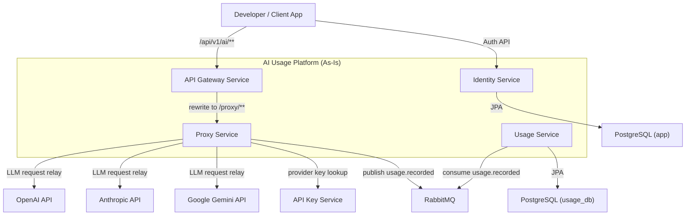
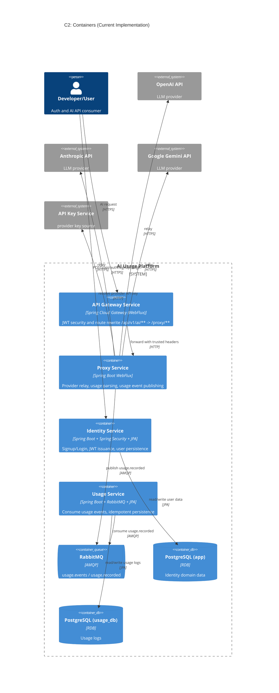
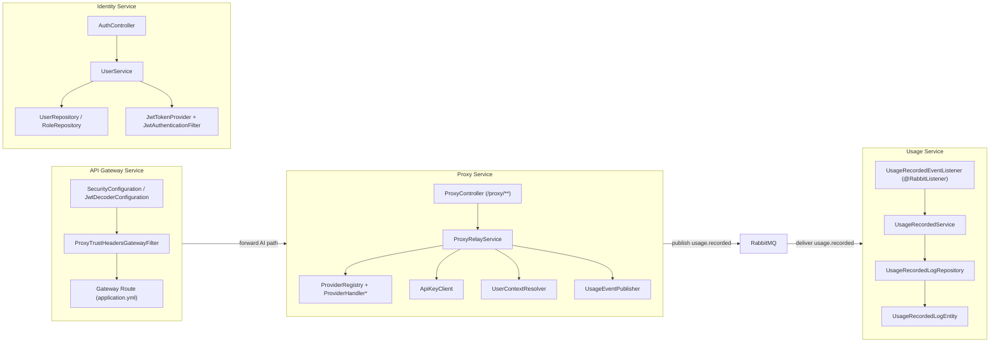
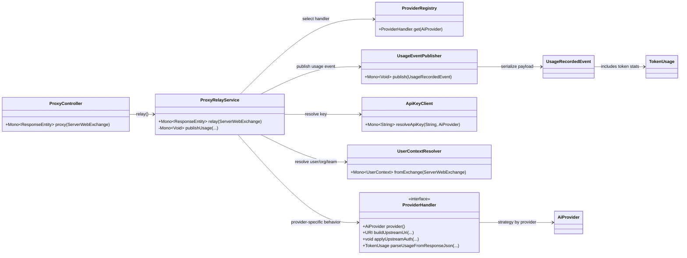
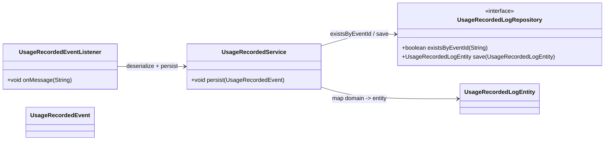
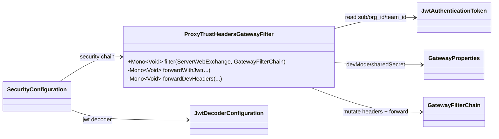
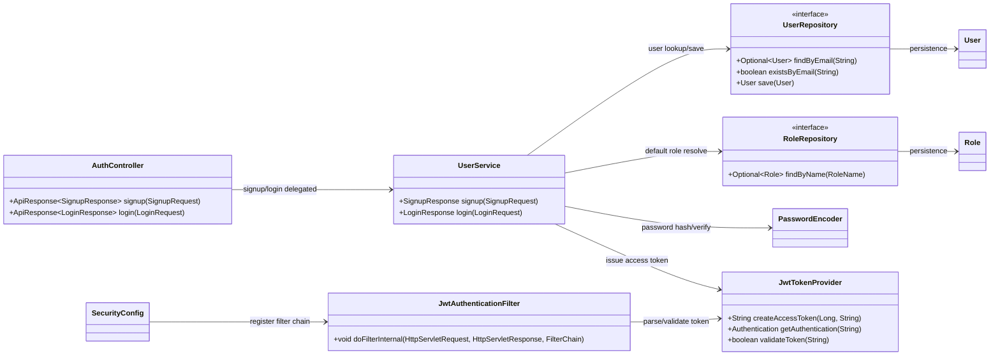

# AI Usage & Billing Platform - C4 Architecture Diagrams (Code As-Is)

이 문서는 목표 설계가 아니라, 현재 저장소에 존재하는 구현 코드 기준으로
시스템 아키텍처를 C4 모델(C1 → C4)로 정리한다.

분석 대상:
- `services/api-gateway-service`
- `services/proxy-service`
- `services/identity-service`
- `services/usage-service`
- `libs/usage-events`
- 서비스별 `application.yml`/`application.properties`

## C1 - System Context

## C2 - Container Diagram

## C3 - Component Diagram (Cross-Service Runtime Flow)

## C4 - Code Diagram (Proxy Relay Core)

## C4 - Code Diagram (Usage Persistence Core)

## C4 - Code Diagram (Gateway Trust Header Flow)

## C4 - Code Diagram (Identity Auth Core)

## 참고 코드/문서

- `services/api-gateway-service/src/main/resources/application.yml`
- `services/api-gateway-service/src/main/java/com/eevee/apigateway/filter/ProxyTrustHeadersGatewayFilter.java`
- `services/proxy-service/src/main/java/com/eevee/proxyservice/web/ProxyController.java`
- `services/proxy-service/src/main/java/com/eevee/proxyservice/relay/ProxyRelayService.java`
- `services/proxy-service/src/main/java/com/eevee/proxyservice/mq/UsageEventPublisher.java`
- `services/usage-service/src/main/java/com/eevee/usageservice/consumer/UsageRecordedEventListener.java`
- `services/usage-service/src/main/java/com/eevee/usageservice/service/UsageRecordedService.java`
- `services/identity-service/src/main/java/com/zerobugfreinds/identity_service/controller/AuthController.java`
- `services/identity-service/src/main/java/com/zerobugfreinds/identity_service/service/UserService.java`
- `services/identity-service/src/main/java/com/zerobugfreinds/identity_service/security/JwtTokenProvider.java`
- `services/identity-service/src/main/java/com/zerobugfreinds/identity_service/security/JwtAuthenticationFilter.java`
