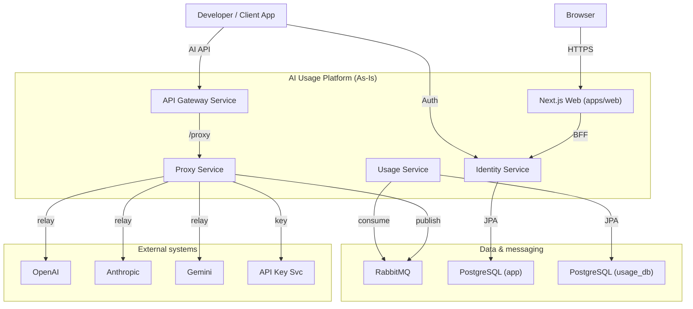
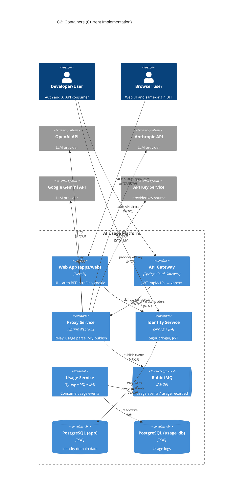
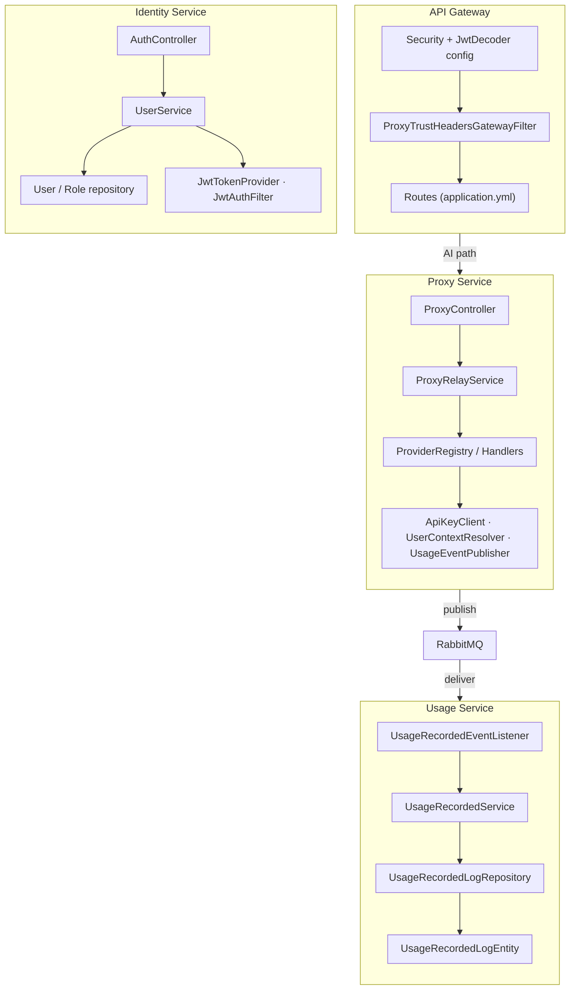
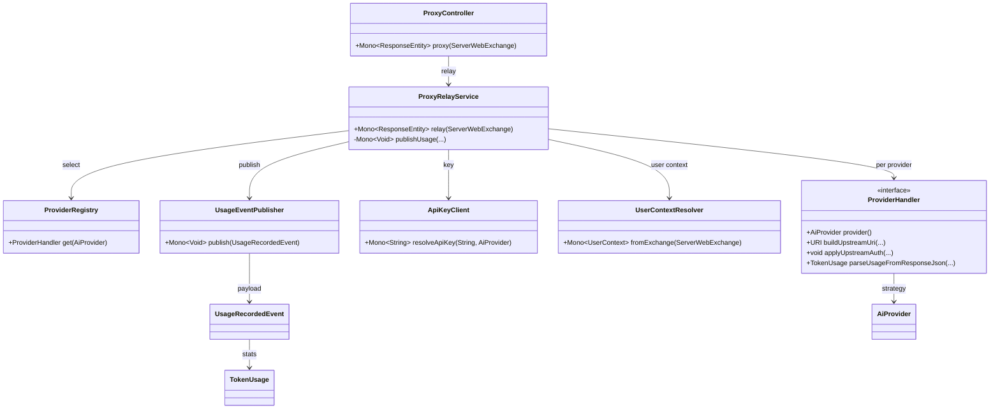
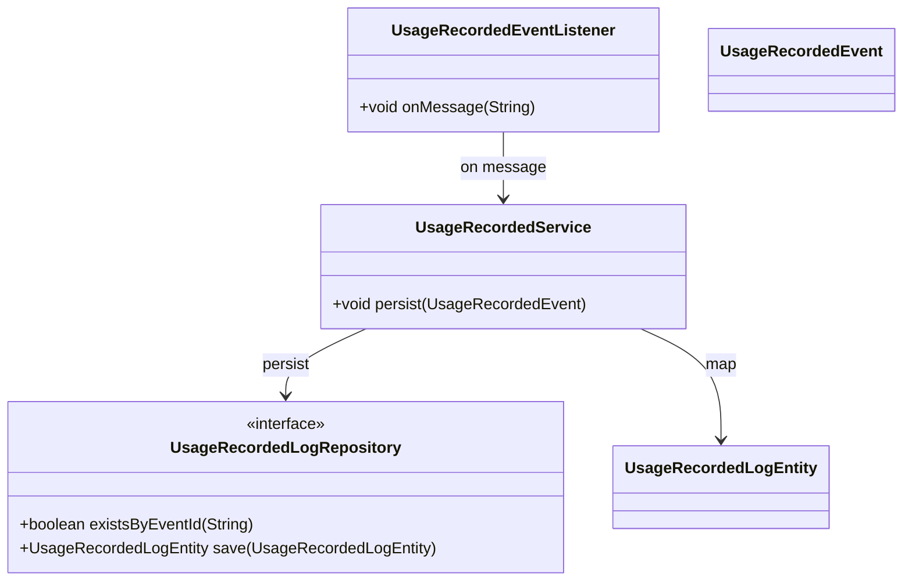
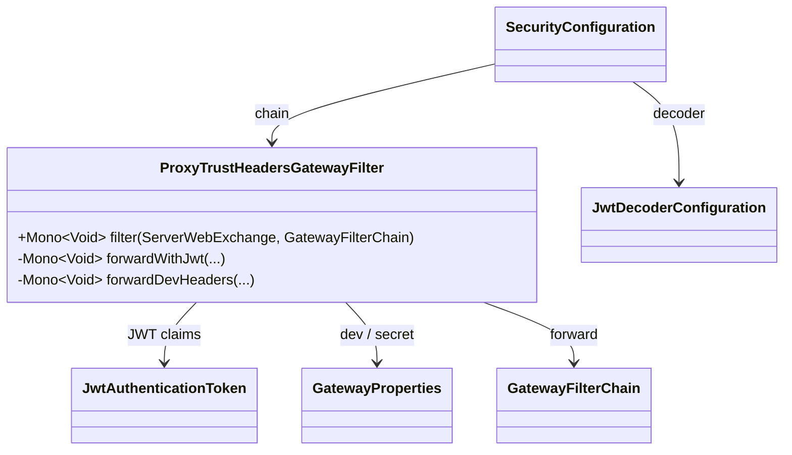
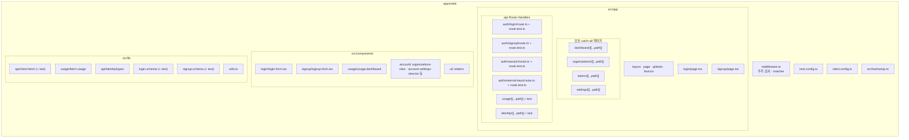
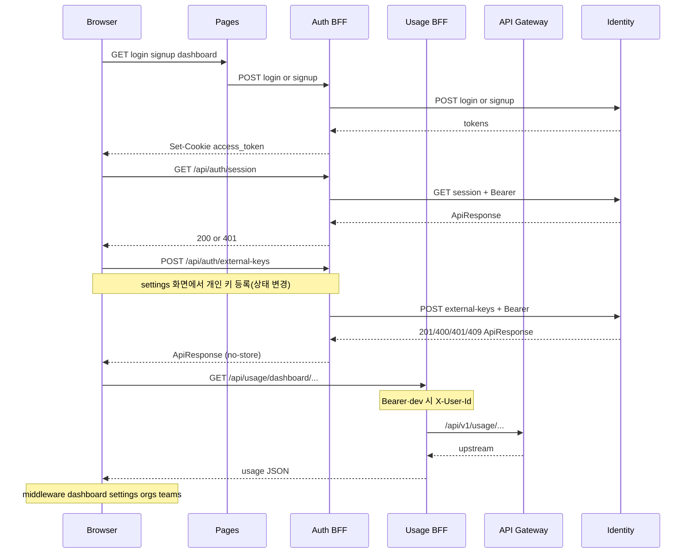
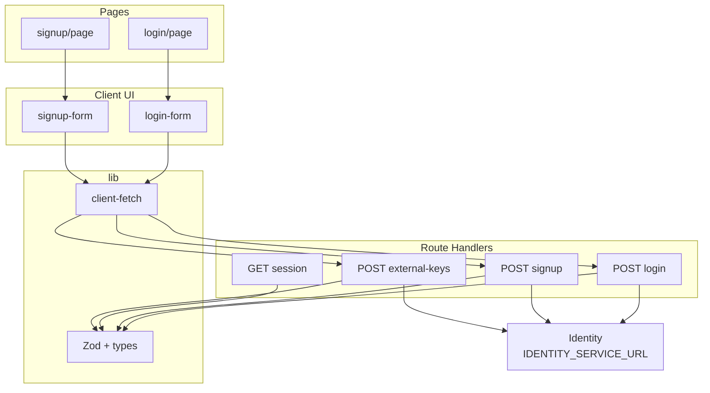
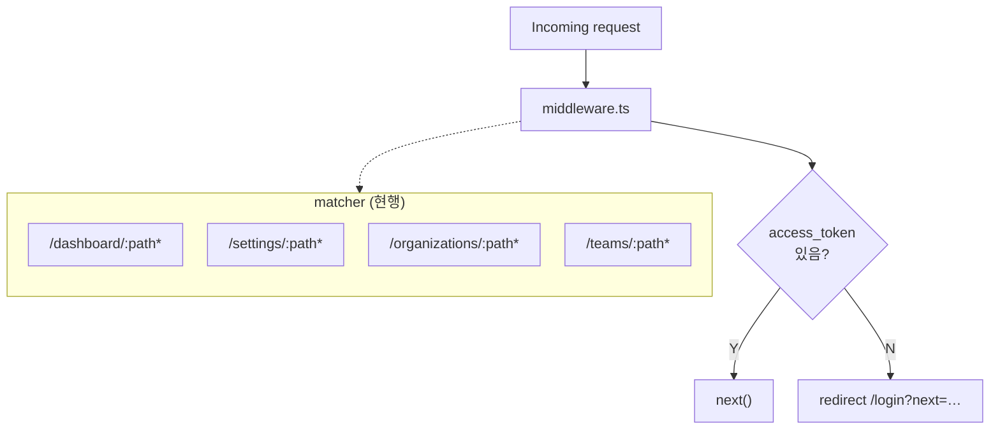

# AI Usage & Billing Platform - C4 Architecture Diagrams (Code As-Is)

이 문서는 목표 설계가 아니라, 현재 저장소에 존재하는 구현 코드 기준으로
시스템 아키텍처를 C4 모델(C1 → C4)로 정리한다.

분석 대상:
- `apps/web` (Next.js UI + BFF Route Handlers, 팀원 C · Frontend)
- `services/api-gateway-service`
- `services/proxy-service`
- `services/identity-service`
- `services/usage-service`
- `libs/usage-events`
- 서비스별 `application.yml`/`application.properties`

## C1 - System Context

화살표 라벨은 짧게 두었고, 상세는 노드 설명·본문을 보면 된다.

## C2 - Container Diagram

## C3 - Component Diagram (Cross-Service Runtime Flow)

## C4 - Code Diagram (Proxy Relay Core)

## C4 - Code Diagram (Usage Persistence Core)

## C4 - Code Diagram (Gateway Trust Header Flow)

## C4 - Code Diagram (Identity Auth Core)

## Web Application (`apps/web`) — 구조·흐름 (팀원 C · Frontend)

**목적:** 브라우저 대상 UI와 인증 BFF를 **현재 저장소 트리 기준(As-Is)** 으로 시각화한다. **팀원 C(프론트)** 가 라우트·컴포넌트·BFF를 바꿀 때 **이 절의 다이어그램과 불릿 목록을 함께 갱신**한다. (집계·알림 **백엔드**는 `docs/architecture.md` §12.)

**동기화 체크리스트 (PR 또는 주기적으로):**

1. `apps/web/src/app` 아래 **새 `page.tsx` / `route.ts` / 동적 세그먼트**가 생기면 디렉터리 맵·흐름도에 반영한다.
2. `middleware.ts`의 **`config.matcher`** 가 바뀌면 미들웨어 다이어그램과 설명을 맞춘다.
3. BFF가 Identity·게이트웨이를 호출하는 방식이 바뀌면 시퀀스 다이어그램을 수정한다(계약은 `docs/contracts/web-identity-bff.md`, Usage 프록시는 `docs/contracts/web-gateway-bff.md`).
4. **구현과 계약 문서가 어긋나면 다이어그램은 코드 우선**으로 두고, 계약 문서 정리는 별도 작업으로 남긴다.

### W1 — 디렉터리·파일 맵 (논리 트리)

> 파일 단위 나열. `*.test.ts` 는 같은 폴더에 두는 패턴을 유지한다.

### W2 — 런타임 흐름 (브라우저 ↔ BFF ↔ Identity·게이트웨이)

> **현행 구현 기준:** `POST` 로그인·회원가입은 Identity로 프록시 후 httpOnly `access_token` 쿠키 설정. **`GET /api/auth/session`** 은 BFF가 **Identity `GET /api/auth/session`** 을 Bearer로 호출해 본문을 검증·전달한다. 대시보드 사용량은 브라우저가 **`GET /api/usage/...`** 로 호출하면 Usage BFF가 **`{API_GATEWAY_URL}/api/v1/usage/...`** 로 프록시한다(`GATEWAY_DEV_MODE` 시 Identity 세션으로 `X-User-Id` 보강). 계약: `docs/contracts/web-identity-bff.md`, `docs/contracts/web-gateway-bff.md`, `docs/contracts/gateway-proxy.md`.

### W3 — 레이어 관계 (UI · 공용 클라이언트 · BFF · 도메인 라이브러리)

### W4 — 미들웨어와 보호 경로

`matcher` 가 가리키는 경로에 대응하는 **`app/dashboard/...` 등 페이지**를 추가·이동하면, W1 트리와 `docs/repository-structure.md` 도 함께 업데이트한다.

## 참고 코드/문서

- `apps/web/middleware.ts`
- `apps/web/src/app/api/auth/login/route.ts`
- `apps/web/src/app/api/auth/login/route.test.ts`
- `apps/web/src/app/api/auth/signup/route.ts`
- `apps/web/src/app/api/auth/signup/route.test.ts`
- `apps/web/src/app/api/auth/session/route.ts`
- `apps/web/src/app/api/auth/session/route.test.ts`
- `apps/web/src/app/api/auth/external-keys/route.ts`
- `apps/web/src/app/api/auth/external-keys/route.test.ts`
- `apps/web/src/app/api/usage/[[...path]]/route.ts`
- `apps/web/src/app/api/identity/[[...path]]/route.ts`
- `docs/contracts/web-identity-bff.md`
- `docs/contracts/web-gateway-bff.md`
- `services/api-gateway-service/src/main/resources/application.yml`
- `services/api-gateway-service/src/main/java/com/eevee/apigateway/filter/ProxyTrustHeadersGatewayFilter.java`
- `services/proxy-service/src/main/java/com/eevee/proxyservice/web/ProxyController.java`
- `services/proxy-service/src/main/java/com/eevee/proxyservice/relay/ProxyRelayService.java`
- `services/proxy-service/src/main/java/com/eevee/proxyservice/mq/UsageEventPublisher.java`
- `services/usage-service/src/main/java/com/eevee/usageservice/consumer/UsageRecordedEventListener.java`
- `services/usage-service/src/main/java/com/eevee/usageservice/service/UsageRecordedService.java`
- `services/identity-service/src/main/java/com/zerobugfreinds/identity_service/controller/AuthController.java`
- `services/identity-service/src/main/java/com/zerobugfreinds/identity_service/service/UserService.java`
- `services/identity-service/src/main/java/com/zerobugfreinds/identity_service/security/JwtTokenProvider.java`
- `services/identity-service/src/main/java/com/zerobugfreinds/identity_service/security/JwtAuthenticationFilter.java`
