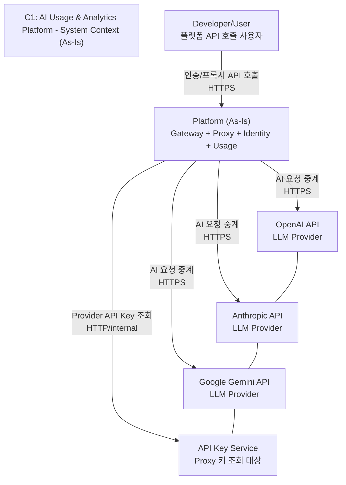
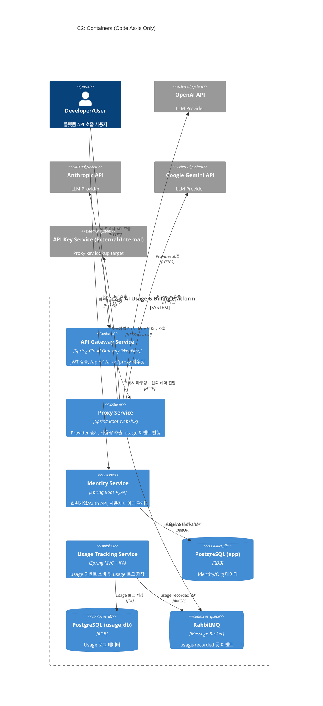
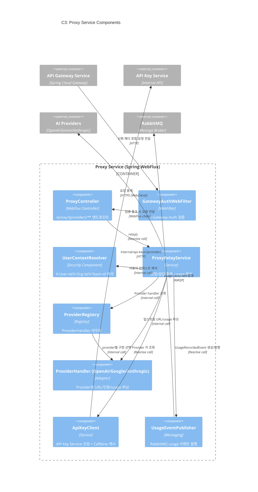
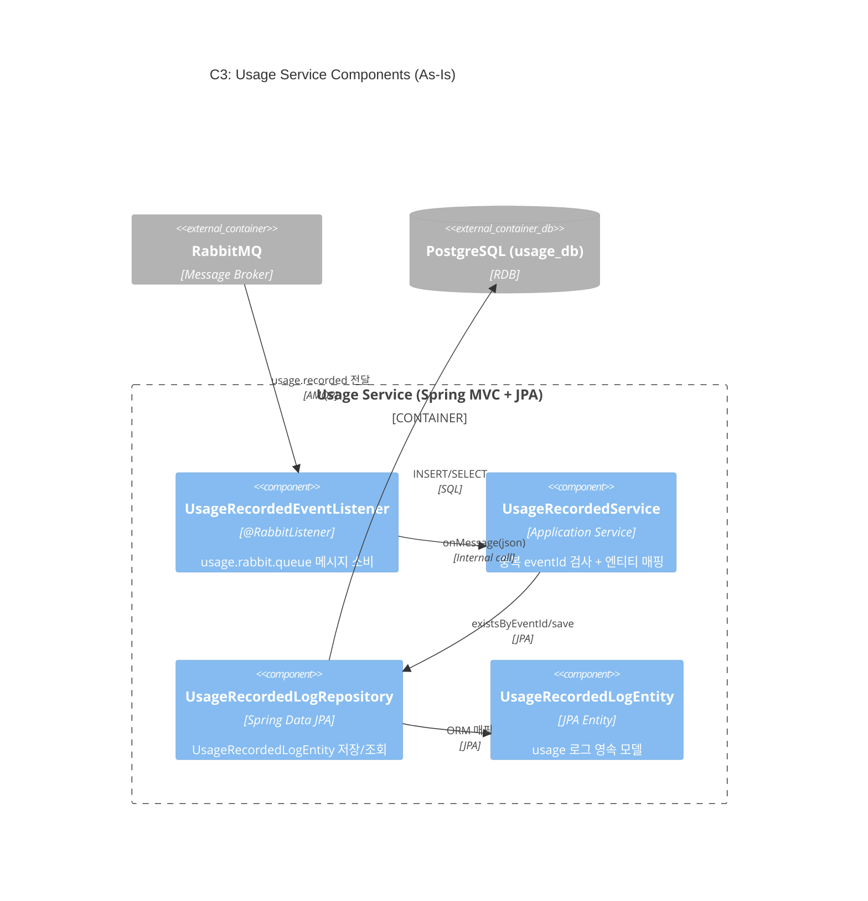
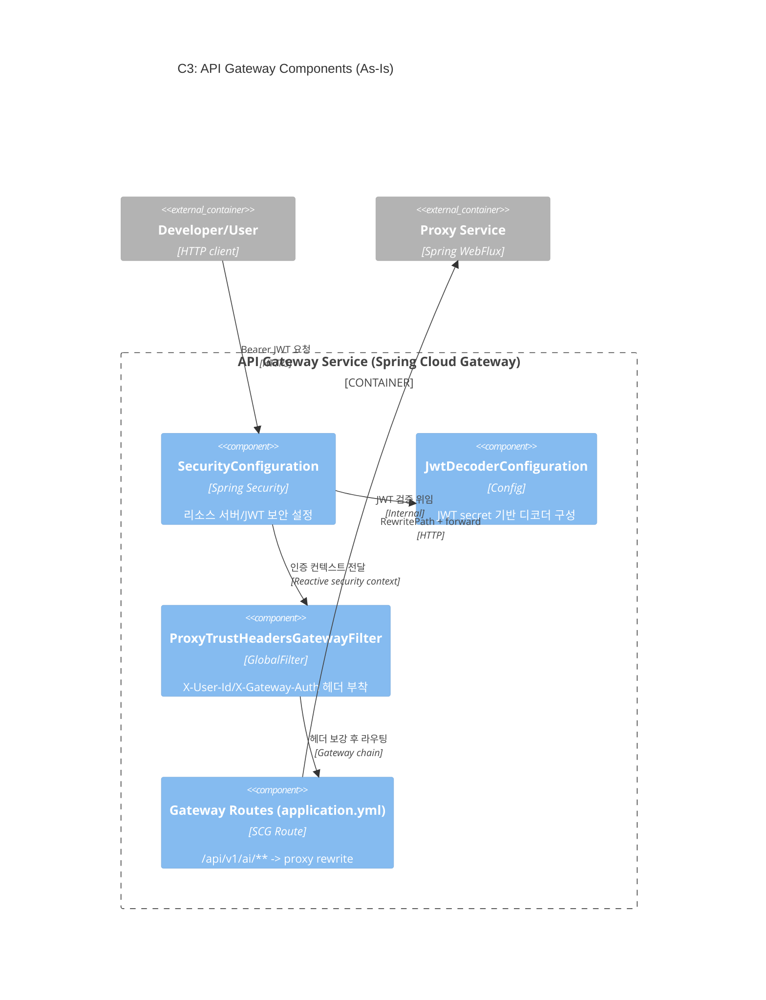
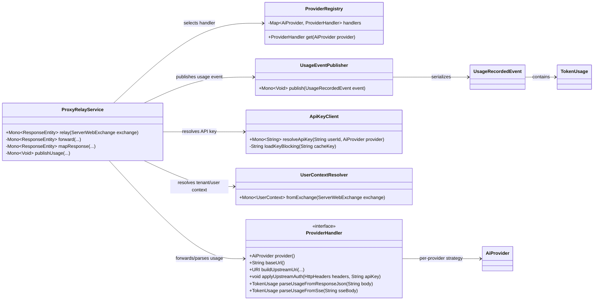
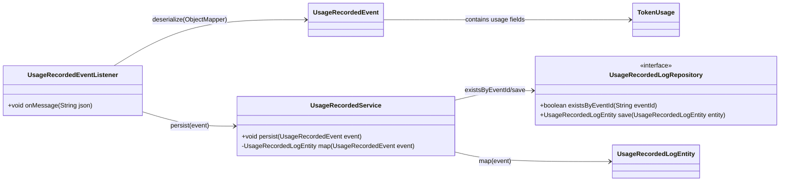
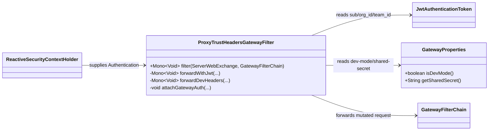

# AI Usage & Billing Platform - C4 Architecture Diagrams (Code As-Is)

이 문서는 설계 문서의 목표 구조가 아니라, 현재 저장소에 존재하는 코드만 기준으로
시스템 아키텍처를 C4 모델(C1 → C2 → C3 → C4)로 표현한다.

분석 대상(코드 기준):
- `services/api-gateway-service`
- `services/proxy-service`
- `services/identity-service`
- `services/usage-service`
- `docker-compose.yml`

## C1 - System Context

## C2 - Container Diagram

## C3 - Component Diagram (Proxy Service)

## C3 - Component Diagram (Usage Service)

## C3 - Component Diagram (API Gateway Service)

## C4 - Code Diagram (Proxy Relay Core)

## C4 - Code Diagram (Usage Event Persist Flow)

## C4 - Code Diagram (Gateway Trust Header Flow)

## 참고 코드/문서

- `services/api-gateway-service`
- `services/proxy-service`
- `services/identity-service`
- `services/usage-service`
- `docker-compose.yml`
- `docs/contracts/gateway-proxy.md`
