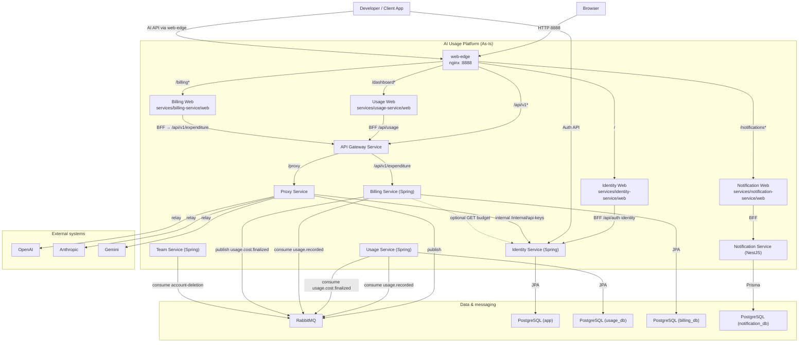
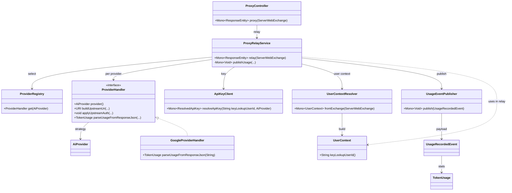
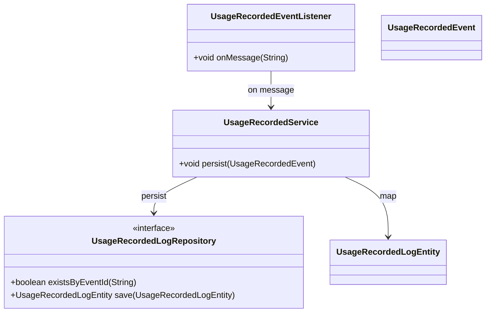
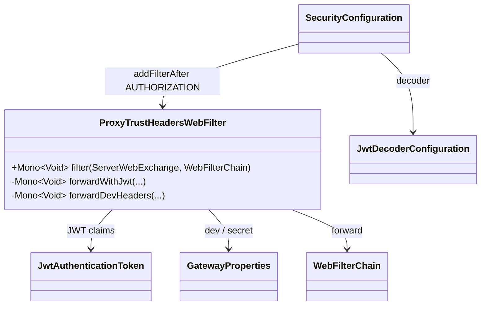
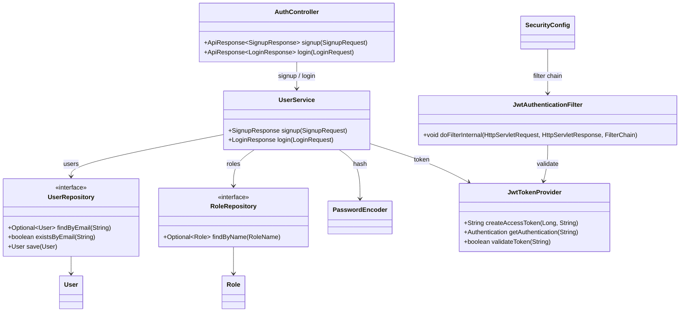
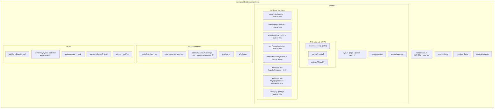
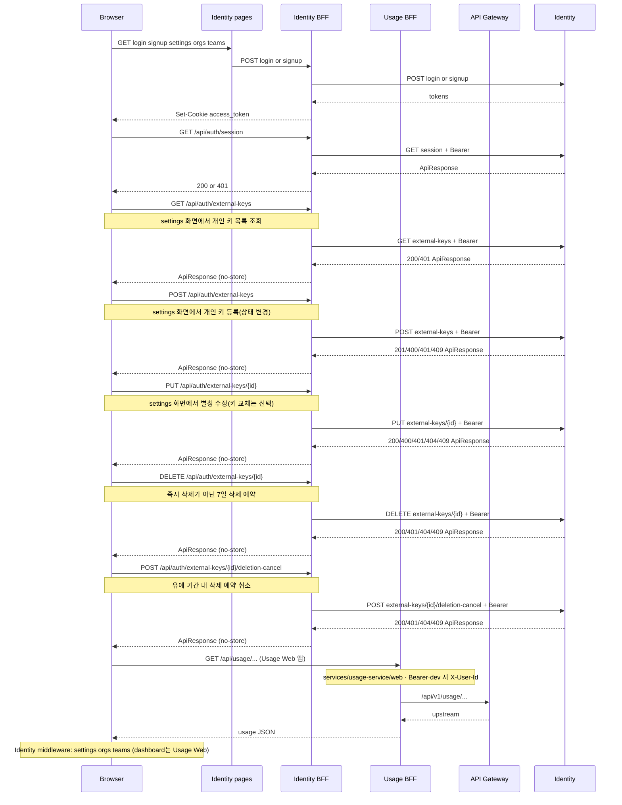
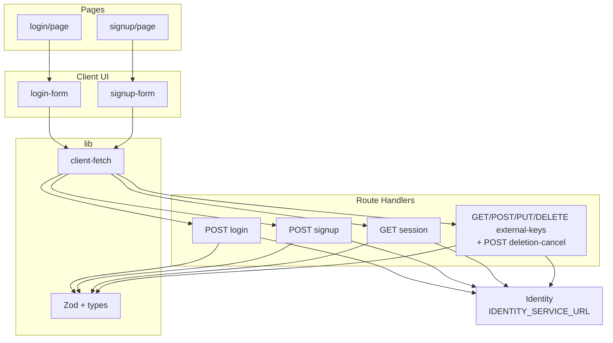
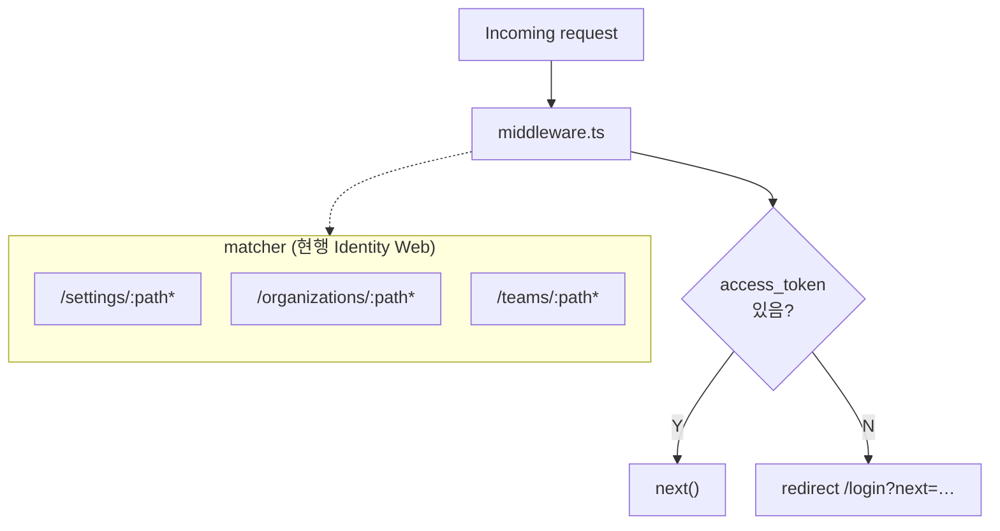

# AI Usage & Billing Platform - C4 Architecture Diagrams (Code As-Is)

이 문서는 목표 설계가 아니라, 현재 저장소에 존재하는 구현 코드 기준으로
시스템 아키텍처를 C4 모델(C1 → C4)로 정리한다.

**문서 버전:** 0.9 (web-edge `:8888` 단일 진입·Gateway 계층·Proxy→Usage RabbitMQ 비동기 흐름 정합 반영)

분석 대상:
- **`services/identity-service/web`** (정본: 랜딩·인증·설정/org UI + `/api/auth/**`·`/api/identity/**` BFF)
- **`services/usage-service/web`** (정본: 대시보드 UI + `/api/usage/**` BFF → 게이트웨이)
- **`services/team-service/web`** (정본: 팀 생성/조회/초대 UI + `/api/team/v1/**` BFF)
- **`services/billing-service/web`** (정본: 지출·비용 UI + `/api/expenditure/**` BFF → 게이트웨이 `/api/v1/expenditure/**`; 팀 월 롤업은 전용 `POST …/team/month-rollup`에서 멤버 검증 후 동일 게이트웨이로 전달)
- **`services/notification-service/web`** (정본: 인앱 알림 UI + BFF → `notification-service` REST)
- `apps/web` (과도기·레거시; 안내용 `README` 위주 — 런타임 정본 아님)
- `services/api-gateway-service`
- `services/proxy-service`
- `services/identity-service`
- `services/usage-service`
- `services/team-service`
- `services/billing-service`
- `services/notification-service`
- `libs/usage-events`
- 서비스별 `application.yml`/`application.properties`
- `test-report/` (팀·실험 보고·원인 분석 메모, 런타임 코드 아님)
- `experiment-logic/` (로컬·네트워크·호출 경로 등 실험 정리, 런타임 코드 아님)

## C1 - System Context

화살표 라벨은 짧게 두었고, 상세는 노드 설명·본문을 보면 된다.



## C2 - Container Diagram

```mermaid
C4Container
title C2: Containers (Current Implementation)

Person(client, "Developer/User", "Auth and AI API consumer")
Person(browserUser, "Browser user", "Web UI and same-origin BFF")

System_Boundary(platform, "AI Usage Platform") {
    Container(webEdge, "web-edge", "Nginx", "단일 진입점 :8888; /api/v1*→Gateway; path 기반 web 분기")
    Container(idWeb, "Identity Web", "Next.js 15", "랜딩·인증·설정; rewrites→타 도메인 web; /api/auth/* · /api/identity/* BFF")
    Container(usWeb, "Usage Web", "Next.js 15", "대시보드; /api/usage/* BFF → Gateway; web-mfe=MF remote")
    Container(billWeb, "Billing Web", "Next.js 15", "지출·비용; /api/expenditure/* BFF → Gateway /api/v1/expenditure")
    Container(ntfWeb, "Notification Web", "Next.js 15", "인앱 알림; BFF → notification-service REST")
    Container(gateway, "API Gateway", "Spring Cloud Gateway", "JWT; /api/v1/ai→/proxy; trust headers; /api/v1/expenditure→Billing")
    Container(proxy, "Proxy Service", "Spring WebFlux", "Relay; usage parse; MQ publish; key→Identity")
    Container(identity, "Identity Service", "Spring + JPA", "Signup/login, JWT")
    Container(usage, "Usage Service", "Spring + MQ + JPA", "Consume usage-recorded + usage.cost.finalized; usage log + api key metadata")
    Container(billing, "Billing Service", "Spring + MQ + JPA", "Consume usage-recorded; cost aggregates; publish usage.cost.finalized; optional Identity budget HTTP")
    Container(team, "Team Service", "Spring + JPA + MQ", "Team domain + account deletion coordination listener")
    Container(notification, "Notification Service", "NestJS + Prisma", "In-app notifications API + team.events MQ consumer")

    ContainerQueue(rabbit, "RabbitMQ", "AMQP", "usage.events(usage.recorded), billing.events(usage.cost.finalized), account-deletion events")
    ContainerDb(appDb, "PostgreSQL (app)", "RDB", "Identity domain data")
    ContainerDb(usageDb, "PostgreSQL (usage_db)", "RDB", "Usage logs")
    ContainerDb(billingDb, "PostgreSQL (billing_db)", "RDB", "Billing aggregates")
    ContainerDb(notifDb, "PostgreSQL (notification_db)", "RDB", "In-app notifications")
}

System_Ext(openai, "OpenAI API", "LLM provider")
System_Ext(anthropic, "Anthropic API", "LLM provider")
System_Ext(google, "Google Gemini API", "LLM provider")

Rel(browserUser, webEdge, "HTTP :8888 단일 진입", "HTTP")
Rel(webEdge, idWeb, "default /", "HTTP")
Rel(webEdge, usWeb, "/dashboard* + usage BFF", "HTTP")
Rel(webEdge, billWeb, "/billing* + expenditure BFF", "HTTP")
Rel(webEdge, ntfWeb, "/notifications* + notification BFF", "HTTP")
Rel(webEdge, gateway, "/api/v1*", "HTTP")
Rel(idWeb, identity, "auth/settings/org BFF → Identity REST", "HTTPS")
Rel(usWeb, gateway, "usage BFF → /api/v1/usage/...", "HTTPS")
Rel(billWeb, gateway, "expenditure BFF → /api/v1/expenditure", "HTTPS")
Rel(ntfWeb, notification, "notification BFF → REST", "HTTPS")
Rel(client, identity, "auth API direct", "HTTPS")
Rel(client, webEdge, "AI request /api/v1/ai/**", "HTTP")
Rel(gateway, proxy, "forward + trust headers", "HTTP")
Rel(gateway, billing, "billing-http route", "HTTP")

Rel(proxy, identity, "internal API keys per user", "HTTP")
Rel(proxy, openai, "relay", "HTTPS")
Rel(proxy, anthropic, "relay", "HTTPS")
Rel(proxy, google, "relay", "HTTPS")
Rel(proxy, rabbit, "publish events", "AMQP")

Rel(usage, rabbit, "consume usage-service.queue + usage-service.usage-cost-finalized.queue", "AMQP")
Rel(billing, rabbit, "consume billing-service.queue", "AMQP")
Rel(billing, rabbit, "publish usage.cost.finalized", "AMQP")
Rel(team, rabbit, "consume team.account-deletion.requested.queue", "AMQP")
Rel(billing, identity, "optional monthly budget HTTP", "HTTPS")
Rel(identity, appDb, "read/write", "JPA")
Rel(usage, usageDb, "read/write", "JPA")
Rel(billing, billingDb, "read/write", "JPA")
Rel(notification, notifDb, "read/write", "Prisma")
```



## C3 - Component Diagram (Cross-Service Runtime Flow)

```mermaid
%%{init: {'flowchart': {'htmlLabels': true, 'nodeSpacing': 28, 'rankSpacing': 40, 'padding': 10}}}%%
flowchart TB
  subgraph GW["API Gateway"]
    direction TB
    gwSec["Security + JwtDecoder config"]
    gwFilter["ProxyTrustHeadersWebFilter<br/>sub→X-User-Id, userId→X-Platform-User-Id"]
    gwRoute["Routes (application.yml)"]
    gwSec --> gwFilter --> gwRoute
  end

  subgraph PX["Proxy Service"]
    direction TB
    pxCtl["ProxyController"]
    pxRelay["ProxyRelayService"]
    pxReg["ProviderRegistry / Handlers"]
    pxRow["ApiKeyClient(keyLookupUserId) · UserContextResolver · UsageEventPublisher"]
    pxCtl --> pxRelay --> pxReg --> pxRow
  end

  RABBIT["RabbitMQ"]

  subgraph US["Usage Service"]
    direction TB
    usListener["UsageRecordedEventListener"]
    usCostListener["UsageCostFinalizedEventListener"]
    usSvc["UsageRecordedService"]
    usCostSvc["UsageCostFinalizedService"]
    usRepo["UsageRecordedLogRepository"]
    usEntity["UsageRecordedLogEntity"]
    usApiMeta["ApiKeyMetadataEntity"]
    usListener --> usSvc --> usRepo --> usEntity
    usCostListener --> usCostSvc --> usRepo
    usEntity -. api_key_id join .-> usApiMeta
  end

  subgraph BL["Billing Service"]
    direction TB
    blListener["BillingUsageRecordedEventListener"]
    blSvc["BillingRecordedService"]
    blListener --> blSvc
  end

  subgraph ID["Identity Service"]
    direction TB
    idCtl["AuthController"]
    idExtCtl["ExternalApiKeyController<br/>/api/auth/external-keys*"]
    idSvc["UserService"]
    idExtSvc["ExternalApiKeyService<br/>register/update/deletion/purge"]
    idRepo["User / Role repository"]
    idExtRepo["ExternalApiKeyRepository"]
    idJwt["JwtTokenProvider · JwtAuthFilter"]
    idPurge["ExternalApiKeyPurgeScheduler"]
    idCtl --> idSvc --> idRepo
    idExtCtl --> idExtSvc --> idExtRepo
    idExtSvc --> idPurge
    idSvc --> idJwt
  end

  GW -->|AI path| PX
  GW -->|/api/v1/expenditure → Billing| BL
  PX -->|publish| RABBIT
  RABBIT -->|deliver| US
  RABBIT -->|deliver| BL
  BL -.->|IdentityBudgetClient (optional)| ID
```

**C3 보충:** `Notification Service` 는 브라우저 BFF → REST·DB 경로 외에도 team 도메인 RabbitMQ 이벤트를 소비한다. 본 절 핵심은 Proxy→MQ→Usage/Billing 비동기 체인이며, 알림 경로는 `docs/architecture.md` §6·§12 및 `docs/contracts/web-notification-bff.md`를 함께 본다.

## C4 - Code Diagram (Proxy Relay Core)



## C4 - Code Diagram (Usage Persistence Core)



## C4 - Code Diagram (Gateway Trust Header Flow)



**현행 동작 요약:** JWT 경로에서 `sub` → `X-User-Id`, 클레임 `userId` → `X-Platform-User-Id`(값이 있을 때만). 개발 모드 `forwardDevHeaders`는 클라이언트가 넘긴 `X-Platform-User-Id`를 유지한다. 프록시는 `UserContextResolver`가 위 헤더를 읽어 `keyLookupUserId()`에 반영한다.

## C4 - Code Diagram (Identity Auth Core)



## Identity Web (`services/identity-service/web`) — 구조·흐름

**목적:** Identity 도메인의 브라우저 UI·BFF를 **정본 트리** 기준으로 시각화한다. Usage 대시보드·Usage BFF는 **`services/usage-service/web`** 절(W2 시퀀스의 `Usage BFF`)을 본다. **지출·비용(Billing Web)** 은 `services/billing-service/web`·`docs/billing-service-overview-20260412.md`·`docs/billing-identity-budget.md` 를 본다. **인앱 알림(Notification Web)** 은 `services/notification-service/web`·`docs/contracts/web-notification-bff.md`·`docs/architecture.md` §12 를 본다.

**동기화 체크리스트 (PR 또는 주기적으로):**

1. `services/identity-service/web/src/app` 아래 **새 `page.tsx` / `route.ts` / 동적 세그먼트**가 생기면 W1·흐름도에 반영한다.
2. `services/identity-service/web/middleware.ts`의 **`config.matcher`** 가 바뀌면 W4와 설명을 맞춘다.
3. BFF가 Identity 업스트림을 호출하는 방식이 바뀌면 W2를 수정한다(계약: `docs/contracts/web-identity-bff.md`).
4. **`next.config.ts`의 `rewrites()`** 가 바뀌면 `docs/contracts/web-split-boundary.md` §2.6·`docs/architecture.md` §13.3 과 맞춘다.
5. **구현과 계약 문서가 어긋나면 다이어그램은 코드 우선**으로 둔다.

### W1 — 디렉터리·파일 맵 (논리 트리)

> 파일 단위 나열. `*.test.ts` 는 같은 폴더에 두는 패턴을 유지한다.



### W2 — 런타임 흐름 (브라우저 ↔ BFF ↔ Identity·게이트웨이)

> **Identity Web**(`services/identity-service/web`): 로그인·회원가입·세션·외부 API 키·Identity 관리 API BFF. **`POST` 로그인·회원가입** 후 httpOnly `access_token` 설정. **`GET /api/auth/session`** 은 Identity Bearer 프록시. **external-keys** 는 `GET/POST/PUT/DELETE` 및 `deletion-cancel` 포함.  
> **Usage Web**(`services/usage-service/web`): 브라우저가 **`GET /api/usage/...`**(basePath 반영 시 경로 접두 다름)로 호출하면 Usage BFF가 **`{API_GATEWAY_URL}/api/v1/usage/...`** 로 프록시(`GATEWAY_DEV_MODE` 시 세션으로 `X-User-Id` 보강).  
> 계약: `docs/contracts/web-identity-bff.md`, `docs/contracts/web-gateway-bff.md`, `docs/contracts/gateway-proxy.md`.



### W3 — 레이어 관계 (Identity Web: UI · client-fetch · BFF)



### W4 — 미들웨어와 보호 경로 (`services/identity-service/web`)



`matcher` 에 맞는 **`src/app/settings|organizations|teams/...` 페이지**를 추가·이동하면 W1과 `docs/repository-structure.md` 를 함께 갱신한다. **대시보드 보호**는 `services/usage-service/web/middleware.ts` 를 본다.

### W5 — Usage Web 요약 (`services/usage-service/web`)

| 항목 | 내용 |
|------|------|
| BFF | `src/app/api/usage/[[...path]]/route.ts` → `API_GATEWAY_URL` 프록시 |
| UI | `src/app/dashboard/...` (기본 basePath는 팀 설정·Compose와 정합) |
| 계약 | `docs/contracts/web-gateway-bff.md`, `docs/contracts/web-split-boundary.md` |

### W6 — Billing Web 요약 (`services/billing-service/web`)

| 항목 | 내용 |
|------|------|
| BFF | `src/app/api/expenditure/[[...path]]/route.ts` → `API_GATEWAY_URL` 의 `/api/v1/expenditure/**`(게이트웨이가 `GATEWAY_BILLING_URI` 로 billing-service 전달). 팀 월 롤업은 **`src/app/api/expenditure/team/month-rollup/route.ts`** 에서 `teamId`·팀 멤버 조회(`BILLING_TEAM_BFF_BASE_URL` 등) 후 허용된 `userIds`만 동일 게이트웨이 경로로 **POST** 한다. |
| UI | `src/components/expenditure/...` (기본 basePath·단일 오리진은 루트 `.env`·Compose와 정합) |
| 계약·개요 | `docs/billing-service-overview-20260412.md`, `docs/billing-identity-budget.md` |

### W7 — Notification Web 요약 (`services/notification-service/web`)

| 항목 | 내용 |
|------|------|
| BFF | `src/app/api/notification/[[...path]]/route.ts` 등 → `NOTIFICATION_SERVICE_URL`(또는 환경별) 로 notification-service REST 프록시 |
| UI | `basePath=/notifications` (web-edge·`docs/architecture.md` §2.3·§12 참고) |
| 계약 | `docs/contracts/web-notification-bff.md` |

## 저장소 문서·실험 디렉터리 (비애플리케이션 코드)

런타임 서비스는 아니나, 팀이 구조·원인·실험을 남기기 위해 루트에 다음을 둔다. C1–C4 다이어그램의 **컨테이너/컴포넌트 경계에는 포함하지 않는다.**

| 경로 | 용도 |
|------|------|
| `test-report/` | 장애·정합 이슈 분석, 변경 보고, 테스트·운영 메모 |
| `experiment-logic/` | 로컬 기동·팀원 `curl`·네트워크 전제 등 실험 정리 |

## 참고 코드/문서

**Identity Web (정본)**  
- `services/identity-service/web/middleware.ts`  
- `services/identity-service/web/src/app/api/auth/login/route.ts` (+ `route.test.ts`)  
- `services/identity-service/web/src/app/api/auth/signup/route.ts` (+ `route.test.ts`)  
- `services/identity-service/web/src/app/api/auth/session/route.ts` (+ `route.test.ts`)  
- `services/identity-service/web/src/app/api/auth/logout/route.ts` (+ `route.test.ts`)  
- `services/identity-service/web/src/app/api/auth/external-keys/route.ts` (+ `route.test.ts`)  
- `services/identity-service/web/src/app/api/auth/external-keys/[id]/route.ts` (+ `route.test.ts`)  
- `services/identity-service/web/src/app/api/auth/external-keys/[id]/deletion-cancel/route.ts`  
- `services/identity-service/web/src/app/api/identity/[[...path]]/route.ts` (+ `route.test.ts`)  
- `services/identity-service/web/src/components/account/account-settings-view.tsx`  

**Usage Web (정본)**  
- `services/usage-service/web/src/app/api/usage/[[...path]]/route.ts` (+ `route.test.ts`)  

**Billing Web (정본)**  
- `services/billing-service/web/src/app/api/expenditure/[[...path]]/route.ts`  
- `services/billing-service/web/src/app/api/expenditure/team/month-rollup/route.ts` (+ `route.test.ts`)  
- `services/billing-service/web/src/components/expenditure/expenditure-dashboard.tsx`  

**Notification Web (정본)**  
- `services/notification-service/web/src/app/api/notification/[[...path]]/route.ts`  

**Billing Service (Spring)**  
- `services/billing-service/src/main/java/com/eevee/billingservice/consumer/BillingUsageRecordedEventListener.java`  
- `services/billing-service/src/main/java/com/eevee/billingservice/service/BillingRecordedService.java`  
- `services/billing-service/src/main/java/com/eevee/billingservice/integration/IdentityBudgetClient.java`  
- `services/billing-service/src/main/resources/application.yml` (`billing.identity`, `billing.rabbit`)  

**Notification Service (NestJS)**  
- `services/notification-service/src/app.module.ts`  
- `services/notification-service/prisma/schema.prisma`  

**과도기**  
- `apps/web/` — 통합 레거시; 런타임 정본은 위 두 `web/` 을 본다 (`apps/web/README.md` 등 안내 참고).
- `docs/contracts/web-identity-bff.md`
- `docs/contracts/web-gateway-bff.md`
- `services/api-gateway-service/src/main/resources/application.yml`
- `services/api-gateway-service/src/main/java/com/eevee/apigateway/filter/ProxyTrustHeadersWebFilter.java`
- `services/proxy-service/src/main/java/com/eevee/proxyservice/web/ProxyController.java`
- `services/proxy-service/src/main/java/com/eevee/proxyservice/relay/ProxyRelayService.java`
- `services/proxy-service/src/main/java/com/eevee/proxyservice/provider/GoogleProviderHandler.java`
- `services/proxy-service/src/main/java/com/eevee/proxyservice/security/UserContext.java`
- `services/proxy-service/src/main/java/com/eevee/proxyservice/mq/UsageEventPublisher.java`
- `docker-compose.yml` (프록시·게이트웨이·RabbitMQ·`postgres-billing`·`postgres-notification`·선택 `billing-web`/`notification-web` 프로파일; 호스트 `bootRun` 전제는 `architecture.md`·본 문서 C1 참고)
- `test-report/`, `experiment-logic/` (문서 전용, 위 § 저장소 문서·실험 디렉터리)
- `services/usage-service/src/main/java/com/eevee/usageservice/consumer/UsageRecordedEventListener.java`
- `services/usage-service/src/main/java/com/eevee/usageservice/service/UsageRecordedService.java`
- `services/identity-service/src/main/java/com/zerobugfreinds/identity_service/controller/AuthController.java`
- `services/identity-service/src/main/java/com/zerobugfreinds/identity_service/controller/ExternalApiKeyController.java`
- `services/identity-service/src/main/java/com/zerobugfreinds/identity_service/service/UserService.java`
- `services/identity-service/src/main/java/com/zerobugfreinds/identity_service/service/ExternalApiKeyService.java`
- `services/identity-service/src/main/java/com/zerobugfreinds/identity_service/scheduler/ExternalApiKeyPurgeScheduler.java`
- `services/identity-service/src/main/java/com/zerobugfreinds/identity_service/security/JwtTokenProvider.java`
- `services/identity-service/src/main/java/com/zerobugfreinds/identity_service/security/JwtAuthenticationFilter.java`
