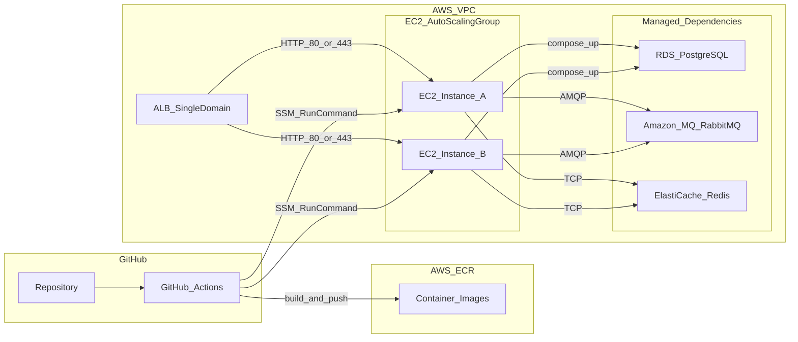
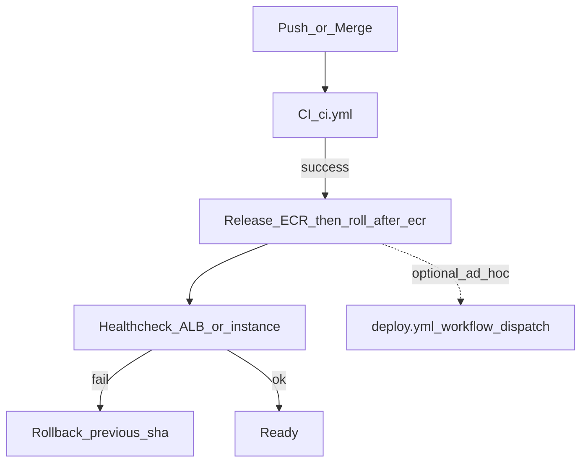

# CD 플랜: AWS ECR + EC2(2대+) + ALB + Docker Compose + SSM

버전: 1.0 (팀 합의용 초안)

## 목표

- 이 저장소 정본에 맞춰 **AWS ECR**에 서비스별 이미지를 푸시하고, **ALB 뒤 EC2 2대 이상**에서 **Docker Compose**로 앱 스택을 기동한다.
- **RDS / Amazon MQ(RabbitMQ) / ElastiCache**는 매니지드로 두고, EC2에는 **앱·웹·web-edge 컨테이너만** 올린다.
- 배포는 **GitHub Actions → SSM Run Command**로 EC2에 내려보내고, **인스턴스 단위 롤링**(drain → 배포 → 헬스체크 → 재등록)으로 무중단에 가깝게 만든다.

## 레포 근거

| 항목 | 경로 |
|------|------|
| CI | [`.github/workflows/ci.yml`](../.github/workflows/ci.yml) |
| 경로 필터(재사용) | [`.github/workflows/path-changes.yml`](../.github/workflows/path-changes.yml) |
| Release (ECR) | [`.github/workflows/release.yml`](../.github/workflows/release.yml) |
| Deploy (ALB+SSM) | [`.github/workflows/deploy.yml`](../.github/workflows/deploy.yml) |
| 로컬 Compose | [`docker-compose.yml`](../docker-compose.yml) |
| 운영 Compose | [`docker-compose.prod.yml`](../docker-compose.prod.yml) |
| 배포 env 예시 | [`.env.deploy.example`](../.env.deploy.example) |
| IAM·ECR·헬스·롤백 정본 | [`aws-github-oidc-ecr-ssm.md`](aws-github-oidc-ecr-ssm.md) |
| Terraform (OIDC·IAM·ECR·선택 인프라) | [`infra/terraform/README.md`](../infra/terraform/README.md) |
| 아키텍처(패턴 B, K8s 범위 밖) | [`architecture.md`](architecture.md) |
| CD 방향 요약 | [`CI.md`](CI.md) |

## 배포 토폴로지

## GitHub Actions CD 흐름

`release.yml` maps **`develop` → Environment `staging`**, **`main` → `production`**. Job **`roll-after-ecr`** runs in that same Environment after ECR when `ALB_TARGET_GROUP_ARN` is set and at least one image was eligible to push ([`CI.md`](CI.md)). **`deploy.yml`** is optional for extra rolls (empty instance list = target group discovery). Details: [`aws-github-oidc-ecr-ssm.md`](aws-github-oidc-ecr-ssm.md).

## 이미지·태그 전략

- **불변 태그(롤백·추적)**: `:<git_sha>`
- **환경 포인터(선택)**: `:staging`, `:prod`
- 배포 시 Compose는 기본적으로 **sha 태그**를 사용해 재현 가능하게 둔다.

## 배포 단위(이미지 목록 — 운영 범위에 맞게 선택)

- 백엔드: `api-gateway-service`, `proxy-service`, `identity-service`, `usage-service`, `billing-service`, `team-service`, `notification-service`
- 웹(Next standalone): `identity-web`, `usage-web`, `billing-web`, `team-web`, `notification-web`, `agent-web`
- 엣지: `web-edge` (단일 도메인 라우팅)

## Release 워크플로 (설계)

- **트리거**: `develop` → 스테이징 자동; `main` → 프로덕션(또는 `workflow_dispatch` + GitHub Environment 승인)
- **빌드·푸시**: `ci.yml`의 `changes`(paths-filter)를 재사용해 **변경된 서비스만** ECR에 push
- **배포(자동)**: ECR 푸시가 성공하고 경로 필터(또는 `force_rebuild_all`)로 이미지 빌드가 한 건이라도 해당되면, 같은 Environment에 `ALB_TARGET_GROUP_ARN`이 있을 때 **`release.yml`의 `roll-after-ecr`** 잡이 타깃 그룹의 EC2를 조회해 SSM 롤링 수행(자세한 조건은 [`CI.md`](CI.md))
- **도구**: `docker/build-push-action` + `push: true`
- **AWS 인증**: GitHub **OIDC AssumeRole** (Access Key 지양)

## Deploy 워크플로 — SSM 롤링 (설계)

대상: ALB Target Group에 등록된 EC2(ASG 권장).

**자동**: `release.yml`의 `roll-after-ecr`가 타깃 그룹에서 인스턴스 ID를 조회해 순차 롤한다([`list-tg-instance-ids.sh`](../scripts/deploy/list-tg-instance-ids.sh)).

**수동**: [`deploy.yml`](../.github/workflows/deploy.yml) `workflow_dispatch` — 인스턴스 ID를 비우면 동일하게 타깃 그룹에서 조회한다.

인스턴스별 순서:

1. ALB에서 해당 인스턴스 **drain**(연결 종료 후 등록 해제)
2. SSM Run Command로 배포 스크립트 실행:
   - ECR 로그인
   - `docker compose -f <prod_compose> pull`
   - `docker compose -f <prod_compose> up -d`
3. 로컬/경량 **헬스체크**(예: `web-edge` 또는 게이트웨이 경로)
4. 성공 시 Target Group **재등록**
5. 실패 시 **이전 `git_sha` 이미지 태그**로 롤백 후 재검증

## 운영용 Compose (설계)

- 로컬 [`docker-compose.yml`](../docker-compose.yml)의 Postgres/RabbitMQ/Redis **컨테이너 정의는 운영 파일에서 제외**한다.
- 별도 파일 예: `docker-compose.prod.yml` (저장소에 둘지, 배포 시 생성할지 팀 합의)
- 앱 `environment`는 **RDS / Amazon MQ / ElastiCache 엔드포인트**와 자격증명(또는 IAM 가능 영역)을 가리키게 한다.
- 비밀값: **SSM Parameter Store** 또는 **Secrets Manager**에서 주입(서버 로컬 `.env`만 쓸 경우 권한·로테이션 정책 필수)

## 헬스체크·롤백

- ALB Target Group 헬스 경로: `web-edge`의 안정 경로(또는 게이트웨이 헬스)로 통일
- 배포 스크립트 내: N회 재시도 후 실패 시 롤백
- 롤백 기준: 배포 직전 **성공했던 `git_sha`**를 인스턴스 또는 SSM 파라미터에 보관

## Terraform 적용 순서 (IaC)

1. **(선택)** [`infra/terraform/bootstrap/README.md`](../infra/terraform/bootstrap/README.md)로 S3 상태 버킷·DynamoDB 락 테이블 생성 — 팀이 **로컬 `terraform.tfstate`** 만 쓰면 생략 가능.
2. **[`infra/terraform/README.md`](../infra/terraform/README.md)** 에서 `terraform init` / `apply` 로 OIDC 프로바이더, **단일** Release·Deploy IAM 역할(`ReleaseRole` / `DeployRole` 기본 이름), ECR 리포지토리(`ecr_repository_suffixes`) 생성(S3 백엔드는 선택). (레거시 패턴은 [`modules/github_env_roles`](../infra/terraform/modules/github_env_roles) 참고.)
3. 선택: 동일 루트에서 `enable_compute_stack = true` 로 VPC·ALB·Target Group·ASG·인스턴스 프로파일 추가 (단순 퍼블릭 레이아웃).
4. [`.github/workflows/release.yml`](../.github/workflows/release.yml) / [`.github/workflows/deploy.yml`](../.github/workflows/deploy.yml) 의 **`env`에 있는 OIDC 역할 ARN**이 `terraform output`과 일치하는지 확인하고, GitHub Environment에는 `AWS_REGION`, `ALB_TARGET_GROUP_ARN`, `SSM_DEPLOY_ROOT` 등 나머지 변수를 맞춘다 (표는 Terraform README).

워크플로와 Compose·SSM 스크립트는 그대로 두고, ARN·리포 이름만 Terraform·YAML과 맞춘다.

## AWS 리소스 체크리스트

- ECR 리포지토리(이미지별 또는 통합 네이밍) — Terraform [`modules/ecr`](../infra/terraform/modules/ecr) 또는 기존 리소스
- IAM: GitHub OIDC Role(ECR push + SSM `SendCommand` 등) — Terraform 루트 [`infra/terraform`](../infra/terraform) 또는 수동 JSON([`aws-github-oidc-ecr-ssm.md`](aws-github-oidc-ecr-ssm.md)); 선택 레퍼런스 모듈 [`modules/github_env_roles`](../infra/terraform/modules/github_env_roles)
- EC2: Instance Profile(ECR pull + SSM Agent), ASG 최소 2대, Launch Template에 Docker/Compose — Terraform [`modules/compute_stack`](../infra/terraform/modules/compute_stack) 선택 또는 수동
- ALB + Target Group + 보안 그룹 — 선택 모듈 또는 수동; 배포 스크립트 [`gha-roll-instance.sh`](../scripts/deploy/gha-roll-instance.sh) 의 `TARGET_PORT`(기본 8888, `terraform output alb_target_port`와 일치)와 TG 포트 일치
- EC2 → RDS / MQ / Redis 네트워크 허용

## 주의사항 (이 프로젝트 특성)

- `GATEWAY_SHARED_SECRET` 등은 게이트웨이·프록시·usage 등 **동일 값** 유지 — [`contracts/gateway-proxy.md`](contracts/gateway-proxy.md)
- 서비스별 DB 분리 원칙은 RDS 구성에도 반영 — [`msa-database-and-service-integration.md`](msa-database-and-service-integration.md)
- Compose는 **컨테이너 단위 세밀 롤링**보다 **인스턴스 단위 롤링**이 현실적

## 구현 TODO (체크리스트)

- [ ] 스테이징/프로덕션 환경 수와 브랜치 트리거 확정 (`develop` / `main`)
- [ ] 운영에 포함할 이미지 목록·ECR 리포지토리 네이밍 확정
- [ ] GitHub OIDC IAM Role 및 최소 권한 정책 — Terraform [`infra/terraform`](../infra/terraform/README.md) 루트 또는 수동 JSON
- [ ] `docker-compose.prod.yml`(또는 동등) 초안 및 env/secret 주입 방식 확정
- [x] Release 워크플로(변경 감지, ECR push, sha 태그) 및 **성공 시 `roll-after-ecr` 자동 롤**(환경 변수 `ALB_TARGET_GROUP_ARN` 등)
- [x] Deploy 워크플로(`workflow_dispatch`, SSM drain/roll, 선택 시 타깃 그룹에서 인스턴스 ID 자동 조회)
- [ ] ALB Target Group 헬스 경로·타임아웃·재시도 정책 확정
- [ ] (선택) Terraform 원격 상태 부트스트랩 및 `enable_compute_stack` 로 ALB/ASG 프로비저닝

---

문서 유지: CD 구현이 바뀌면 본 파일과 [`CI.md`](CI.md) · [`architecture.md`](architecture.md) §10과 모순이 없는지 확인한다.
