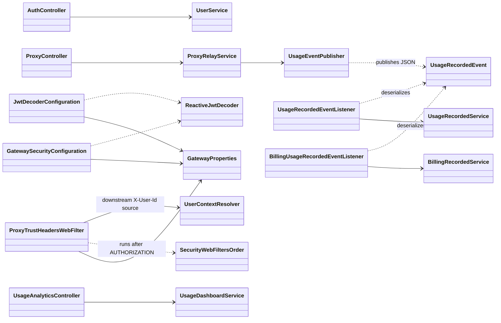
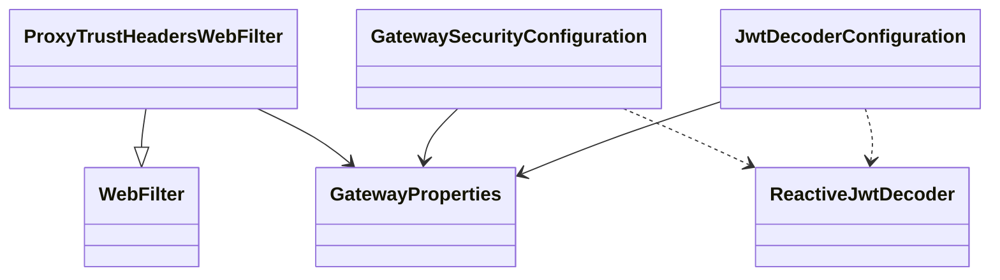
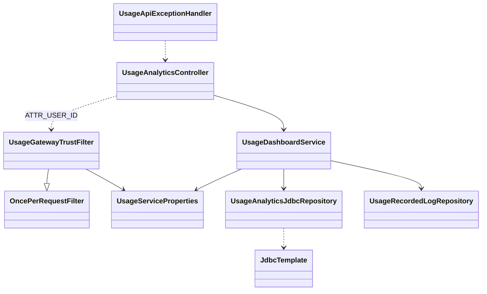
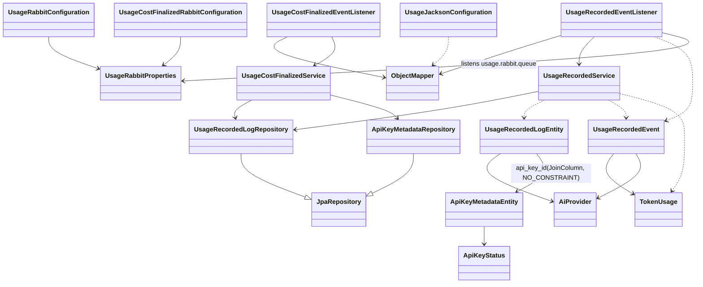
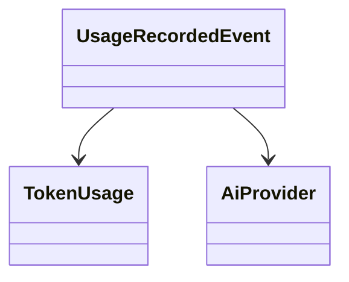
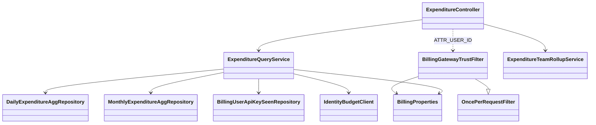
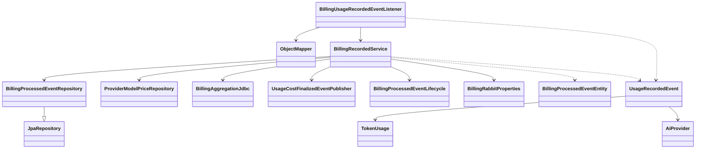
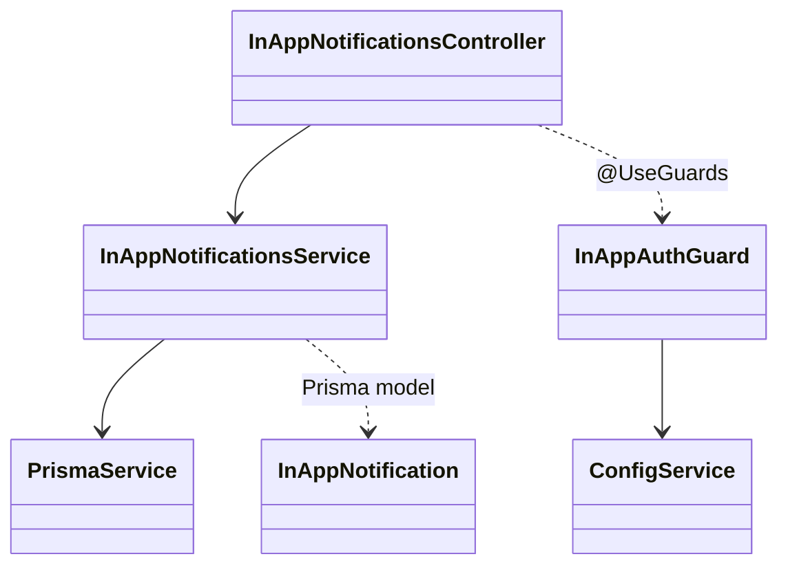

# Class Diagram

`docs/c4-architecture-diagrams.md`에 붙여 넣을 수 있도록 Mermaid 클래스 다이어그램을 정리합니다. 최근 변경(Usage 대시보드·분석 API, 게이트웨이 신뢰 필터, Identity 세션 API, Billing 과금·집계, Notification 인앱 API, Usage API Key metadata 분리)을 반영했습니다.

**가독성:** 전 서비스를 한 그림에 넣으면 노드가 과다해지므로, **① 교차 서비스 개요** 후 **② 서비스·관심사별 서브다이어그램**으로 나눴습니다.

**이름 충돌:** Java 코드에서 `SecurityConfiguration`이 proxy-service와 api-gateway-service에 각각 있습니다. 아래 다이어그램에서는 **`ProxySecurityConfiguration`** / **`GatewaySecurityConfiguration`** 으로 구분합니다 (각각 `com.eevee.proxyservice.security.SecurityConfiguration`, `com.eevee.apigateway.config.SecurityConfiguration`).

---

## 1) Cross-service overview (경량)

---

## 2) Identity Service

```mermaid
classDiagram
direction TB

class AuthController
class ExternalApiKeyController
class GlobalExceptionHandler
class UserService
class ExternalApiKeyService
class UserRepository
class ExternalApiKeyRepository
class JpaRepository
class User
class Role
class ExternalApiKeyEntity
class ExternalApiKeyProvider
class SignupRequest
class SignupResponse
class LoginRequest
class LoginResponse
class SessionResponse
class ExternalApiKeyRegisterRequest
class ExternalApiKeyRegisterResponse
class DuplicateExternalApiKeyException
class ApiKeyLimitExceededException
class SecurityConfig
class JwtAuthenticationFilter
class OncePerRequestFilter
class JwtTokenProvider
class RestAuthenticationEntryPoint
class AuthenticationEntryPoint

AuthController --> UserService
AuthController ..> SignupRequest
AuthController ..> SignupResponse
AuthController ..> LoginRequest
AuthController ..> LoginResponse
AuthController ..> SessionResponse
UserService --> UserRepository
UserService --> JwtTokenProvider
UserService ..> User
UserService ..> SignupRequest
UserService ..> SignupResponse
UserService ..> LoginRequest
UserService ..> LoginResponse
UserRepository --|> JpaRepository
User --> Role

ExternalApiKeyController --> ExternalApiKeyService
ExternalApiKeyController ..> ExternalApiKeyRegisterRequest
ExternalApiKeyController ..> ExternalApiKeyRegisterResponse
ExternalApiKeyService --> ExternalApiKeyRepository
ExternalApiKeyService ..> ExternalApiKeyEntity
ExternalApiKeyService ..> DuplicateExternalApiKeyException
ExternalApiKeyService ..> ApiKeyLimitExceededException
ExternalApiKeyEntity --> ExternalApiKeyProvider
ExternalApiKeyRepository --|> JpaRepository

GlobalExceptionHandler ..> DuplicateExternalApiKeyException
GlobalExceptionHandler ..> ApiKeyLimitExceededException
JwtAuthenticationFilter --|> OncePerRequestFilter
JwtAuthenticationFilter --> JwtTokenProvider
RestAuthenticationEntryPoint --|> AuthenticationEntryPoint
SecurityConfig --> JwtAuthenticationFilter
SecurityConfig --> RestAuthenticationEntryPoint
```

---

## 3) Proxy Service

WebFlux 보안은 코드상 `com.eevee.proxyservice.security.SecurityConfiguration` 이 `SecurityWebFilterChain`을 등록합니다. 아래는 릴레이·프로바이더·신뢰 헤더 중심입니다.

---

## 4) API Gateway Service

---

## 5) Usage Service — Gateway trust & dashboard HTTP

게이트웨이가 넘긴 `X-User-Id` / `X-Gateway-Auth`를 **`UsageGatewayTrustFilter`**에서 검증·요청 속성으로 두고, **`UsageAnalyticsController`**가 **`UsageDashboardService`**로 대시보드·로그 조회를 위임합니다.

---

## 6) Usage Service — Rabbit ingestion & persistence

---

## 7) Lib — `usage-events` (공유 계약)

---

## 9) Billing Service — Gateway trust & expenditure HTTP

게이트웨이가 넘긴 `X-User-Id` / `X-Gateway-Auth`를 **`BillingGatewayTrustFilter`**에서 검증·요청 속성으로 두고, **`ExpenditureController`**가 **`ExpenditureQueryService`**·**`ExpenditureTeamRollupService`**로 지출 조회·팀 롤업을 위임합니다.

---

## 10) Billing Service — Rabbit ingestion & cost publishing

**`BillingUsageRecordedEventListener`**가 `usage-recorded` 큐의 JSON을 **`UsageRecordedEvent`**로 역직렬화한 뒤 **`BillingRecordedService`**가 멱등·가격·일/월 집계를 처리하고, 설정에 따라 **`UsageCostFinalizedEventPublisher`**로 비용 확정 이벤트를 발행합니다.

---

## 11) Notification Service (NestJS / Prisma)

인앱 알림 API는 **`InAppNotificationsController`**가 **`InAppAuthGuard`**(게이트웨이 `X-User-Id`·내부 시크릿) 뒤에서 **`InAppNotificationsService`**로 Prisma 접근을 위임합니다. 스키마 모델은 `services/notification-service/prisma/schema.prisma`를 본다.

---

## 12) Web (`apps/web`) — 다이어그램 (과도기 통합 Next; 목표 `services/*/web/`)

Java·Billing 백엔드 절(1–7, 9–10)·Notification 절(11)과 달리, **Next.js 앱 Mermaid 도식은 `docs/c4-architecture-diagrams.md` 한 곳에만 두고** 디렉터리·BFF·미들웨어가 바뀔 때 그 절(W1–W4)을 갱신한다.

| 구분 | 문서 위치 |
|------|-----------|
| 디렉터리 맵·시퀀스·레이어·미들웨어 | [c4-architecture-diagrams.md](./c4-architecture-diagrams.md) 의 **「Web Application (`apps/web`)」** 절 (W1–W4) |
| C1/C2의 Browser / Web 컨테이너 | 동 파일 상단 C1·C2 |

**동기화:** `app/` 라우트·`api/auth/*/route.ts`·`middleware.ts`·`components/`·`lib/api/` 변경 시 위 앵커 절의 다이어그램·설명을 코드와 맞춘다. 구현과 `docs/contracts/web-identity-bff.md` 가 다르면 **다이어그램은 코드 우선**으로 수정하고 계약 문서는 별도로 정리한다. 역할·경로는 `docs/architecture.md` **§13(서비스 단위 웹·BFF)**·**§12(집계·알림 백엔드)**·`docs/repository-structure.md` §6를 본다.
