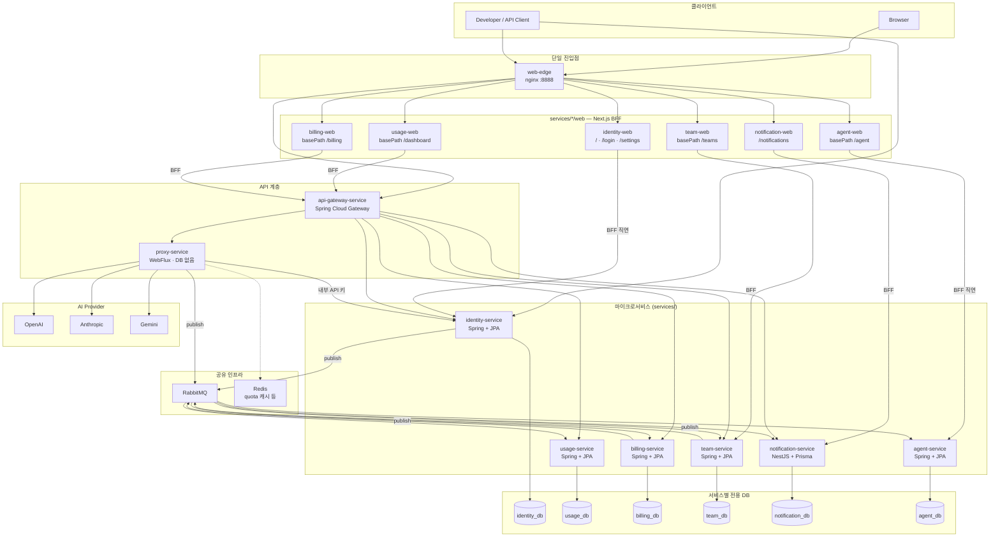
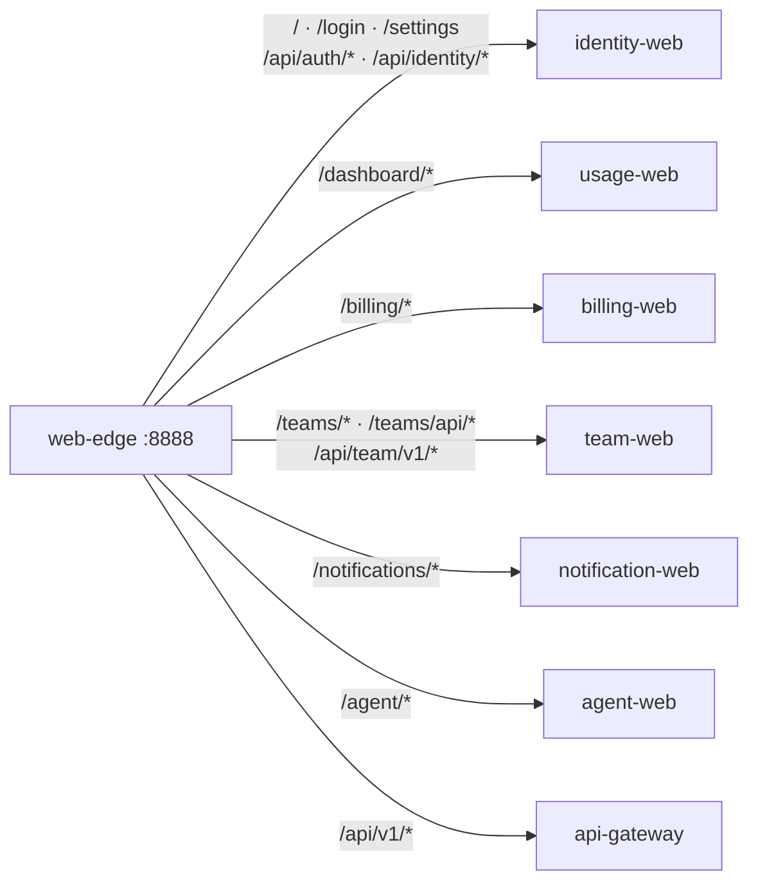
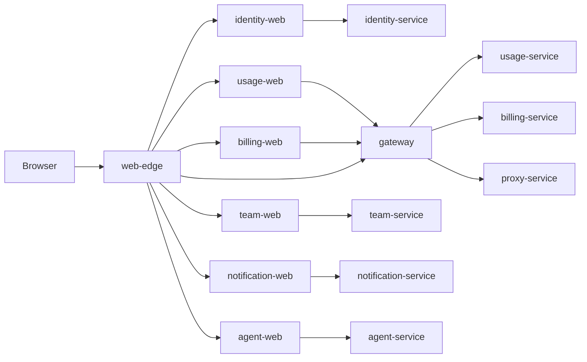
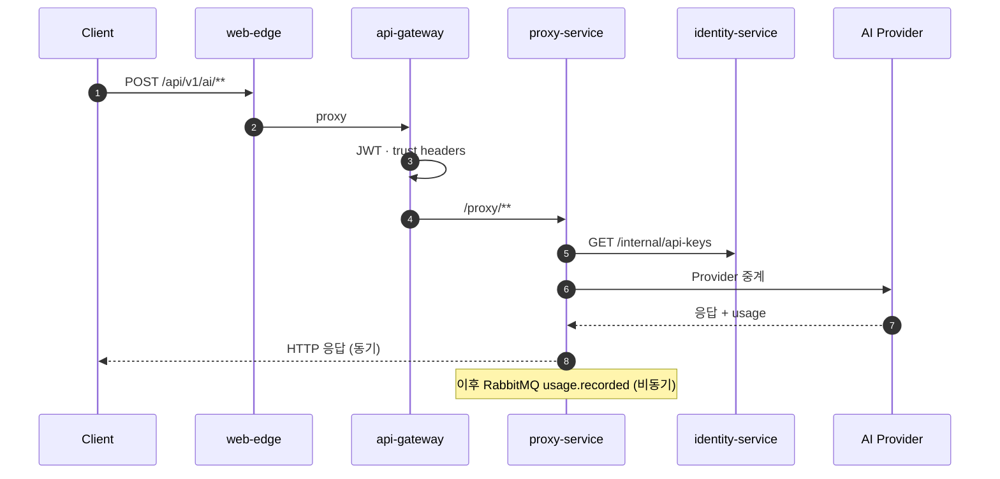
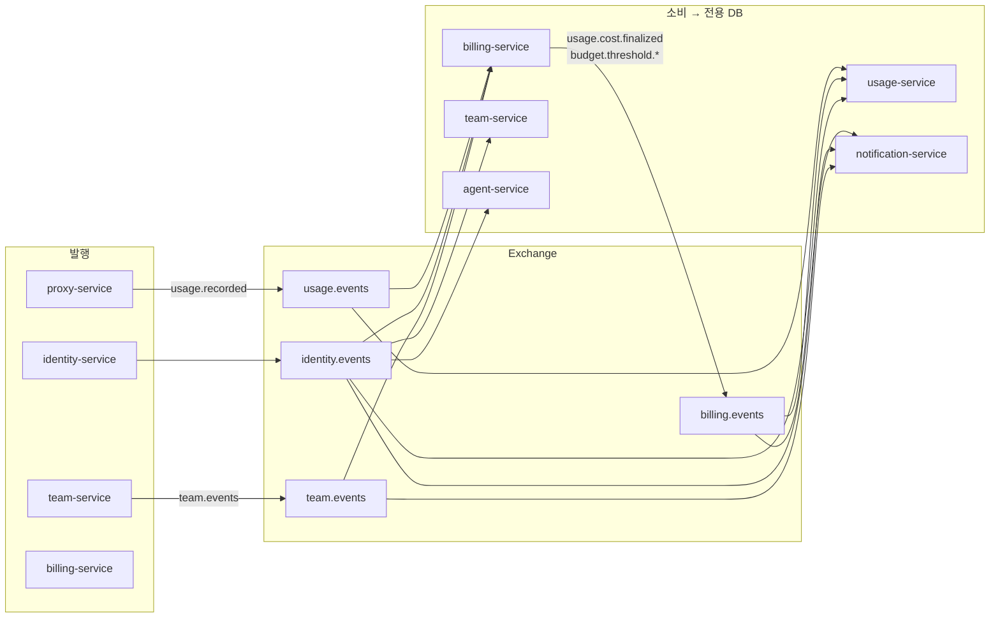
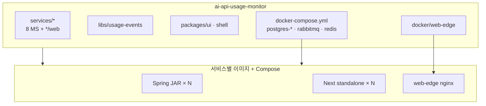

# MSA 아키텍처 개요 (As-Is)

**문서 버전:** 1.0  
**기준:** 저장소 코드 · [`architecture.md`](architecture.md) v0.6.6 · [`c4-architecture-diagrams.md`](c4-architecture-diagrams.md) v1.0 · [`repository-structure.md`](repository-structure.md) §2.1

본 문서는 **목표 설계가 아니라** 현재 `services/`·`docker-compose.yml`·Gateway 라우트 기준 **한눈에 보는 MSA 구조도**를 모은다. 서비스 책임·이벤트 페이로드·계약의 정본은 각 링크 문서를 본다.

---

## 0. 관련 문서

| 주제 | 문서 |
|------|------|
| 서비스 분해·스택·이벤트 상세 | [`architecture.md`](architecture.md) |
| C4 모델·컴포넌트·코드 다이어그램 | [`c4-architecture-diagrams.md`](c4-architecture-diagrams.md) |
| 폴더·모노레포·`web/` 배치 | [`repository-structure.md`](repository-structure.md) |
| DB 분리·서비스 간 연동 규칙 | [`msa-database-and-service-integration.md`](msa-database-and-service-integration.md) |
| web-edge 경로·BFF 경계 | [`contracts/web-split-boundary.md`](contracts/web-split-boundary.md) |
| Gateway·Proxy 신뢰 경계 | [`contracts/gateway-proxy.md`](contracts/gateway-proxy.md) |
| Agent 도메인 | [`agent-service-overview-20260430.md`](agent-service-overview-20260430.md) |

**문서에만 있고 별도 `services/` 배포 단위가 없는 것:** Quota(§4.8), Analytics & Reporting(§4.7), 독립 API Key Service(§4.4 — 구현은 `identity-service`).

---

## 1. MSA 전체 구조 (서비스 · DB · 메시징)

각 마이크로서비스는 **전용 PostgreSQL**만 사용한다. 타 서비스 DB에 JDBC 등으로 **직접 접근하지 않는다**. 서비스 간 연동은 **HTTP API** 또는 **RabbitMQ**만 쓴다.

### 1.1 배포 단위 · DB 소유권

| `services/` | 전용 DB | 핵심 책임 |
|-------------|---------|-----------|
| `api-gateway-service` | 없음 | JWT·라우팅·trust headers |
| `proxy-service` | 없음 | AI 중계, `usage.recorded` 발행 |
| `identity-service` | `identity_db` | 인증·조직·개인 API 키 |
| `usage-service` | `usage_db` | usage 로그·사용량 대시보드 |
| `billing-service` | `billing_db` | 비용 집계·예산 임계 이벤트 |
| `team-service` | `team_db` | 팀·멤버·팀 API 키 |
| `notification-service` | `notification_db` | 인앱 알림 |
| `agent-service` | `agent_db` | 스냅샷·추천·어시스턴트 |

---

## 2. web-edge 경로 분기 (`:8888`)

정본: `docker/web-edge/nginx.conf.template`, [`contracts/web-split-boundary.md`](contracts/web-split-boundary.md).

---

## 3. API Gateway 라우트 (코드 기준)

정본: `services/api-gateway-service/src/main/resources/application.yml`.

Gateway가 **프록시하는 업스트림**은 아래 6개이다. **`agent-service` 라우트는 없다.**

| Gateway 경로 | 업스트림 | 비고 |
|--------------|----------|------|
| `/api/v1/ai/**` | `proxy-service` | → `/proxy/**` rewrite |
| `/api/v1/ai/ext/**` | `proxy-service` | ext HMAC, JWT 아님 |
| `/api/v1/usage/**` | `usage-service` | |
| `/api/v1/expenditure/**` | `billing-service` | |
| `/api/identity/**` | `identity-service` | → `/api/**` rewrite |
| `/api/team/**` | `team-service` | → `/api/**` rewrite |
| `/api/notification/**` | `notification-service` | → `/api/**` rewrite |

Gateway **자체** 엔드포인트: `GET /internal/web-edge/auth/resolve` (`WebEdgeAuthController`, nginx `auth_request`).

### 3.1 BFF가 Gateway를 타는지 (실제 트래픽)

| BFF | Gateway 경유 | 실제 연결 |
|-----|--------------|-----------|
| `usage-web` | 예 | `API_GATEWAY_URL` → `/api/v1/usage/**` |
| `billing-web` | 예 | `API_GATEWAY_URL` → `/api/v1/expenditure/**` |
| `notification-web` | 설정에 따라 | gateway 또는 `NOTIFICATION_SERVICE_URL` 직연 |
| `identity-web` | 보통 아님 | `IDENTITY_SERVICE_URL` 직연 |
| `team-web` | 보통 아님 | nginx → team-web BFF → `team-service` |
| `agent-web` | 아님 | `agent-service` 직연 |

---

## 4. 동기 요청 — AI API (Proxy)

Proxy는 Usage DB에 **직접 쓰지 않고** 이벤트만 발행한다 ([`architecture.md`](architecture.md) §2·§6).

---

## 5. 비동기 이벤트 (RabbitMQ)

| Exchange | 대표 routing key | 발행 | 주요 소비 |
|----------|------------------|------|-----------|
| `usage.events` | `usage.recorded` | Proxy | Usage, Billing |
| `billing.events` | `usage.cost.finalized`, `billing.budget.threshold.reached`, … | Billing | Usage, Notification |
| `identity.events` | `identity.user.sync`, `identity.external-api-key.status-changed`, … | Identity | Team, Usage, Billing, Notification, Agent |
| `team.events` | 팀 도메인, `team.api.key.#` | Team | Notification, Billing |

상세 토폴로지: [`architecture.md`](architecture.md) §6.2, [`billing-outbound-events.md`](billing-outbound-events.md).

---

## 6. 모노레포 · 배포 (패턴 B)

- **Kubernetes 미사용** — 로컬·배포는 Docker Compose + 서비스별 이미지 분리 ([`architecture.md`](architecture.md) §10.1).
- 브라우저 **단일 진입:** `web-edge` `:8888` (`WEB_EDGE_PORT`).
- Compose `profile: web`: `identity-web`, `usage-web`, `billing-web`, `team-web`, `notification-web`, `agent-web`, `web-edge` 등.

---

## 7. 문서 유지

다음이 바뀌면 **본 문서·[`c4-architecture-diagrams.md`](c4-architecture-diagrams.md)·[`architecture.md`](architecture.md) §0** 을 함께 검토한다.

- `services/api-gateway-service/.../application.yml` 라우트 추가·삭제
- `docker/web-edge/nginx.conf.template` 공개 경로
- `services/` 아래 신규·제거 마이크로서비스 또는 `web/` BFF 업스트림 변경
- RabbitMQ exchange·큐 이름 ([`architecture.md`](architecture.md) §6.2)

**구현과 문서가 어긋나면 코드·Compose를 정본**으로 둔다.
