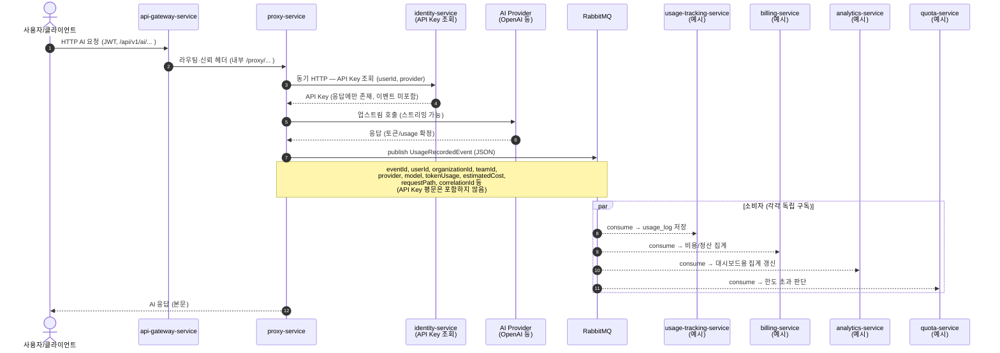
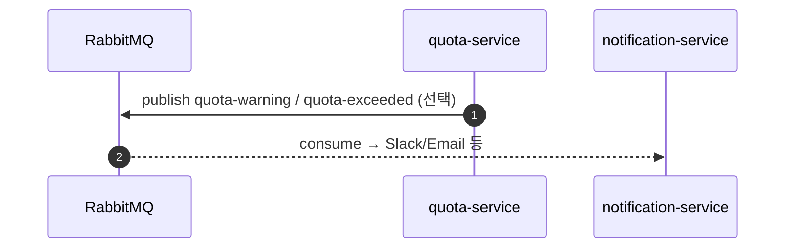
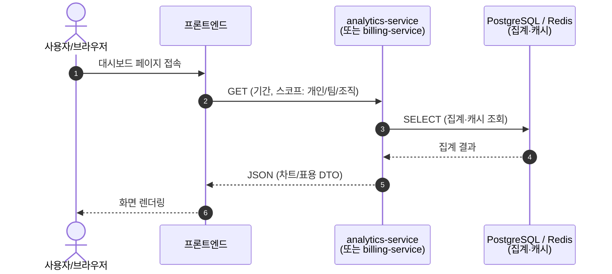

# 시퀀스 다이어그램 (이벤트·조회 흐름)

본 문서는 `docs/architecture.md`의 도메인을 전제로, **사용량이 쌓이는 경로(이벤트)** 와 **대시보드 조회 경로**를 시퀀스 다이어그램으로 정리한다.  
다이어그램은 [Mermaid](https://mermaid.js.org/) 문법이며, GitHub·VS Code(Mermaid 확장) 등에서 렌더링할 수 있다.  
**여러 소비자가 같은 이벤트를 어떻게 나눠 소비하는지**(팬아웃·큐)는 [`docs/event-consumer-flow.md`](event-consumer-flow.md)를 참고한다.

---

## 1. AI 호출 시 — API Key 조회(동기) + `UsageRecordedEvent` 발행(비동기)

사용자가 **개인**이든 **조직·팀 소속**이든, 프록시는 JWT 등으로 `userId`·`organizationId`·`teamId` 컨텍스트를 확정한 뒤 Provider를 호출하고, 사용량이 확정되면 **`UsageRecordedEvent`** 를 RabbitMQ로 발행한다.

---

## 2. (선택) Quota 임계치 도달 시 — 추가 이벤트

팀 설계에 따라 `quota-service`가 **별도 이벤트**를 발행할 수 있다. (이름·페이로드는 팀 합의)

---

## 3. 대시보드 조회 시 — HTTP 조회만 (일반적으로 MQ 이벤트 없음)

대시보드에 보이는 수치는 **이미 ①에서 적재·집계된 데이터**이다. 사용자가 화면을 열 때는 보통 **REST 조회**만 수행한다.

---

## 4. 문서 유지

- `UsageRecordedEvent` 필드 변경 시 `libs/usage-events` 및 본 문서를 함께 갱신한다.
- 소비자 서비스가 아직 없으면 다이어그램의 participant 이름을 “예정”으로 표기하고, 구현 후 정리한다.
