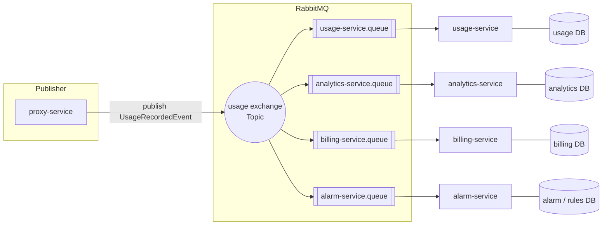
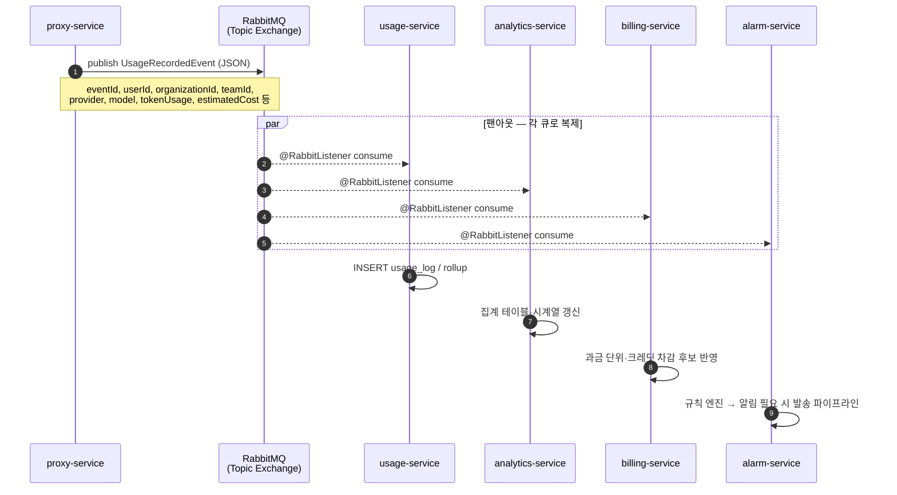
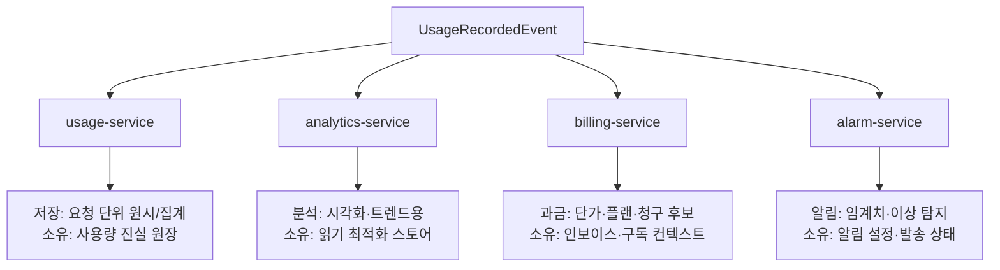
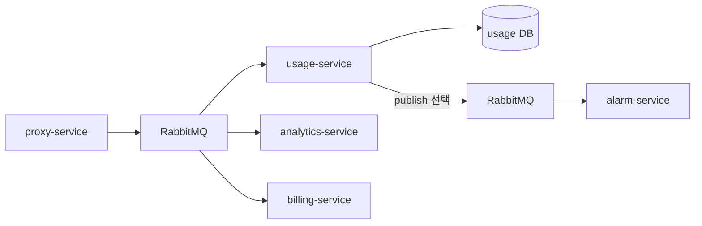

# `UsageRecordedEvent` 소비 흐름 (proxy-service 발행 → 다중 서비스)

`proxy-service`가 RabbitMQ로 **`UsageRecordedEvent`** 를 **한 번** 발행할 때, 각 도메인 서비스가 **어떻게 소비하는지**를 다이어그램으로 정리한다.  
이벤트 페이로드·필드는 `libs/usage-events`의 `UsageRecordedEvent` 및 [`docs/sequence-diagrams.md`](sequence-diagrams.md)를 따른다.

---

## 1. 전체 구조: Topic Exchange + 서비스별 큐 (팬아웃)

동일한 라우팅 키로 발행된 메시지를 **여러 큐**에 바인딩하면, 각 소비자는 **자기 큐**에서 **독립적으로** 메시지를 받는다. 서비스 간 DB는 공유하지 않는다.

**요약**

| 소비자 | 큐(예시 이름) | 소비 후 하는 일(도메인) |
|--------|----------------|-------------------------|
| **usage-service** | `usage-service.queue` | 사용량 **원장** INSERT, 일·월 집계 갱신 |
| **analytics-service** | `analytics-service.queue` | 대시보드용 **OLAP/집계** 적재·스냅샷 갱신 |
| **billing-service** | `billing-service.queue` | 플랜·단가 기준 **과금 단위** 반영, 청구 입력 데이터 |
| **alarm-service** | `alarm-service.queue` | 임계치·스파이크 **규칙 평가**, 알림 트리거 |

각 서비스는 **멱등 처리**(예: `eventId` 기준)로 중복 전달을 안전하게 처리한다.

**발행·바인딩(본 저장소와 정합):** Topic Exchange 이름 **`usage.events`**, 라우팅 키 **`usage.recorded`** (`proxy-service`의 `proxy.rabbit.*`와 동일). `usage-service`는 큐 **`usage-service.queue`** 를 선언하고 위 Exchange에 해당 키로 바인딩한다(`services/usage-service`).

---

## 2. 시퀀스: 발행 1회 → 소비자 N (병렬)

---

## 3. 서비스별 소비 관점 정리

---

## 4. (선택) usage-service가 추가 이벤트를 발행하는 패턴

모든 소비자가 **원시 이벤트**를 구독하면 부하가 커질 수 있어, 팀 합의 하에 **usage-service**만 `UsageRecordedEvent`를 소비하고, 집계·한도 판단 후 **`UsageThresholdBreached`** 같은 **도메인 이벤트**를 다시 발행해 **alarm-service**만 구독하게 할 수 있다. 이 경우에도 **다른 서비스가 usage DB에 직접 접속하지는 않는다.**

---

## 5. 대시보드·월별 비용 조회 (이벤트 외)

화면에서 **기간별 합계·차트**를 볼 때는 보통 **HTTP GET**으로 `analytics-service` 또는 `usage-service`·`billing-service`의 **조회 API**를 호출한다. 이 경로는 [`docs/sequence-diagrams.md`](sequence-diagrams.md) §3과 같다. **usage-service와 analytics-service의 역할·REST vs 이벤트 선택**은 [`docs/usage-analytics-relationship.md`](usage-analytics-relationship.md)를 참고한다.

---

## 6. 문서 유지

- Exchange 이름·라우팅 키·큐 이름은 **환경 설정·운영 합의**에 맞춘다.
- `UsageRecordedEvent` 변경 시 `libs/usage-events`, [`docs/sequence-diagrams.md`](sequence-diagrams.md), 본 문서를 함께 갱신한다.
