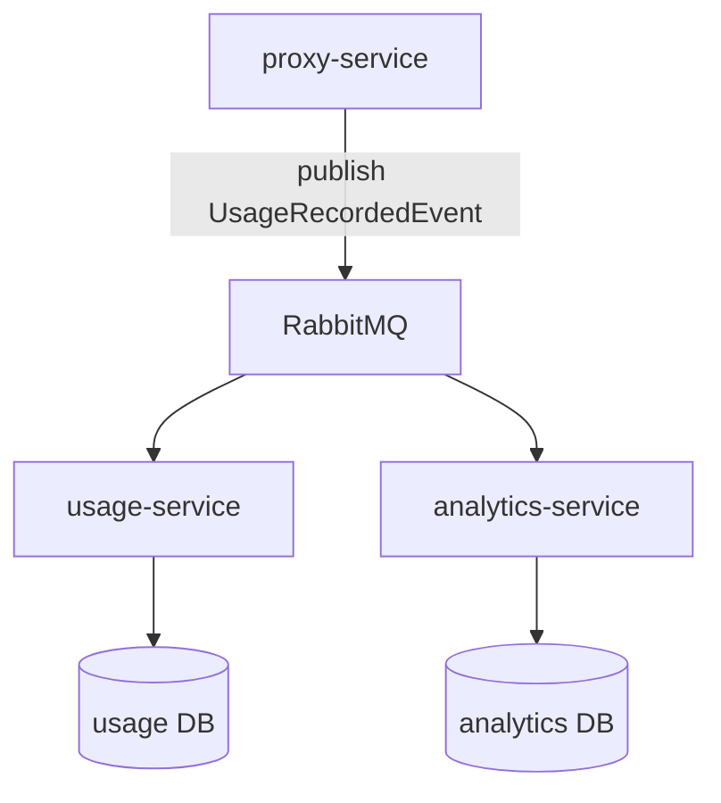

# usage-service와 analytics-service 관계

버전: 1.0  

**usage-service**(사용량 원장·집계)와 **analytics-service**(대시보드·분석 읽기 모델)의 **도메인 경계**, **데이터 소유권**, **연동 방식(이벤트 vs REST)** 을 정리한다.  
전제: [`docs/architecture.md`](architecture.md)의 MSA 원칙(서비스별 DB, 타 서비스 DB 직접 접근 금지), [`docs/event-consumer-flow.md`](event-consumer-flow.md)의 `UsageRecordedEvent` 팬아웃.

---

## 1. 역할 구분

| 구분 | usage-service | analytics-service |
|------|----------------|-------------------|
| **핵심 질문** | “**얼마나 썼는가?**” — 소비 **사실·원장** | “**어떻게 보여줄/분석할 것인가?**” — **시각화·트렌드·읽기 최적화** |
| **데이터 소유** | 사용량 **권위(authority)** 에 가까운 저장소 | 분석·대시보드 전용 **프로젝션**(projection) 저장소 |
| **전형적 저장** | 요청 단위 로그, 정규화 집계, 감사·정산 입력 | 시계열·롤업·캐시, 차트용 DTO에 가까운 구조 |

두 서비스는 **서로의 PostgreSQL(또는 기타 DB)에 직접 접속하지 않는다.**

---

## 2. 공통 입력: `UsageRecordedEvent`

`proxy-service`가 Provider 호출 후 [`libs/usage-events`](../libs/usage-events)의 **`UsageRecordedEvent`** 를 RabbitMQ에 **한 번** 발행한다.  
usage·analytics는 **동일 이벤트 스트림**을 각자 소비할 수 있다. 상세 바인딩·큐 예시는 [`docs/event-consumer-flow.md`](event-consumer-flow.md)를 따른다.

---

## 3. 연동 패턴

### 3.1 패턴 A — 팬아웃 + 각자 DB + 멱등 (권장: 트래픽·확장성)

proxy가 발행한 메시지를 **Topic Exchange**에서 **서비스별 큐**로 나눠 받는다. **usage**와 **analytics**가 **같은 이벤트**를 **독립적으로** 소비하고, **각자 DB**에 반영한다.



- **멱등성**: `eventId`(및 필요 시 비즈니스 키)로 **중복 수신**에 안전하게 처리한다.
- **정합성**: 두 DB를 **항상 동일 시점·동일 스키마**로 맞추는 것이 목표가 아니라, **같은 이벤트**를 **다른 목적**으로 반영한다. 분석 측은 **집계 지연(eventual consistency)** 을 허용할 수 있다.
- **권위**: 감사·과금 원장이 필요하면 **usage-service**를 사용량 **권위(authoritative) 소스**로 두는 정책을 따른다.

### 3.2 패턴 B — analytics가 usage REST로 조회 (단순·저트래픽)

**analytics-service**가 **자기 DB에 적재하지 않고**(또는 캐시만 두고), 대시보드 요청 시 **usage-service의 조회 API**를 **HTTP(GET 등)** 로 호출한다.

```mermaid
sequenceDiagram
    participant Client as 클라이언트/FE
    participant AN as analytics-service
    participant US as usage-service
    participant DB as usage DB

    Client->>AN: 대시보드 조회 (예: GET)
    AN->>US: 사용량/집계 조회 API
    US->>DB: SELECT
    DB-->>US
    US-->>AN: JSON
    AN-->>Client: 화면용 응답
```

- **장점**: 구현 단순, **항상 usage DB 기준**으로 최신·단일 진실에 가깝게 표시 가능.
- **단점**: 대시보드 트래픽이 **usage-service 조회 부하**로 직결되고, usage 장애 시 **분석 화면**도 같이 영향받기 쉽다.

### 3.3 패턴 C — 하이브리드

- **이벤트**로 analytics 전용 저장소에 **롤업·시계열**을 쌓고,
- **상세·보정·드릴다운**이 필요할 때만 **usage REST**를 호출한다.

팀 규모와 QPS에 따라 A→C로 확장하는 경우가 많다.

---

## 4. REST는 어디에 쓰이나

| 경로 | REST의 역할 |
|------|-------------|
| **사용자 대시보드** | 브라우저/게이트웨이가 **analytics-service**(또는 BFF)의 **GET**으로 조회하는 것이 일반적이다. 응답 데이터는 **analytics DB**에서 오거나, 패턴 B라면 **usage를 proxy한 결과**다. [`docs/sequence-diagrams.md`](sequence-diagrams.md) §3 참고. |
| **서비스 간(usage ↔ analytics)** | 패턴 B/C에서 **analytics → usage** 조회만 동기 HTTP로 둔다. **usage가 analytics DB를 읽지 않는다.** |

**이벤트**는 주로 **적재·전파**; **REST**는 **요청 시점의 조회·명령**에 쓰는 식으로 역할을 나눈다.

---

## 5. 요약 표

| 질문 | 답 |
|------|-----|
| analytics가 usage 데이터를 보여줄 때 **항상** usage에 REST해야 하나? | **아니다.** 패턴 A처럼 **동일 이벤트를 analytics가 소비**해 **자기 DB**를 두는 방식이 확장에 유리하다. |
| 두 DB를 **완전히 동일**하게 맞춰야 하나? | **보통 아니다.** 멱등 소비와 **업무상 허용 가능한 지연**을 정하고, **원장 권위**는 usage에 둔다. |
| MSA에서 **타 서비스 DB**를 조회해야 할 때? | **직접 조회 금지.** **소유 서비스의 API** 또는 **이벤트로 받은 자기 DB**를 사용한다. |

---

## 6. 문서 유지

- `UsageRecordedEvent` 스키마 변경 시 `libs/usage-events`, [`docs/event-consumer-flow.md`](event-consumer-flow.md), 본 문서를 함께 검토한다.
- Exchange·큐 이름·REST 경로는 구현·운영 설정에 맞춰 본 문서에 반영한다.
