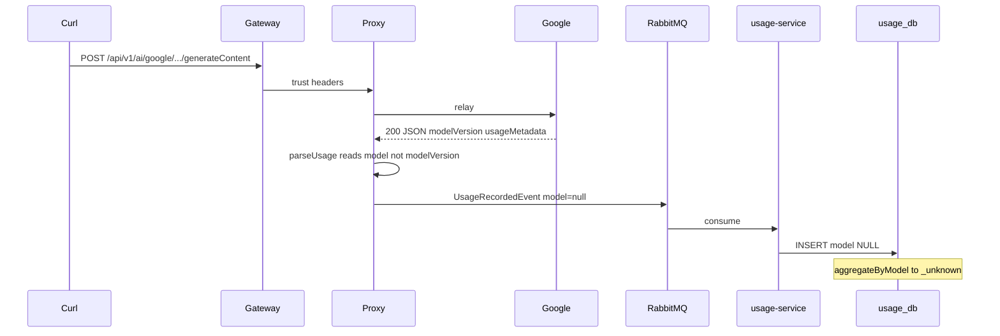

# 대시보드에서 모델이 unknown으로 보이는 원인 분석 (Gemini curl 200 이후)

문서 목적: 게이트웨이 경유 `curl` 로 Gemini `generateContent` 호출이 **HTTP 200** 이고 본문도 정상 수신되는데, 사용량 대시보드의 **모델별 요청 수·기타 집계에서 모델이 unknown** 으로만 보이는 이유를, 저장 파이프라인·이벤트 발행·응답 파싱 관점에서 정리한다.

---

## 1. 현상 정리

- **클라이언트:** `curl` → API Gateway(예: `localhost:8080`) → Proxy → Google Gemini.
- **관측:** 응답은 200, 본문에 후보 텍스트 등이 옴.
- **대시보드:** 모델별 집계 등에서 모델 이름이 **unknown** (또는 `_unknown` 에 가까운 표시) 으로 나옴.

질문 핵심은 다음 중 어디가 깨졌는지이다.

| 가설 | 이 문서의 결론 |
|------|----------------|
| `usage_db` 에 아예 저장이 안 된다 | 반드시 그렇지는 않음. **저장은 되는데 `model` 컬럼이 비는 경우**가 주원인과 잘 맞음 |
| 이벤트 발행부터 잘못된다 | 이벤트는 발행되지만 **`model` 필드가 null** 인 채로 설계대로 전달될 수 있음 |
| 그 외 | **응답 JSON 필드명 불일치** (`model` vs `modelVersion`) + 집계 SQL의 빈 모델 처리 |

---

## 2. 결론 (원인 우선순위)

### 2.1 주원인: Google 성공 응답의 모델 필드 이름과 파서 불일치

Google Gemini REST API의 `GenerateContentResponse` 는 공식 스키마상 최상위에 **`modelVersion`** (string, output only) 과 **`usageMetadata`** 등을 둔다. 최상위 **`model`** 이라는 필드명으로 모델 ID를 주는 형태가 아니다.

반면 프록시의 Google 전용 파서는 최상위에서 **`model` 만** 읽는다.

```52:64:services/proxy-service/src/main/java/com/eevee/proxyservice/provider/GoogleProviderHandler.java
    public TokenUsage parseUsageFromResponseJson(String responseBody) {
        try {
            JsonNode root = objectMapper.readTree(responseBody);
            JsonNode meta = root.get("usageMetadata");
            if (meta == null || meta.isNull()) {
                return null;
            }
            String model = text(root.get("model"));
            Long prompt = longVal(meta.get("promptTokenCount"));
            Long completion = longVal(meta.get("candidatesTokenCount"));
            Long total = longVal(meta.get("totalTokenCount"));
            return new TokenUsage(model, prompt, completion, total);
```

- 성공 응답에 **`usageMetadata` 가 있으면** `TokenUsage` 객체는 생성되지만, **`model` JSON 키가 없으면** `text(root.get("model"))` 는 null 이다.
- 결과적으로 **`TokenUsage.model()` 은 null** 이 되고, 토큰 수는 채워질 수 있다.

이 한 가지로 “200인데 모델만 unknown” 과 “토큰 합계는 어느 정도 잡히는데 모델 축만 unknown” 이 동시에 설명 가능하다.

### 2.2 부차 원인: 에러 응답(예: 404 JSON) — 동일 unknown 이지만 메커니즘이 다름

업스트림이 **에러 본문**만 주는 경우, `usageMetadata` 가 없으면 위 파서는 **아예 `null` 을 반환**한다. 그러면 아래 `publishUsage` 경로에서 `usage` 가 null 이면 **모델뿐 아니라 토큰도 이벤트에 실리지 않는다** (이벤트 필드가 null).

“200 성공” 케이스와 구분하려면 **응답 본문에 `usageMetadata` 가 있는지** 를 보면 된다.

### 2.3 파이프라인(이벤트 → DB)은 “null model 을 그대로 저장”하면 정상 동작

프록시는 업스트림 응답을 처리한 뒤 `UsageRecordedEvent` 를 만든다. 모델 필드는 파싱된 `TokenUsage` 에서 온다.

```197:208:services/proxy-service/src/main/java/com/eevee/proxyservice/relay/ProxyRelayService.java
        UsageRecordedEvent event = new UsageRecordedEvent(
                null,
                null,
                ctx.correlationId(),
                ctx.userId(),
                ctx.organizationId(),
                ctx.teamId(),
                resolvedApiKey.keyId(),
                resolvedApiKey.keyFingerprint(),
                resolvedApiKey.keySource(),
                provider,
                usage != null ? usage.model() : null,
                usage,
```

- `usage != null` 이어도 **`usage.model()` 이 null** 이면 이벤트의 `model` 은 null.

usage-service 쪽 매핑:

```36:48:services/usage-service/src/main/java/com/eevee/usageservice/service/UsageRecordedService.java
    private static UsageRecordedLogEntity map(UsageRecordedEvent event) {
        TokenUsage tu = event.tokenUsage();
        String model = event.model();
        ...
        if (tu != null) {
            if (model == null || model.isBlank()) {
                model = tu.model();
            }
            prompt = tu.promptTokens();
            completion = tu.completionTokens();
            total = tu.totalTokens();
        }
```

- 이벤트 `model` 과 `tokenUsage.model` 이 둘 다 비어 있으면 **엔티티의 `model` 은 null** 로 저장된다.

### 2.4 집계: 빈 모델은 `_unknown` 으로 그룹

```107:116:services/usage-service/src/main/java/com/eevee/usageservice/repository/analytics/UsageAnalyticsJdbcRepository.java
    public List<ModelUsageAggregate> aggregateByModel(String userId, Instant from, Instant toExclusive) {
        String sql = """
                SELECT COALESCE(NULLIF(trim(model), ''), '_unknown') AS m,
                       provider,
                       COUNT(*)::bigint,
                       COALESCE(SUM(prompt_tokens), 0)::bigint
                FROM usage_recorded_log
                WHERE user_id = ? AND occurred_at >= ? AND occurred_at < ?
                GROUP BY COALESCE(NULLIF(trim(model), ''), '_unknown'), provider
```

- DB에 `model` 이 NULL 이거나 공백이면 **`_unknown`** 버킷으로 집계된다.
- 프론트엔드 차트는 이 값을 그대로 또는 가공해 **unknown** 처럼 보여줄 수 있다.

### 2.5 대시보드 사용자 ID 불일치 (별도 증상)

웹 대시보드는 세션 기반 BFF로 usage API 를 호출한다 (`apps/web/src/lib/usage/fetch-usage.ts`). **curl 에 쓴 JWT 의 `sub` 과 브라우저에 로그인된 사용자 ID(이메일 등)가 다르면**, 집계 대상 행이 달라져 **0건** 이거나 **다른 사용자 데이터**만 보일 수 있다. 이 경우 증상은 “모델만 unknown” 보다 **데이터 자체가 안 맞음** 에 가깝다.

---

## 3. end-to-end 흐름 (요약 다이어그램)



---

## 4. “이벤트 발행이 잘못됐나?” 에 대한 답

- **형식/직렬화가 깨져서** RabbitMQ 소비 시 예외가 난다면 `UsageRecordedEventListener` 에서 로그가 남고 **행이 안 쌓인다**.
- **행이 쌓이는데 model 만 비어 있다면**, 발행 자체보다 **페이로드 내용(`model` null)** 이 원인에 가깝다.
- 프록시 [`UsageEventPublisher`](services/proxy-service/src/main/java/com/eevee/proxyservice/mq/UsageEventPublisher.java) 는 `UsageRecordedEvent` 를 JSON 으로 직렬화해 교환기로 보낸다. **null 필드는 `@JsonInclude(NON_NULL)` 때문에 생략될 수 있으나**, 역직렬화 후에도 “모델 없음”은 동일하다.

---

## 5. “usage_db 저장이 실패한 것인가?” 에 대한 답

아래를 순서대로 보면 구분이 쉽다.

| 관측 | 해석 |
|------|------|
| `usage_recorded_log` 에 **해당 시간대 행이 없음** | Rabbit 미도달, usage-service 미기동, 리스너 예외, 또는 프록시가 `publishUsage` 까지 못 감(스트리밍/예외 경로 등) |
| **행은 있는데** `model` 만 NULL, `prompt_tokens` 등은 채워짐 | 본 문서 **주원인(필드명 불일치)** 과 잘 맞음 |
| `model` 과 토큰 모두 NULL | 에러 응답 등으로 `parseUsageFromResponseJson` 이 **null** 반환했을 가능성 |

### 5.1 확인 체크리스트 (운영/로컬)

1. 동일 `user_id`(게이트웨이가 넘긴 `X-User-Id`)로 `usage_recorded_log` 를 조회해 **행 존재 여부**를 본다.
2. 최근 행에서 **`model` 컬럼**, **`prompt_tokens`**, **`upstream_status_code`** 를 함께 본다.
3. 프록시 로그에서 해당 요청에 대해 **usage 이벤트 발행 여부**(필요 시 디버그 로그 추가는 별도 작업)를 확인한다.
4. RabbitMQ 큐 적체·DLQ 여부를 확인한다 (메시지가 쌓이거나 버려지면 DB 와 불일치).

---

## 6. 참고: OpenAI 경로와의 대비

OpenAI Chat Completions 스타일 응답은 루트에 **`model`** 필드가 있는 경우가 많아, 동일 파서 패턴이 맞을 수 있다.

```75:87:services/proxy-service/src/main/java/com/eevee/proxyservice/provider/OpenAiProviderHandler.java
    private TokenUsage extractUsage(JsonNode root) {
        JsonNode usage = root.get("usage");
        if (usage == null || usage.isNull()) {
            return null;
        }
        String model = text(root.get("model"));
        Long prompt = longVal(usage.get("prompt_tokens"));
        ...
        return new TokenUsage(model, prompt, completion, total);
    }
```

Google Gemini 만 **공식 응답 스키마가 다르기 때문에** 동일 증상이 provider 별로 다르게 나타날 수 있다.

---

## 7. 수정 방향 (참고 — 코드 변경은 별도 작업)

문서 목적은 분석이므로 구현은 강제하지 않는다. 개선 시에는 예를 들어 다음을 검토할 수 있다.

1. `parseUsageFromResponseJson` 에서 **`modelVersion` 우선**, 없으면 `model`, 둘 다 없으면 요청 경로의 모델 세그먼트(예: `.../models/{id}:generateContent`) 를 보조로 파싱.
2. 공식 `UsageMetadata` 필드명 변경이 있으면 프록시 파서와 동기화.

---

## 8. 한 줄 요약

- **200 성공인데 대시보드만 unknown** 이면, 우선 **`GoogleProviderHandler` 가 `modelVersion` 대신 `model` 만 읽는지** 의심하는 것이 타당하다.
- **이벤트/DB 파이프라인이 완전히 실패한 것**이 아니라, **저장되는 `model` 값이 비어 `_unknown` 으로 집계되는 것**에 가깝다.
